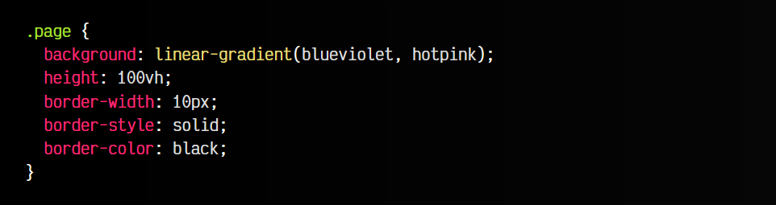
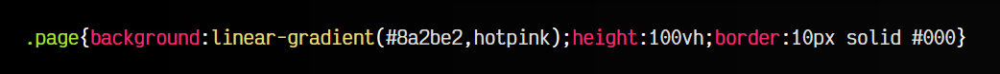
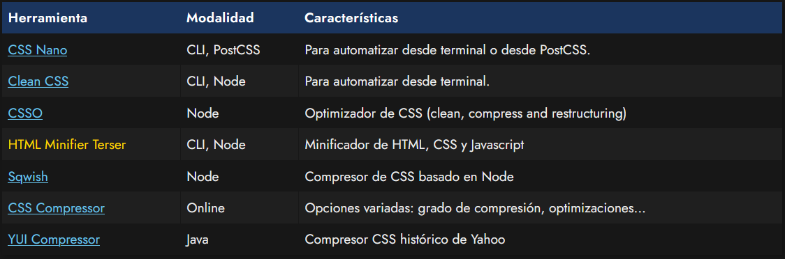

# 
Minificar CSS

Normalmente, cuando el desarrollador escribe código (no sólo código CSS, sino también HTML o Javascript) tiene que mantener un equilibrio entre varios factores clave, entre los que podemos destacar los siguientes:

   - Funcionamiento: El código debe estar bien escrito para funcionar correctamente. Siempre. Además, se debe cuidar el correcto funcionamiento en diferentes navegadores (crossbrowser), diferentes sistemas operativos (incluyendo dispositivos de escritorio, móviles y/o tablets), los cuales suelen/pueden tener algunas diferencias considerables.

   - Legibilidad: El código debe estar correctamente indentado, facilitando la legibilidad por humanos, favoreciendo la velocidad de modificación e introducción de cambios (mantenibilidad).

   - Tamaño: Cuanto más texto tenga un archivo CSS, HTML o Javascript (espacios, líneas en blanco, comentarios, código no usado...), más grande será el tamaño final del archivo, por lo que más tiempo tardará en descargarse, y probablemente, en procesarse por el navegador.

   - Rendimiento: Cuanto más costosas sean las operaciones que vamos a obligar a hacer al navegador, más tardará en procesarse y por lo tanto, más tiempo tardará en pintar y renderizar (dibujar) la página.

## ¿Qué es la minificación?
La minificación (en inglés, uglify o minification) es la acción de eliminar carácteres o comentarios en un archivo de código para el navegador (.html, .css o .js, por ejemplo), ya que su omisión no hace que el código deje de funcionar.

El objetivo es reducir su tamaño total, y por lo tanto, descargarlos más rápido. En archivos CSS muy grandes esto suele influir de forma considerable, por lo que es una buena práctica utilizar herramientas de minificación para reducir el tamaño del archivo CSS, condensando toda su información, eliminando espacios, nuevas líneas, etc...

Haciendo esto, conseguiremos que el archivo ocupe menos, pero a cambio perderemos legibilidad. Por esta razón, es habitual conservar los archivos CSS originales (sin minificar) que serán los que editemos y modifiquemos, mientras que los archivos minificados se generarán a partir de estos mediante herramientas automatizadas:

   - index.css (Archivo editable, legible, orientado a humanos)
   - index.min.css (Archivo minificado, generado de forma automática, no editable, el que lee el navegador)

Hay que tener en cuenta que el proceso de minificación es un paso totalmente opcional, por lo que no es obligado realizarlo, pero se considera una buena práctica de optimización.

## Ejemplo visual de minificación
A continuación, veamos como es el código de un mismo archivo .css con su contenido sin minificar y minificado:

Ejemplo de código CSS legible: index.css (147 bytes)

css:

html:

vista:

Ejemplo de código CSS minificado con CSSNano: index.min.css (86 bytes)

css:

html:

vista:

Como se puede ver, el tamaño y la legibilidad del archivo .css se reduce considerablemente. Al ser un archivo de tan pocas líneas, no hay demasiada diferencia, pero a medida que el archivo crece, la diferencia es aún mayor.

Observa que las herramientas de minificación no sólo se basan en eliminar espacios, sino que también suelen hacer operaciones de optimización (cambiar black por #000, o blueviolet por #8a2be2) o similares, con el objetivo de ahorrar carácteres.

En resumen: el primer archivo es el código para humanos, el que debemos mantener y trabajar con él. El segundo archivo es el código para el navegador, que no se debe modificar directamente por humanos y que se debe generar a partir del primero. El archivo minificado es el que se utiliza en la web definitiva que leerá el navegador.

## Herramientas de minificación
Existen múltiples herramientas para minificar CSS, y además suprimir propiedades repetidas, eliminar propiedades o valores inútiles, etc. Algunas de las más populares son las que vemos a continuación:

Es importante tener en cuenta que es poco frecuente hoy en día utilizar estos minificadores de forma manual, ya que estos minificadores de código suelen venir incorporados en unas herramientas denominadas [automatizadores o empaquetadores](https://lenguajejs.com/automatizadores/). Son algo más complejos y conviene profundizar en ellos cuando se tenga más conocimiento y experiencia. El objetivo es que no tengamos que preocuparnos de estas y otras tareas repetitivas que podría estar haciendo una máquina.

