# 
StyleLint: Linter CSS

Escribir código CSS correctamente es difícil, y sobre todo cuando empezamos, es muy habitual que adquiramos malas prácticas que hagan que nuestro código CSS sea de peor calidad. Esto es un problema, ya que a medida que escribimos código CSS, tiende a crecer exponencialmente y se vuelve mucho más difícil de mantener.

Este artículo explica detalladamente como utilizar Stylelint y entenderlo en profundidad. Si buscas algo más rápido y práctico, echa un vistazo al paquete de NPM stylelint-config-manzdev.

## ¿Qué es StyleLint?
Existen unas herramientas llamadas linters, que se encargan de revisar nuestro código a medida que lo vamos escribiendo y nos avisan de posibles problemas y malas prácticas. StyleLint es el linter por excelencia de CSS, mediante el cuál podremos vigilar la calidad del código CSS escrito e ir adquiriendo mejores hábitos de escritura de CSS.

## Instalación de StyleLint
Para comenzar la instalación de StyleLint simplemente escribimos lo siguiente desde una [terminal de texto](https://terminaldelinux.com/terminal/):

Esto instalará la herramienta y un paquete de configuración estándar llamado stylelint-config-standard en nuestro proyecto como dependencias de desarrollo.

Para comprobar que todo ha ido correctamente, podemos escribir lo siguiente, que nos dará la versión de stylelint instalada:

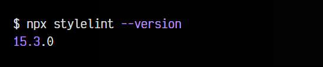

Si es así, podemos continuar al siguiente apartado.

Si alguno de los comandos anteriores te da error, probablemente sea porque no tienes instalado (o bien configurado) [NodeJS](https://nodejs.org/en/). En ese caso, te recomiendo seguir la guía de [instalación de Node con NVM](https://lenguajejs.com/npm/introduccion/instalacion-node-con-nvm/) y/o [aprender a utilizar NPM](https://lenguajejs.com/npm/administracion/crear-nuevo-proyecto/).

## Configuración de StyleLint
Para utilizar nuestro linter CSS debemos escribir lo siguiente:

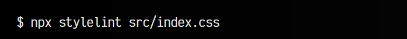

   - npx es una herramienta que ayuda al sistema a buscar el comando de Node
   - stylelint es el nombre del linter que vamos a iniciar
   - src/index.css es la ruta de nuestro archivo .css que vamos a analizar

Si lo ejecutamos en este punto, probablemente tengamos un error similar al siguiente:

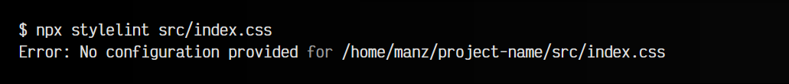

Esto ocurre porque no hemos creado un archivo de configuración, que es necesario para utilizar la herramienta. Así pues, creamos un archivo .stylelintrc.json en la raíz del proyecto (al mismo nivel que el package.json, fuera de src/) e incluimos las siguientes lineas:

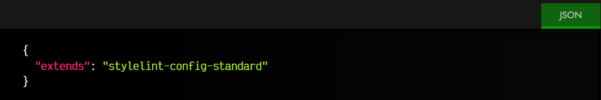

Esto significa que va a leer la configuración base del paquete que instalamos anteriormente llamado stylelint-config-standard, por lo que ya debería funcionar nuestro linter con unas reglas básicas definidas por este paquete.

Una vez configurado, imaginemos ahora que tenemos el siguiente archivo src/index.css con las siguientes líneas:

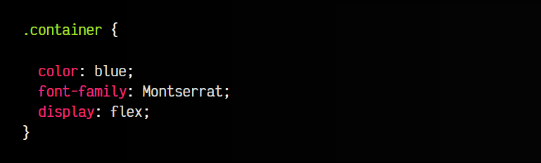

Observa que tenemos una línea en blanco en el bloque del selector .container, que la tipografía indicada no tiene una tipografía genérica alternativa. Volvemos a ejecutar el siguiente comando:

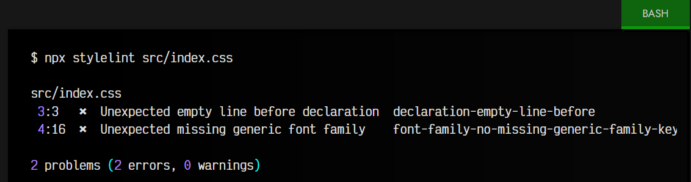

Si tenemos un fichero src/index.css con varias líneas de código CSS en él con algún tipo de error nos aparecerán los errores como podemos ver en el ejemplo anterior. En el caso de que el fichero src/index.css no tenga errores, no nos mostrará nada.

En el mensaje del ejemplo anterior, nos indica que existen dos errores:

    En la línea 3, carácter 3, no se esperaba una línea vacía
    En la línea 4, carácter 16, se esperaba una tipografía genérica

Como puedes ver, estos son problemas de estilo de código (que afectan al programador que lee el código), pero no errores que eviten que el navegador muestre correctamente la página. El linter es interesante porque nos acostumbra a escribir correctamente el código, de modo que sea más fácil de leer.

Observa que al final de cada error, nos indica una palabra clave, que es el nombre de la regla que ha detectado error. Si tienes curiosidad sobre alguna, puedes buscarla en la [lista de reglas de Stylelint](https://stylelint.io/user-guide/rules/).

## El fichero .stylelintrc.json
El fichero .stylelintrc.json incluye la configuración que indica a StyleLint como debe comportarse. De momento, sólo hemos dicho que utilice la configuración heredada del paquete stylelint-config-standard, sin embargo, se pueden añadir más paquetes de configuración:

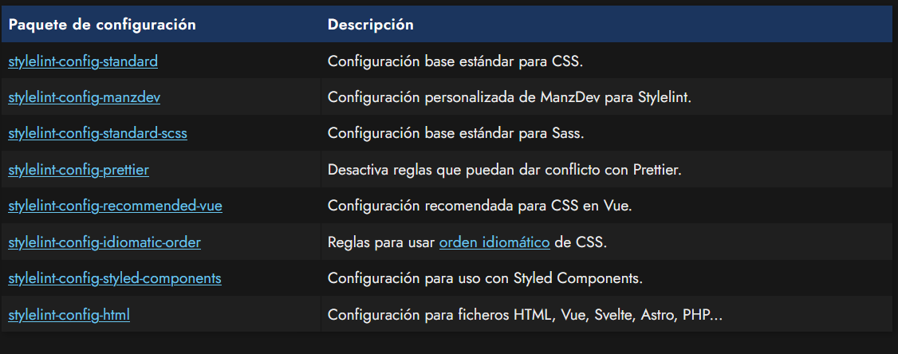

Por ejemplo, veamos como haríamos para soportar código del preprocesador Sass. Lo primero, instalamos el paquete correspondiente si está disponible:

Una vez hecho, lo cargamos en el fichero de configuración correspondiente:

json:
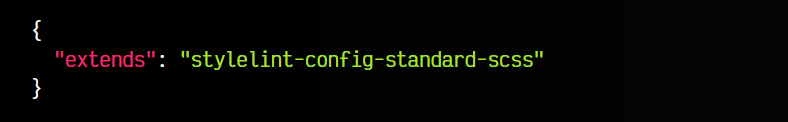

## Sintaxis personalizada
En algunos casos, puede que no exista un paquete de configuración para una sintaxis específica. En ese caso, podemos utilizar customSyntax para indicar una configuración personalizada y que se adapte el linter lo mejor posible:

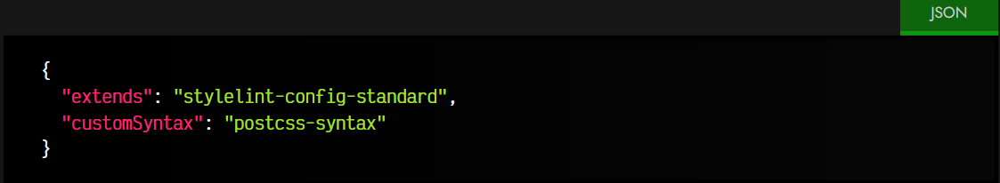

En este caso, postcss-syntax permite cambiar automáticamente de sintaxis, según la extensión del fichero utilizado. No te olvides de instalar el paquete postcss-syntax, así como otros como postcss-styled (styled-components), postcss-jsx (JSX o CSS-in-JS) o postcss-html (HTML, Vue, Astro, PHP...) según interese para soportar formatos más específicos.

## Reglas de StyleLint
Paquetes como stylelint-config-standard o similares, no son más que una configuración predefinida que incluye un conjunto de reglas determinado. Las reglas son las normas que tiene StyleLint para detectar si algo es incorrecto o no. Existe una amplia [lista de reglas de StyleLint](https://stylelint.io/user-guide/rules/), separadas por categorías.

Es posible que en nuestro caso, nos guste la configuración por defecto de stylelint-config-standard, sin embargo, no estemos de acuerdo con alguna de las reglas preconfiguradas. Si es así, nosotros podemos modificar ciertas reglas particulares y ajustarla a nuestros criterios en nuestro archivo .stylelintrc.json:

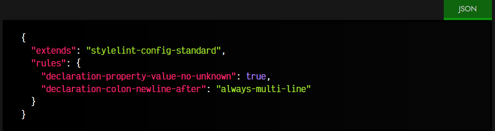

Observa que en la propiedad rules, hemos definido la regla [declaration-property-value-no-unknown](https://stylelint.io/user-guide/rules/declaration-property-value-no-unknown/) a true, por lo que obligamos a que el linter revise los valores de las propiedades y avise si estamos usando alguno que no exista, todo ello independientemente de la configuración que se tenga en el paquete de configuración extendido original.

Lo mismo ocurre con la regla [declaration-colon-newline-after](https://github.com/stylelint-stylistic/stylelint-stylistic) definida al valor always-multi-line. Sobreescribirá el valor que tenía en el paquete de configuración stylelint-config-standard al que hemos definido nosotros.

## Corregir CSS (Autofix)
Una vez hemos llegado hasta este punto, tenemos nuestro StyleLint funcionando desde una terminal. Sin embargo, no es cómodo abrir la terminal cada vez que queremos comprobar si hay errores en nuestro código CSS. Lo ideal sería que esta tarea la realizara nuestro editor de código como VSCode a medida que escribimos en nuestro fichero .css.

Para ello, instalaremos [la extensión StyleLint](https://marketplace.visualstudio.com/items?itemName=stylelint.vscode-stylelint) para VSCode. Una vez hecho, pulsamos F1 y marcamos la opción Abrir configuración de Usuario (JSON). Nos aparecerá un fichero .json que es la configuración de VSCode, donde añadiremos lo siguiente:

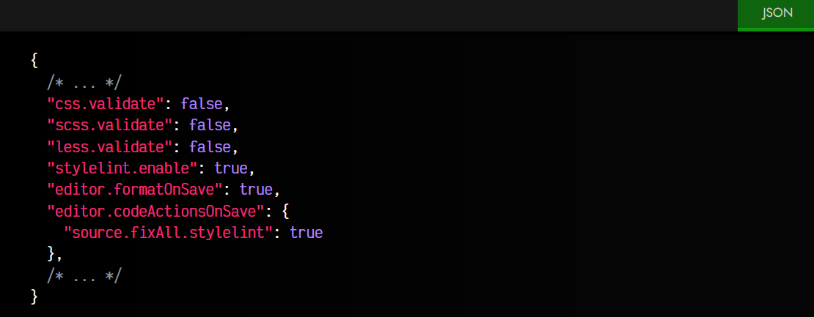

Vamos a explicar que hace cada una de ellas:

   - Las propiedades css.validate, scss.validate y less.validate desactivan el linter básico (usaremos StyleLint).
   - La propiedad stylelint.enable activa el StyleLint en nuestro VSCode. Mostrará los errores en la pestaña "Problemas". Necesita la extensión mencionada anteriormente.
   - La propiedad editor.formatOnSave hace posible formatear el documento cada vez que guardemos un fichero.
   - La propiedad editor.codeActionsOnSave determina que se hará cuando se guarde el fichero. En nuestro caso colocamos source.fixAll.stylelint a true, lo que hará que intente corregir los problemas automáticamente.

Esta última opción es la equivalente a escribir lo siguiente en la terminal:

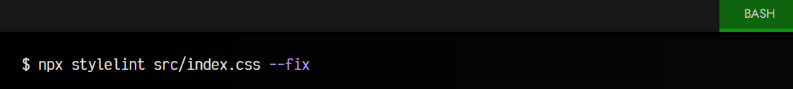

Ten en cuenta que, por ejemplo, editor.formatOnSave está en un ambito global, por lo tanto se ejecuta al guardar cualquier tipo de archivo. Si sólo quieres que ocurra con ficheros .css, escribimos lo siguiente:

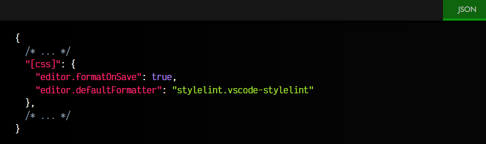

En este caso, el formatOnSave sólo se activará para los archivos de tipo css, los cuales serán formateados por defecto con la extensión StyleLint. Otros formatos podrían ser [javascript], [html], [markdown], etc...