# 
Metodologías CSS

Siempre he sostenido que una de las cosas más complejas de CSS es la organización. Salvo que estemos trabajando con cosas muy pequeñas, es muy sencillo que el código CSS se nos haga muy grande y se vuelva muy difícil de mantener y organizar.

La naturaleza de CSS hace que sea muy complejo de organizar. Cuando queremos diseñar algo, hay múltiples vertientes que queremos controlar; el aspecto visual en general, sí, pero eso implica muchas facciones: colores y tonalidades, que funcionen bien juntos, sombras, espacios, dimensiones, responsive, etc. Además, tenemos que intentar evitar que sea incoherente o que podamos añadir valores que no sean homogéneos (por ejemplo, dos tonalidades de color muy similares pero diferentes), o un tamaño de 30px para un elemento y otro de 31px para otro elemento.

## ¿Qué es una metodología CSS?
Se considera una metodología a una serie de métodos, consejos o forma de trabajar, que en el caso de seguir sus recomendaciones será mucho más fácil mantener y organizar tu código CSS. Existen metodologías más generalistas, otras que simplemente son convenciones para la sintaxis CSS y la forma de escribir clases y otras que se centran en como organizar los ficheros o la arquitectura de tu página.

    Es importante tener claro que las metodologías buscan cumplir ciertos casos de uso que quizás no son exactamente los que nos vienen bien a nosotros, pero pueden existir programadores a los que les viene bien para sus casos de uso. Ten la mente abierta, observa bien los criterios que nos aconsejan y pruebalos antes de descartarlos o criticarlos.

Recuerda que no estás obligado a seguir una metodología concreta, simplemente son recomendaciones con las que puede ser más sencillo organizarte al escribir y mantener código, y depende de tu forma de trabajar que te guste más una que otra.

## Metodologías CSS
En la siguiente tabla puedes ver una lista histórica de metodologías CSS que han conseguido cierta relevancia (algunos frameworks CSS han nacido a partir de dichas metodologías):

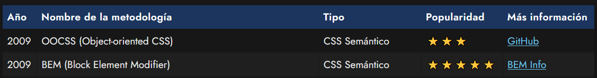
 [	Soporte en Sass](https://sass-lang.com/)
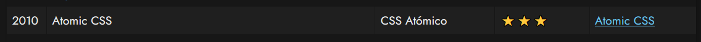

 [Atomizer,](https://acss.io/)  [Tachyons,](https://tachyons.io/) [BassCSS](https://basscss.com/)
 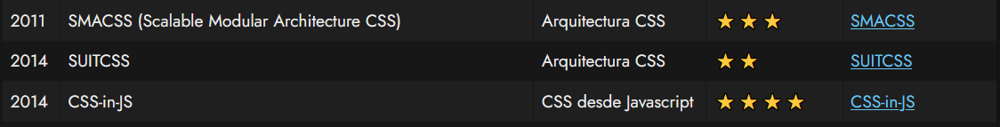

[Styled Components](https://styled-components.com/), [Emotion](https://emotion.sh/docs/introduction), [CSS Modules](https://github.com/css-modules/css-modules), [ WebComponents](https://lenguajejs.com/webcomponents/shadow-dom/css-webcomponents/)

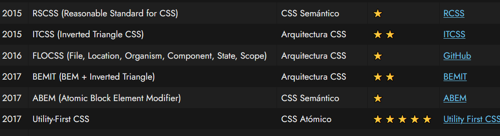

De los anteriores, salvo por motivos históricos para comprender el movimiento de la industria de CSS o casos específicos, nos vamos a enfocar en lo que considero las vertientes más populares hoy en día: CSS Semántico (en general), BEM, CSS-in-JS y Utility-first CSS.

## CSS Semántico
Probablemente, si estamos en fase de aprendizaje y queremos hacer una card, es muy posible que nuestro código termine siendo algo muy parecido a lo siguiente, que se denomina CSS semántico. Esta forma de escribir código CSS es muy natural y directa, aunque si uno no es cuidadoso, puede adquirir ciertos vicios y malas prácticas que acaben complicando el mantenimiento de tu código CSS a la larga:

html:
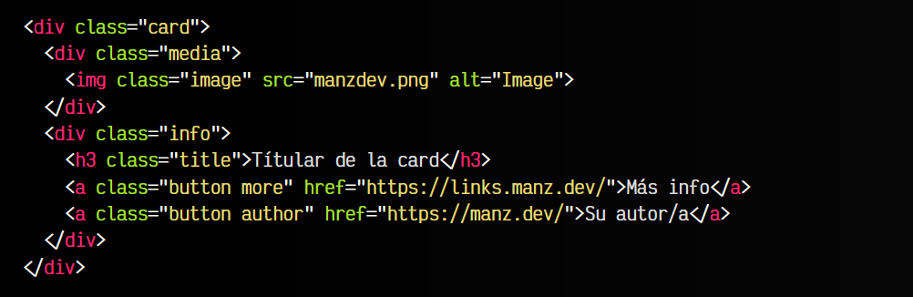

css:
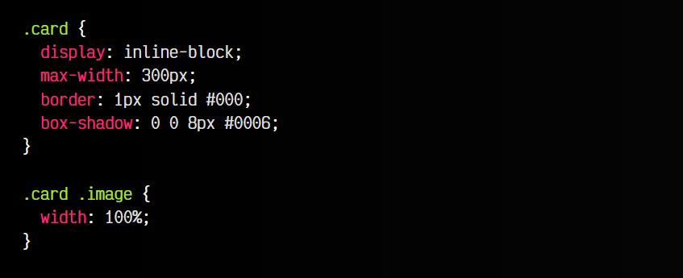
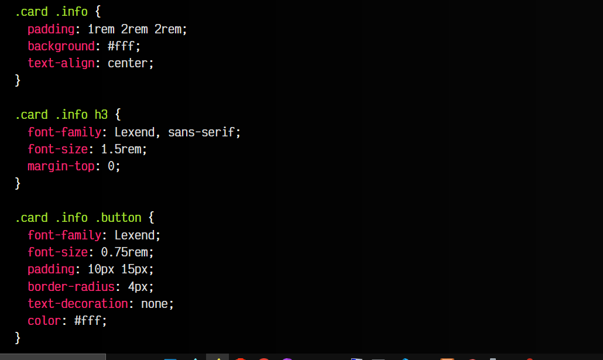

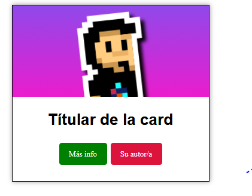

Ten muy en cuenta que, al utilizar selectores CSS con varios niveles de profundidad (para evitar seleccionar otros elementos que se llaman igual), eso hace que la [especificidad CSS](https://lenguajecss.com/css/cascada-css/que-es-cascada/) aumente y pueda producir efectos inesperados si no se sabe identificar.

## BEM (Block Element Modifier)
Justo para evitar estos problemas de especificidad CSS, nace una de las metodologías CSS más populares, que aún hoy en día sigue siendo muy utilizada: BEM. A grandes rasgos, es una forma de nombrado de clases CSS que hace mucho más intuitivo su nombrado y organización, dividiendo todo en bloques, elementos y modificadores:

html:
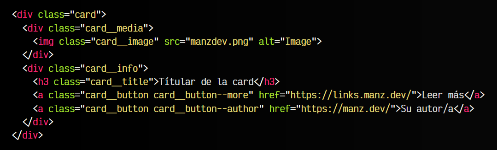

css:
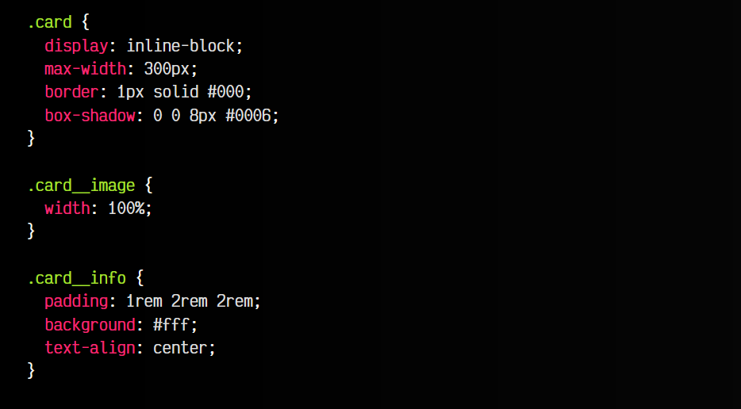
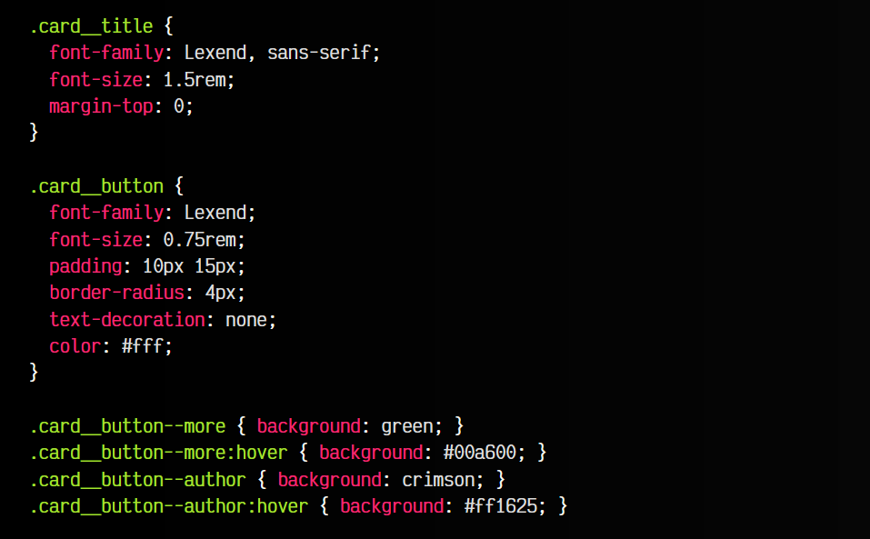

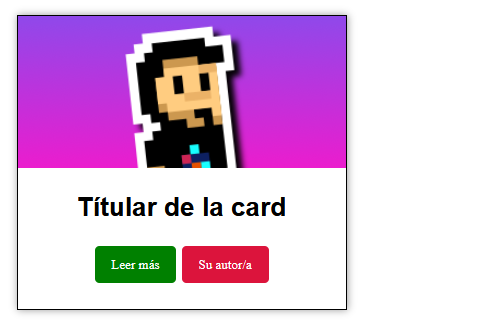

El código CSS creado con BEM suele utilizar clases únicas que representan a un elemento concreto, reduciendo su especificidad (sólo es una clase) y evitando darle estilo a un elemento de forma inesperada (colisiones de nombres de clase) porque se llama de la misma forma aunque pertenece a otra parte de la página.

BEM es una metodología que es muy cómoda para utilizar junto a preprocesadores como Sass, ya que permite aprovechar su [anidado CSS](https://lenguajecss.com/css/calidad-de-codigo/css-nesting/) para generar clases únicas de BEM.

## Utility-first CSS
Otra de las metodologías CSS más utilizadas hoy en día es el de las clases de utilidad (Utility-first CSS). Esta metodología, derivada de otra metodología denominada CSS atómico, aconseja crear clases de utilidad muy sencillas, con una o muy pocas propiedades CSS, que se apliquen en el HTML para dar estilo a los elementos. De esta manera, la forma de seleccionar elementos y darles estilo recae más en el HTML que en el CSS, algo que a priori resulta mucho más productivo:

html:
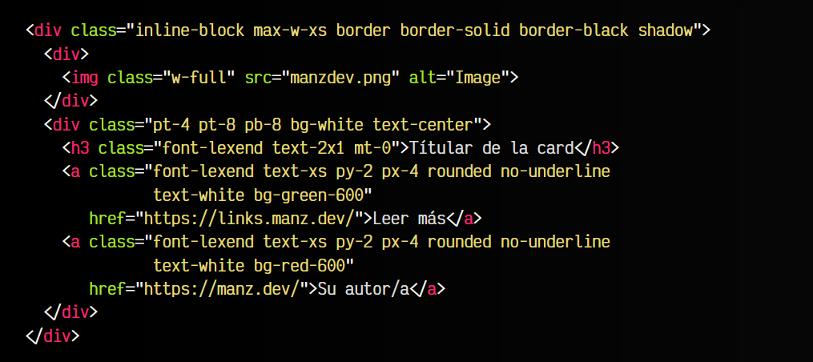

css:
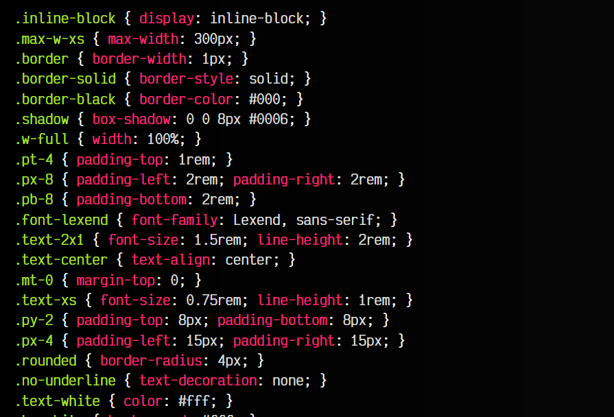
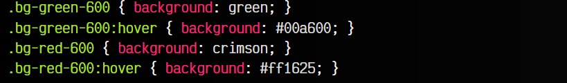

vista:
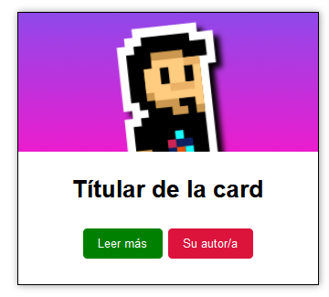

Aunque a priori, el código CSS parece mucho menos entendible, la idea detrás de las clases de utilidad es que observando el HTML (y no el CSS) puedas tener una idea del estilo que se le da a ese elemento. Unido a que existen librerías, motores o frameworks (como TailwindCSS, por ejemplo) que ya tienen las clases predefinidas, sólo tendríamos que preocuparnos por aprenderlas y escribir las clases HTML en el lugar adecuado.

## CSS-in-JS
Otra categoría muy popularizada en los últimos años, es la de CSS-in-JS, o lo que es lo mismo, manejar el CSS a través de Javascript. Con el incremento de la popularidad de React (librería donde «todo se hace desde Javascript»), gestionar estilos desde un fichero CSS no era demasiado cómodo, por lo que se populariza una metodología donde la idea es gestionar CSS desde un fichero Javascript, aprovechando las ventajas, flexibilidad y potencia de un lenguaje de programación y su control del DOM (o del Virtual DOM en el caso de React).

Observa este ejemplo, donde el HTML es idéntico, pero en lugar de utilizar un fichero .css, escribimos código Javascript. Utilizamos la librería CSS-in-JS Emotion, concretamente su ayudante css, para crear objetos de Javascript (ten en cuenta que existen multitud de librerías CSS-in-JS y cada una lo gestiona de formas variadas y diferentes, esto es un ejemplo muy simple):

html:
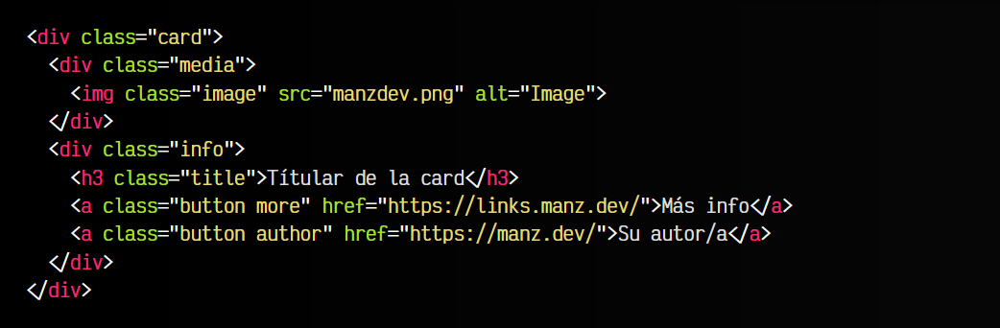

js:
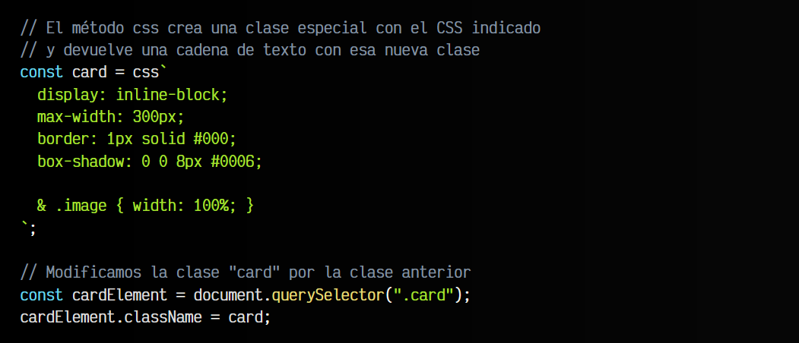
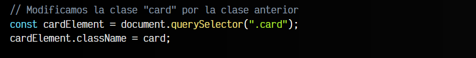
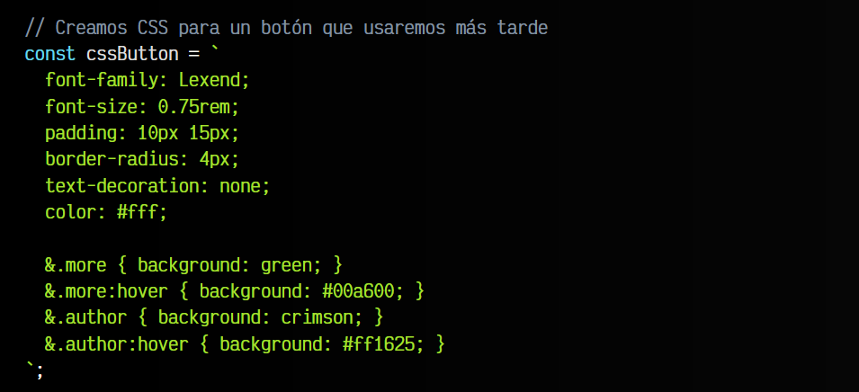
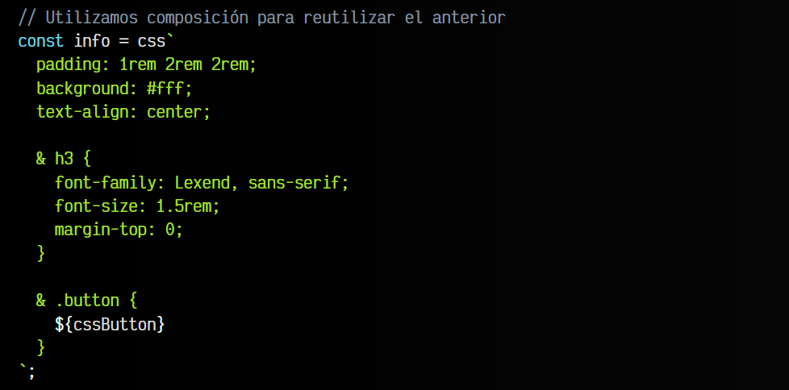
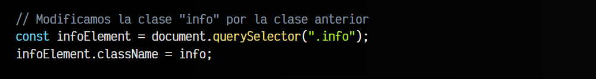

Mediante este método css escribimos  un STRING con nuestro código CSS, de forma que se nos devuelve un STRING con una clase especial (por ejemplo css-k2dutc) que reemplazaremos por card. De esta forma, también se asegura que los nombres de clases son únicos y no aplicará estilos por error.

Este ejemplo didáctico tiene el código todo junto para ser más sencillo de entender. Sin embargo, en un ejemplo real podríamos utilizar [módulos ECMAScript](https://lenguajejs.com/javascript/modulos/que-es-esm/) para separar cada bloque de código en ficheros separados y tenerlo todo mucho más organizado.

## CSS Semántico (Moderno)
El CSS moderno tiene muchas características interesantes para hacer que el código sea mucho más entendible, breve y fácil de mantener, de modo que vamos a mostrar el código CSS semántico que vimos anteriormente, pero mejorándolo utilizando herramientas y features modernas de CSS:

html:
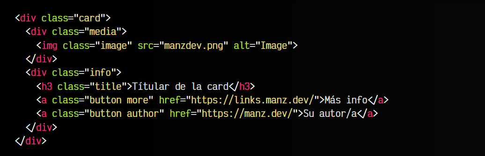

css:
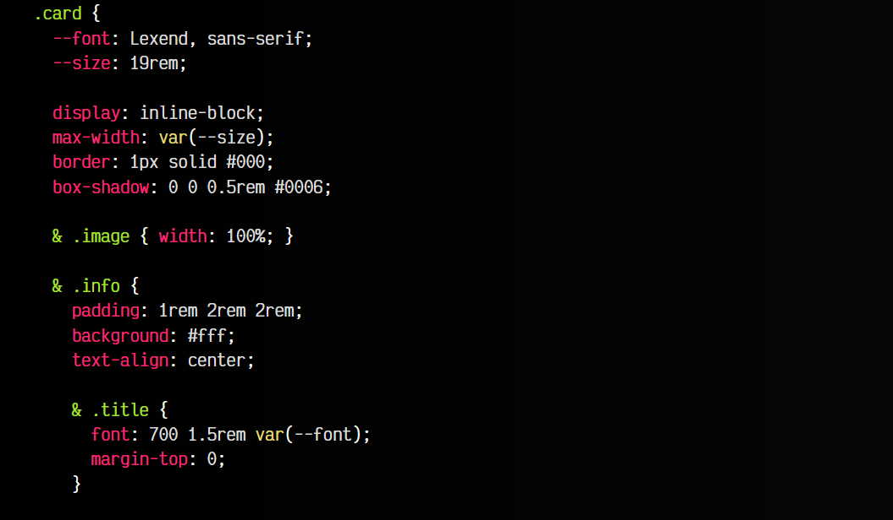
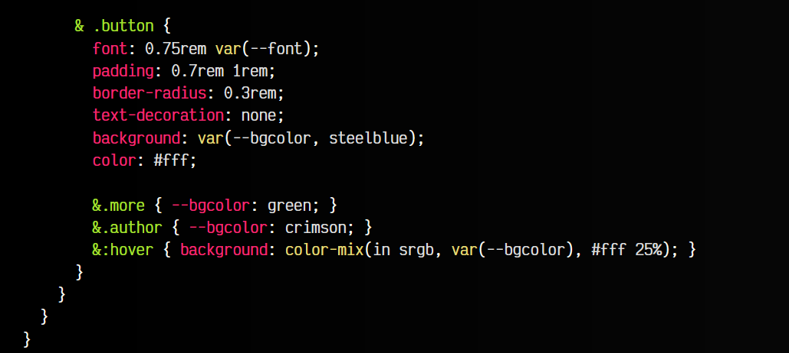

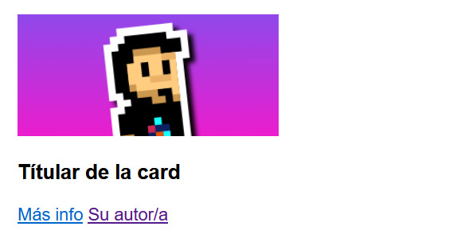

Entre algunas de las características que aquí se utilizan, se encuentran las siguientes:

   - ✨ [Variables CSS](https://lenguajecss.com/css/cascada-css/css-custom-properties/): Reutiliza valores CSS para que el código sea más mantenible.
   - ✨ [Nesting CSS](https://lenguajecss.com/css/calidad-de-codigo/css-nesting/): Utiliza el anidado nativo para facilitar la lectura y escritura de CSS.
   - ✨ [Espacios de colores](https://lenguajecss.com/css/colores/espacios-color/): Permite mezclar colores y reutilizar colores existentes.
   - ✨ [La regla @scope](https://lenguajecss.com/css/cascada-css/la-regla-scope/):(EXPERIMENTAL) Permite delimitar el ámbito de acción de los estilos en el DOM.

