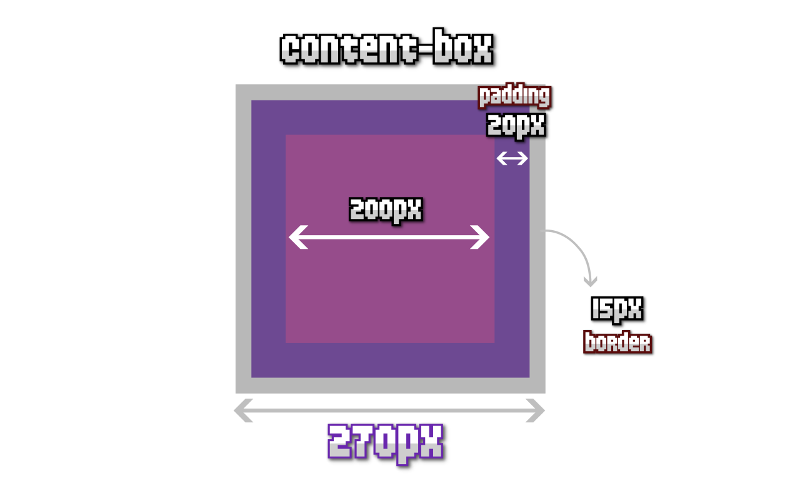
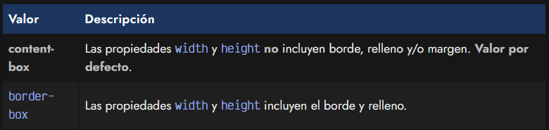
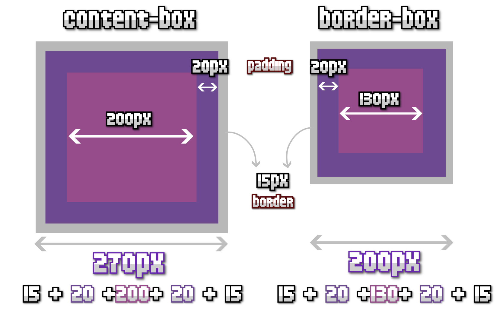

# 
La propiedad box-sizing

Aunque el concepto del modelo de cajas de CSS es sencillo, hay varios detalles que es interesante conocer antes de continuar. En muchas ocasiones, trabajar con los tamaños de varios elementos puede resultar frustrante, ya que es muy habitual que ocurran ciertas situaciones inesperadas.

## El tamaño de las cajas.
Por defecto, el modelo de cajas de CSS sigue un esquema donde al dar un tamaño a un elemento, concretamente se le da tamaño a su contenido (rosa, en la imagen). Sin embargo, si además le añadimos un borde (border) y/o un relleno (padding), se sumará al tamaño del contenido.

Observa este caso de ejemplo, que te explicaré un poco más abajo:

Esto puede resultar algo poco intuitivo, ya que un elemento al que le demos un tamaño width: 200px, y que además tenga un border: 15px y un padding: 20px, resultaría en realidad un elemento de tamaño total de 270px. ¿Cuál es la razón?

   - 15px de borde izquierdo
   - 15px de borde derecho
   - 20px de relleno izquierdo
   - 20px de relleno derecho
   - 200px del ancho del contenido

Tener que realizar estos cálculos, puede resultar complejo y poco predecible, especialmente en situaciones donde estamos muy justos de espacio.

## La propiedad box-sizing.
En CSS, existe una propiedad denominada box-sizing que permite alterar esta versión del modelo de cajas. Lo explicado en el ejemplo anterior es el funcionamiento por defecto del modelo de cajas de CSS, donde la propiedad box-sizing tiene el valor content-box.

Sin embargo, tiene disponible otro valor denominado border-box donde se puede cambiar el comportamiento de este modelo de cajas por uno simplificado donde el tamaño del border y del padding están incluídos en el tamaño del contenido dados por propiedades como width o height.

Veamos un ejemplo donde utilizaremos:

   - Tamaño width y height de 200px.
   - Borde de 15px por cada lado.
   - Relleno de 20px por cada lado.

Observa que en el caso de la izquierda, donde usamos box-sizing: content-box (modelo por defecto), los tamaños de borde y de relleno se suman al dado por anchos y altos, por lo que el tamaño total del elemento será de 270px (200px + 15px + 15px + 20px + 20px).

Sin embargo, en el caso de la derecha, donde usamos box-sizing: border-box, los tamaños de borde y de relleno se restan al tamaño dado por anchos y altos, por lo que el tamaño total del elemento será de 200px. Sin embargo, el tamaño disponible para el contenido se reduce a 130px ya que resta el de los márgenes y bordes (200px - 15px - 15px - 20px - 20px).

Más adelante, ten en cuenta que existirán propiedades CSS que utilizarán valores como border-box o content-box. En general, estas propiedades se utilizarán para hacer referencia a si queremos tener en cuenta border, padding y contenido (el caso de border-box) o si queremos tener en cuenta sólo contenido (el caso de content-box).