# 
Ajuste y balance de textos

Existen situaciones donde podemos necesitar modificar la forma en la que se renderiza el texto en los elementos contenedores de nuestra página. La forma en la que el navegador ajusta el texto para adaptarse al contenedor, no siempre es la ideal, por lo que la siguiente propiedad nos puede venir muy bien.

## La propiedad text-wrap
La propiedad text-wrap nos permite ajustar el texto del elemento al que se lo aplicamos, adaptando la forma en la que se muestra el contenido. Los valores que soporta esta propiedad son los siguientes:

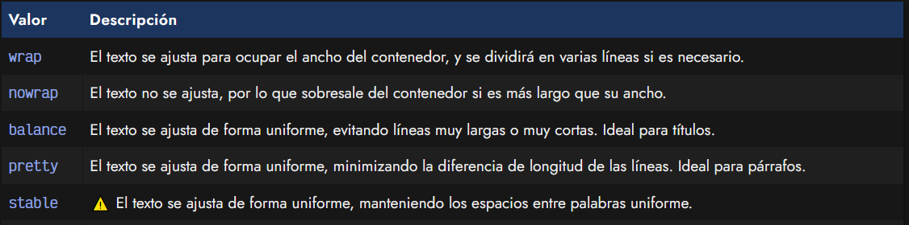

## Los valores wrap y nowrap
Observa el siguiente ejemplo. Por defecto, el valor aplicado es wrap, donde el contenido se ajusta al tamaño de ancho del contenedor, al que le hemos puesto un max-width: 300px para obligar a ajustar el texto. Si pulsamos en la demo y cambiamos el valor de text-wrap a nowrap veremos que el texto se desborda:

css:
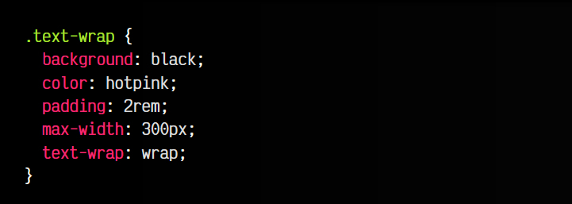

js:
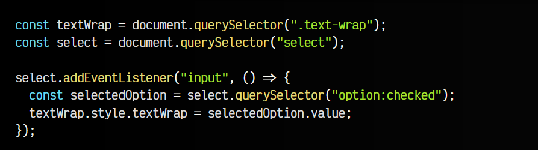

html:
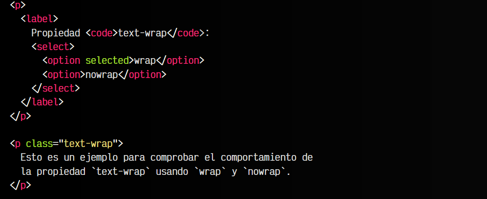

vista:
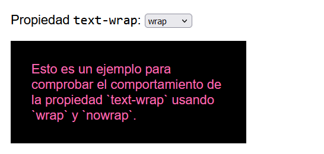
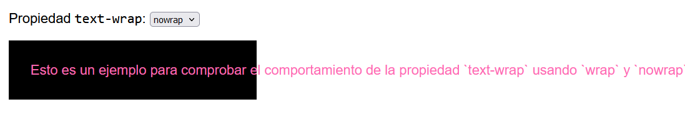

En el caso del valor nowrap el texto no se ajustará al contenido, sino que se desbordará. Aunque no es lo habitual, en algunas ocasiones nos puede interesar este comportamiento.

## El valor balance
El valor balance se suele utilizar en titulares y headings. Con él conseguimos que nuestros titulares, de tener múltiples líneas, sean equilibrados y eviten los tamaños de línea excesivamente pequeños o excesivamente largos.

En este ejemplo puedes cambiar el valor de text-wrap que se aplicará al titular (la zona violeta):

css:
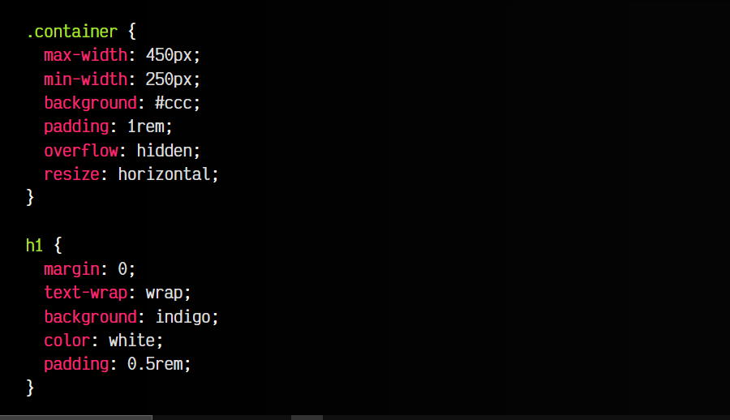

js:
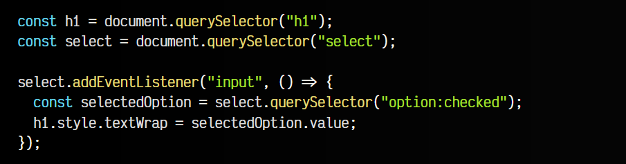

html:
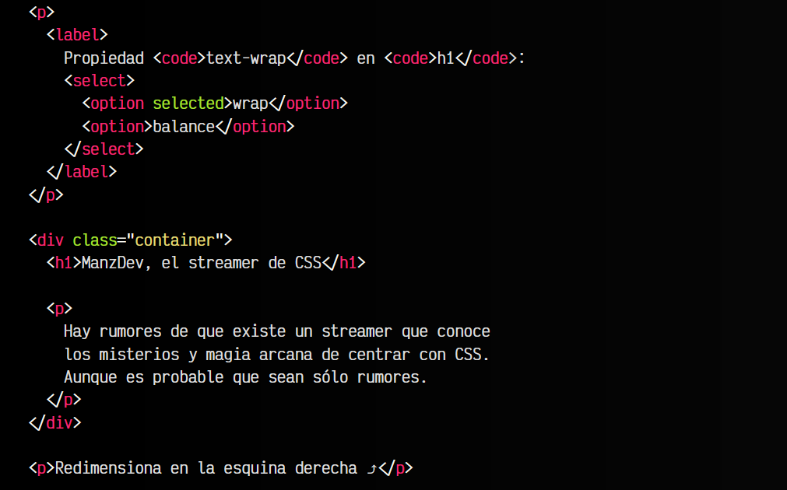

vista:
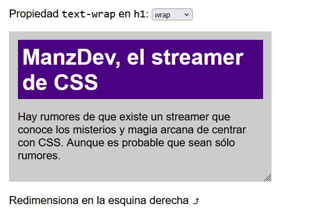
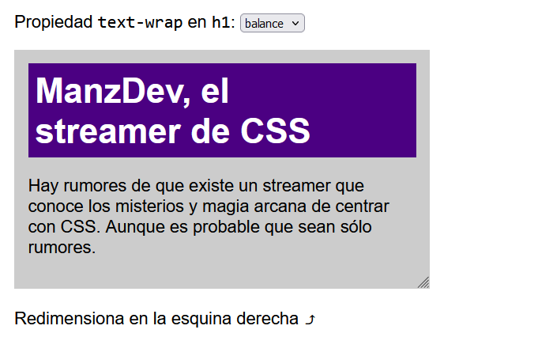

## El valor pretty
Por otro lado, el valor pretty suele utilizarse en párrafos de texto, y no en titulares. En este caso, el texto se ajustará intentando que la longitud de las líneas de los párrafos sea lo más similar posible, consiguiendo un aspecto más equilibrado.

Observa el ejemplo siguiente, donde cambiamos el párrafo a este valor:

css:
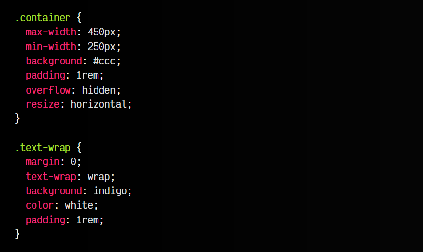

js:
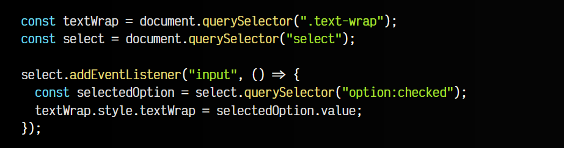

html:
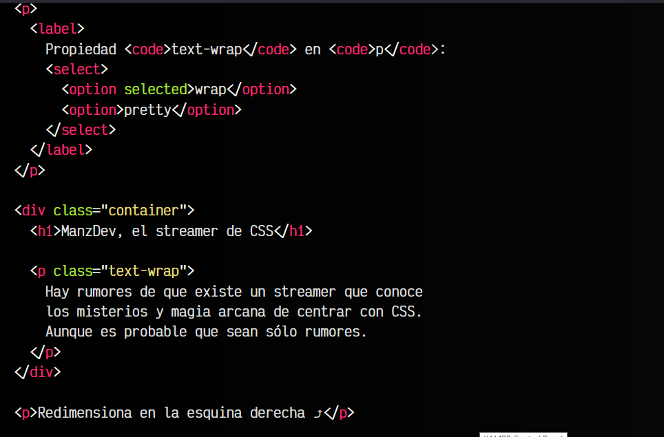

vista:
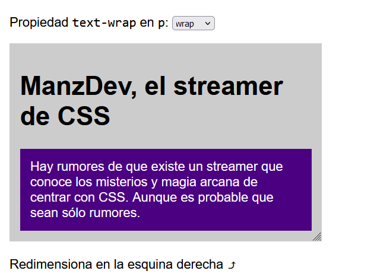

## El valor stable
Por último, el valor stable nos permite ajustar el texto de forma que se mantengan los espacios entre palabras de forma uniforme. Esto nos permite que el texto sea más estable, algo que se suele observar, por ejemplo, cuando estamos editando una zona de texto.

Por ejemplo, si tuvieramos un fragmento de texto con el atributo contenteditable, dándo al usuario la capacidad de editar ese texto, sería una situación ideal para aplicar el valor stable:

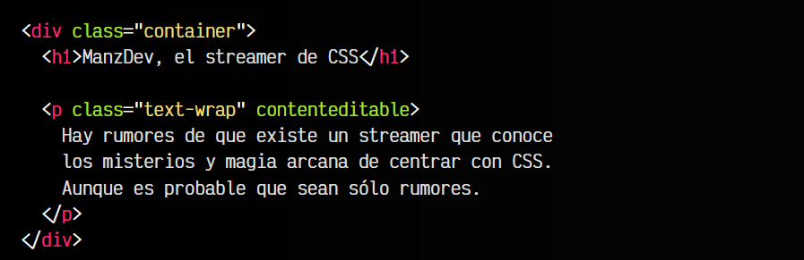

Este valor aún es experimental, y tiene poco soporte en navegadores. Procede con precaución:

Ten en cuenta que la propiedad text-wrap es un atajo de las propiedades text-wrap-mode (wrap y nowrap) y text-wrap-style (resto). Sin embargo, se recomienda no utilizarlas aún a favor de text-wrap, ya que sus nombres son provisionales.
