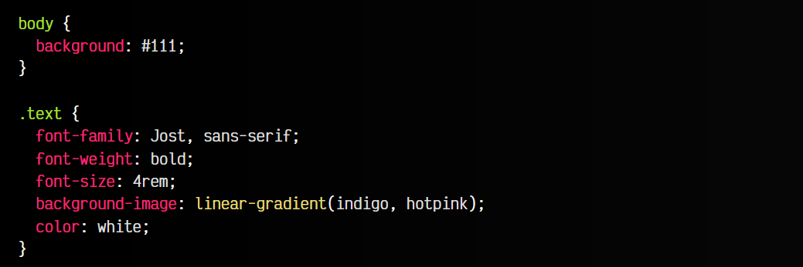
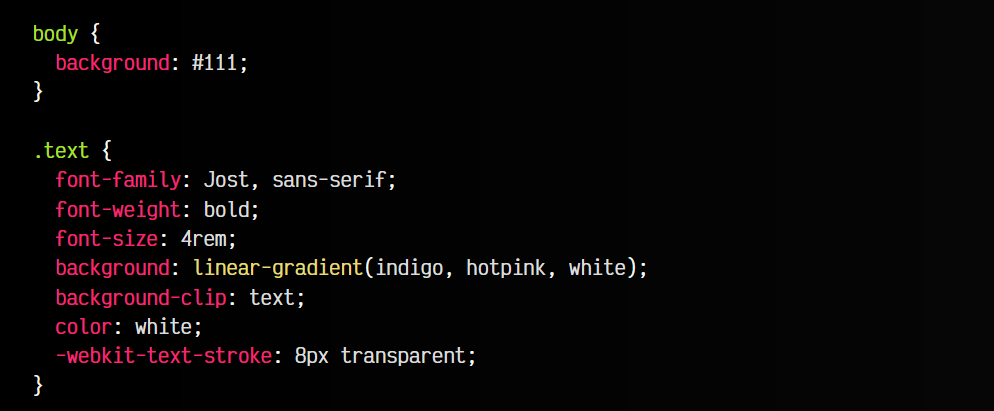
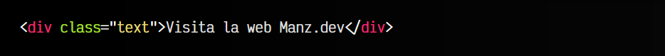

# 
Textos con degradados

En ciertas ocasiones nos gustaría utilizar textos con colores degradados. Sin embargo, podemos pensar que es algo imposible de realizar, puesto que la propiedad color para dar color a un texto no soporta gradientes. Aunque esto es cierto, existen algunos «trucos» para conseguir textos con gradientes.

## Creando textos con gradiente
Vamos a empezar por crear un pequeño fragmento de código CSS donde establecemos una tipografía, con un grosor bold y un tamaño concreto. Además, colocamos un degradado de fondo y un color de texto blanco:

css:

html:

vista:

¡Un momento, Manz! Me has estafado. ¡No era esto lo que yo quería con «Texto con degradado». No te preocupes, esto es sólo un primer paso para hacer lo que buscas, en las siguientes líneas lo modificaremos.

## La propiedad background-clip
Existe una propiedad algo desconocida denominada background-clip. La mencionamos más en detalle en el post sobre [la propiedad background-image](https://lenguajecss.com/css/imagenes-y-fondos/propiedad-background-image/) y relacionadas. Sin embargo, esta propiedad, tiene un valor text no estándar, que viene muy bien para casos como este.

Observa que en el ejemplo anterior, hemos añadido el background-clip: text y parece que deja de funcionar el background-image:

css:

html:

js:

vista:

Sin embargo, lo que está ocurriendo es que background-clip: text está indicando al navegador, que recorte el fondo justo con el contorno del texto. Lo que ocurre, es que, como tenemos el color de texto en blanco, tapa este recorte y parece que ha inhabilitado el fondo, que en realidad se sigue efectuando.

Si cambiamos el valor de color a transparent o algún valor con canal alfa o transparencia, veremos el gradiente de fondo.

► Más sobre la propiedad [background-clip.](https://lenguajecss.com/css/imagenes-y-fondos/propiedad-background-image/#la-propiedad-background-clip-origin)

## La propiedad -webkit-text-fill-color
Hay que saber que el color: transparent con el background-clip: text puede que no funcione bien en algunos navegadores, por lo que suele ser más seguro utilizar la propiedad -webkit-text-fill-color.

Esta propiedad no es una propiedad estándar, sin embargo, está bien soportada en los navegadores actuales y se puede utilizar para conseguir el mismo efecto anterior, pero con mayor grado de compatibilidad.

Observa el siguiente ejemplo:

css:

html:

vista:

Como puedes ver, se sigue observando el gradiente sin necesidad de usar color: transparent. Además, hemos modificado el gradiente añadiendole puntos de parada. Recuerda que puedes utilizar otros tipos de gradiente, como radial o cónico, y utilizar propiedades que los modifiquen.

## Crear textos con bordes gradientes
De la misma forma que hemos visto hasta ahora, podemos utilizar la propiedad -webkit-text-stroke que explicamos en el artículo contorno en tipografías. Esta propiedad hace lo mismo que -webkit-text-fill-color, pero en lugar de con el relleno, con el borde.

Esto nos permitiría establecer un color: white en nuestro texto, pero luego, con -webkit-text-stroke volver transparente el borde o contorno del texto y que se refleje el gradiente que tenemos de fondo:

css:

html:

vista:

Recuerda que ciertas propiedades que hemos mencionado no son estándar, por lo que hay que incluir el prefijo -webkit en dichas propiedades.

## Crear textos con imagen
Si ya has trabajado con imágenes y gradientes en CSS, como te habrás imaginado, igual que utilizamos gradientes podemos utilizar imágenes, por lo que también podríamos crear un texto que en lugar de un degradado utilice una imagen.

Observa este ejemplo. Simplemente hemos cambiado el background-image por una imagen, en lugar de utilizar un gradiente:

css:

html:

vista:

## Crear textos con gradientes animados
Y como habrás podido imaginar, también podemos animar los gradientes si queremos conseguir algún efecto un poco más llamativo. Para ello, creamos una [animación CSS](https://lenguajecss.com/css/animaciones/animaciones/), y posteriormente, le damos un tipo a la variable CSS --angle, para que el navegador sepa como debe crear su animación:

css:

html:

vista:

Como ves, varias formas interesantes de crear textos con degradados o imágenes.