# 
Textos y alineaciones

Hasta ahora hemos visto propiedades que se centran en modificar aspectos relacionados con las tipografías, pero CSS dispone de propiedades para modificar aspectos de textos, alejándose de criterios de tipografías, y centrándose más en objetivos de alineación, tratamiento de espaciados o detalles similares.

Dichas propiedades se centran en varios apartados:

   - 1️⃣ Espacios en blanco
   - 2️⃣ Límites de líneas y palabras
   - 3️⃣ Alineaciones de texto
   - 4️⃣ Espaciados de texto

## Espacios en blanco
Habrás observado que si en tu código HTML escribes 5 espacios en blanco seguidos, el navegador a la hora de renderizarlo los unifica en un sólo espacio en blanco, por lo que no importa cuando espacios en blanco escribas, a la hora de renderizarlos sólo tendrá en cuenta uno:

Esto se puede modificar de varias formas. La primera y quizás la más antigua y poco adecuada, sería reemplazar cada espacio que se quiere visualizar en el navegador por la entidad HTML de no break space, es decir el código &"nbsp";. Esto representa literalmente un espacio en blanco.

## La propiedad white-space
Sin embargo, no es la mejor solución, ya que puede ensuciar bastante el código HTML y no es demasiado semántico. Existe una propiedad CSS denominada white-space, que permite modificar el comportamiento de los espacios en blanco en el HTML a la hora de renderizarlos.

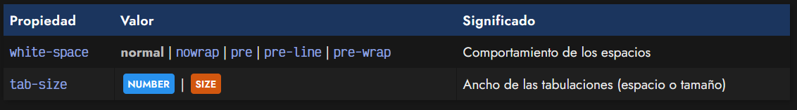

Utilizando la propiedad white-space, podemos indicar el comportamiento que tendrán los espacios en blanco, que por defecto, como hemos visto, tienen el valor normal y no se muestra sino uno solo. Sin embargo, tiene otros valores disponibles:

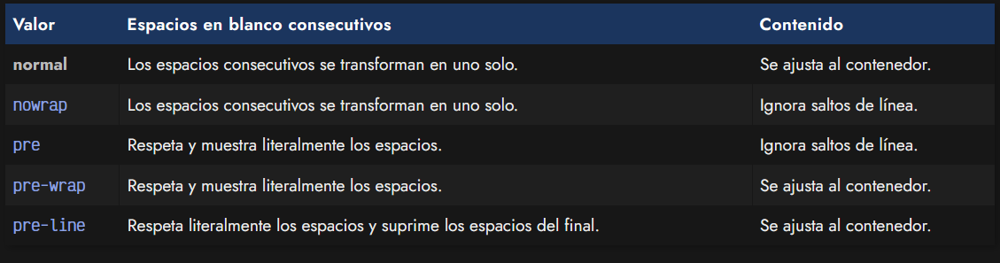

Nota: La diferencia entre pre-wrap y pre-line es que este último respeta literalmente los espacios que están antes del texto, mientras que si sobran después del texto, los suprime.

## La propiedad tab-size
Por otro lado, tenemos la propiedad tab-size que permite establecer el número de espacios que se mostrarán en el cliente o navegador al representar el carácter TAB de un (tabulador), que generalmente se convierten a espacios en blanco, sin embargo son visibles en elementos HTML como "textarea" o "pre".

Por defecto, el número de espacios que representa el navegador es de 8, sin embargo se puede cambiar por otro número de espacios o por una medida específica.

## Límites de línea y palabras
Existen ciertas situaciones donde palabras o lineas de texto demasiado largas no caben en su contenedor, y se debe tomar una decisión de como se comportará el navegador al renderizar ese contenido: desbordar el contenedor, desplazar a un lugar donde haya más espacio o partir/dividir el contenido.

Estos cambios (y relacionados) se hacen a través de las siguientes propiedades CSS:

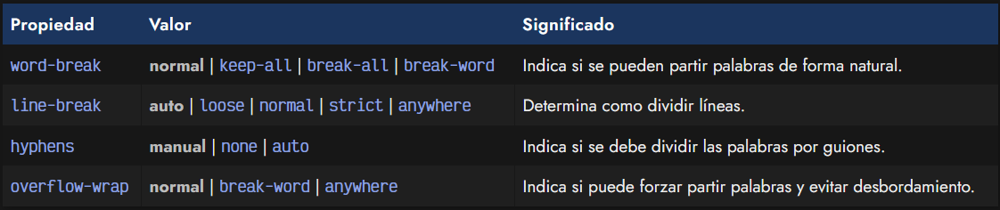

Si te encuentras con la desagradable situación en la que un texto concreto (por ejemplo, un enlace demasiado largo) no cabe dentro de un contenedor, verás que el texto puede desbordarse y provocar efectos no deseados como salirse de su lugar. Para mitigar este problema, combinaciones de las propiedades word-break, line-break, hyphens y overflow-wrap, podrían ayudarnos a modificar estos comportamientos:

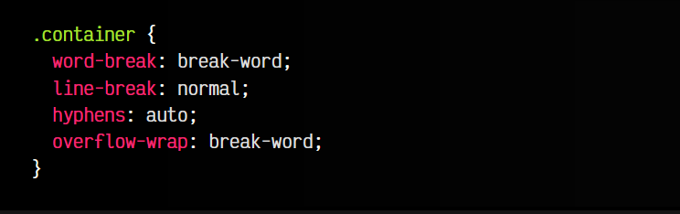

La propiedad overflow-wrap sólo funciona cuando white-space está establecida a valores que respeten los espacios. La propiedad word-wrap es la antigua forma de referirse a overflow-wrap.

## Alineaciones de texto
Cuando estamos escribiendo mucho texto en nuestros elementos, es posible que necesitemos alinear los textos, para colocarlos de una forma específica: texto a la izquierda, texto a la derecha, texto centrado, etc... Para ello, utilizaremos las siguientes propiedades CSS:

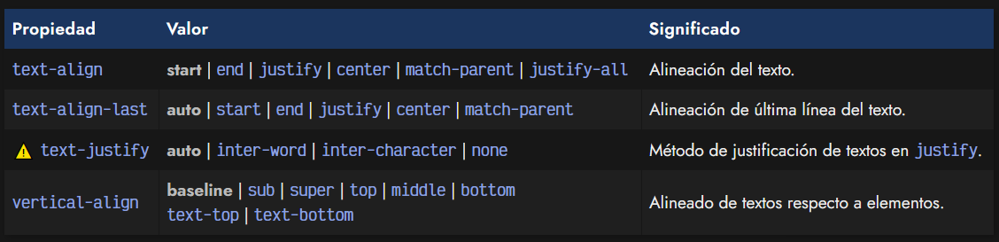

La primera propiedad CSS text-align sirve para alinear textos, mientras que text-align-last sirve para alinear la última línea del texto. En ambos casos, se pueden utilizar los siguientes valores:

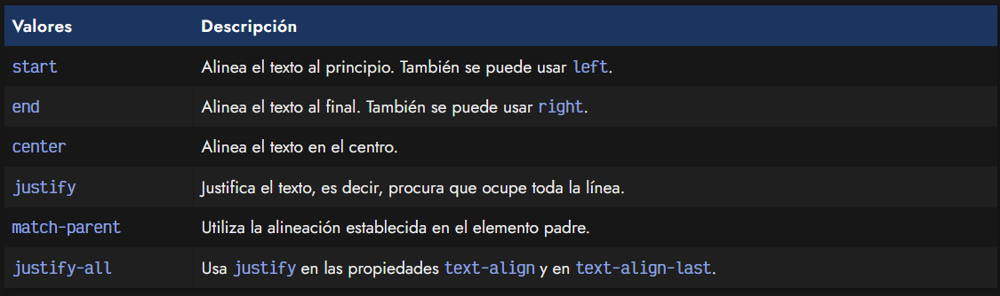

En la propiedad text-justify, podemos indicar el tipo de justificación de texto que el navegador realizará: automática (el navegador elige), ajustar el espacio entre palabras (el resultado de ajustar con la propiedad word-spacing), ajustar el espacio entre par de carácteres (el resultado de ajustar con la propiedad letter-spacing) y justificación desactivada.

Sin embargo, ten en cuenta que el soporte de esta propiedad no está muy extendido.

## La propiedad vertical-align
Al igual que existe text-align para alinear horizontalmente, también existe la propiedad vertical-align , que se encarga de la alineación vertical de un elemento. Puede ser muy interesante, por ejemplo, para alinear textos al lado de las imágenes.

Se pueden establecer las siguientes opciones para vertical-align:

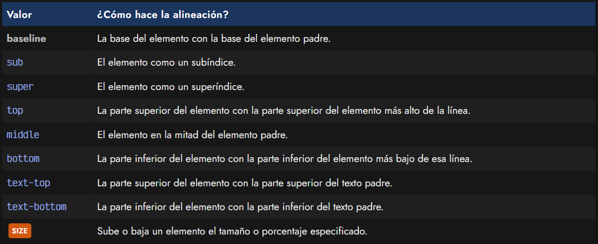

Cuidado al utilizar vertical-align. Esta propiedad puede querer utilizarse para centrar verticalmente un elemento, sin embargo, su utilización es un poco menos intuitiva de lo que en un principio se cree, ya que se debe utilizar para alinear textos respecto a elementos. Para alinear bloques de contenido o crear estructuras de diseño, véase Flexbox o Grid.

## Espaciado de texto
Existen varias propiedades mediante las cuales podemos crear espacios en diferentes zonas, por ejemplo, entre líneas, letras o palabras. Estos espacios sirven para ajustar visualmente las tipografías y que se puedan leer de una forma mucho más agradable, no canse tanto la vista, y simplemente mejorar la experiencia del lector.

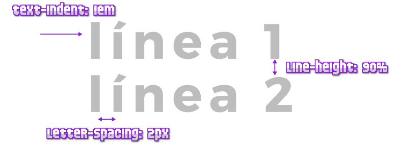

Las propiedades que tenemos para modificar estos detalles son las siguientes:

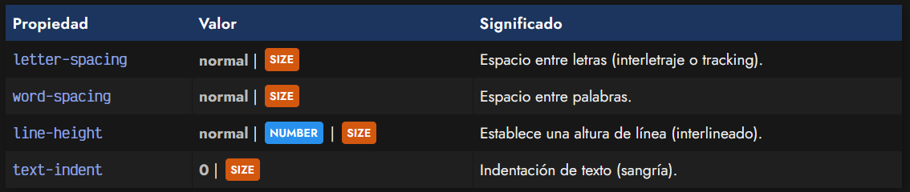

## La propiedad letter-spacing
La propiedad letter-spacing , permite indicar el espacio de separación que hay entre cada letra de un texto, denominado comúnmente interletraje o tracking.

Si utilizamos valores negativos tendremos las letras más unidas, mientras que con valores positivos, las letras se encontrarán más separadas unas de otras.

## La propiedad line-height
Por su parte, la propiedad line-height permite especificar la altura que tendrá cada línea de texto de un párrafo. Esto es una característica que puede facilitar muchísimo la lectura, puesto que un interlineado excesivo puede desorientar al lector, mientras que uno insuficiente puede hacer perder al visitante el foco en el texto.

## La propiedad word-spacing
La propiedad word-spacing permite establecer el espacio que hay entre palabras en un texto determinado. Esto puede facilitar la legibilidad de los textos de una página web y da flexibilidad y control sobre ciertas tipografías que puede que no tengan suficiente espacio entre las palabras escribas, ya que sus espacios tienen un tamaño insuficiente.

## La propiedad text-indent
Por último, la propiedad text-indent establece un tamaño de indentación, o lo que es lo mismo, hace un sangrado, en la primera línea del texto, desplazándolo la longitud especificada hacia la derecha (o izquierda en cantidades negativas).

La propiedad text-indent tiene una sintaxis avanzada que permite aplicar algunos extras:

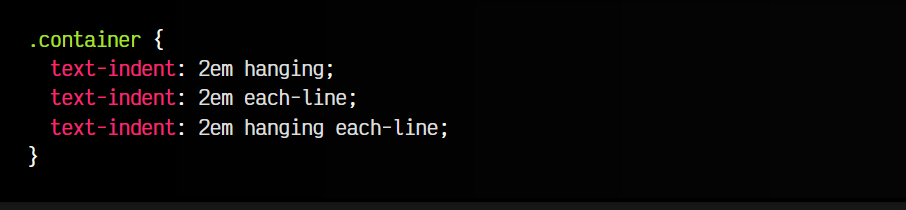

Los valores significan lo siguiente:

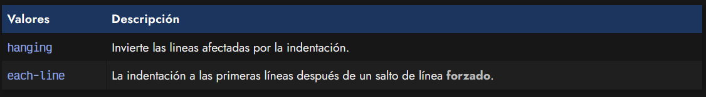

Sin embargo, aunque el soporte básico de text-indent se soporta correctamente, el soporte de estas dos últimas características no está demasiado extendido.