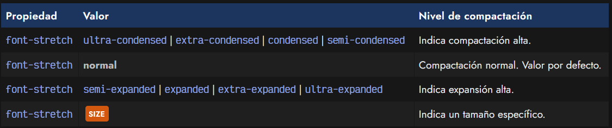
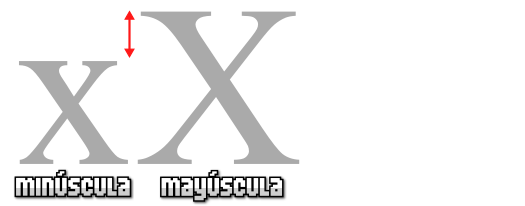
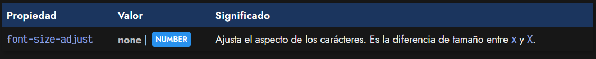
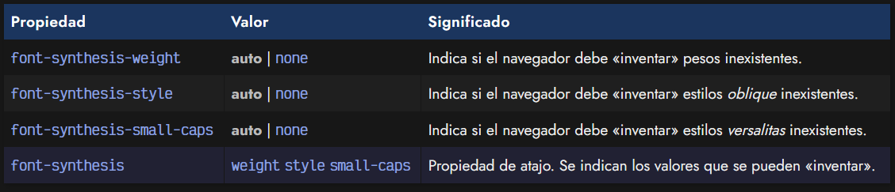
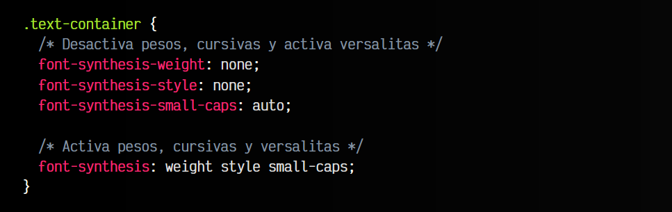

# 
Ajustes en tipografías

Dentro de la familia principal font-* de propiedades CSS para tipografías, se encuentran algunas propiedades que, aunque no se suelen utilizar tanto, permiten ajustar ciertas características de las fuentes en nuestras páginas.

Vamos a echar un vistazo y ver como funcionan.

## La propiedad font-stretch
Mediante esta propiedad podemos definir el grado de compactación o expansión de los carácteres de la tipografía, desde valores muy condensados (para ocupar menos espacio) a valores muy expandidos (para ocupar más espacio):

Como se puede ver en la última opción, se puede especificar el tamaño específico (por ejemplo en porcentajes). Recuerda que para que la propiedad font-stretch funcione correctamente, la tipografía seleccionada debe poseer una versión «condensada» o «expandida» en su diseño, para así poderla aplicar. De lo contrario, no se observarán resultados.

## La propiedad font-size-adjust
Con la propiedad font-size-adjust podemos ajustar el tamaño de la tipografía indicando la diferencia de tamaño entre la x minúscula y la X mayúscula. Con esta característica, podemos conseguir reducir la proporción de tamaño entre mayúsculas y minúsculas de nuestros textos, si consideramos que no es adecuada:

Por defecto, el valor de esta propiedad es none, que establece el tamaño indicado por el diseñador de la tipografía. Ojo a la compatibilidad, ya que es una característica que aún no ha sido soportada ampliamente.

## Ajustes de carácteres inexistentes
Muchas tipografías tienen incluidos pesos para renderizar estilos en negrita, oblique o versalitas, pero muchas otras tipografías no lo tienen. El navegador, por defecto, suele «inventar» o «sintetizar» estos estilos para que, aunque no estén diseñados, pueda renderizarlos en el navegador.

Sin embargo, en algunas ocasiones puede que no se vean adecuadamente. Con las siguientes propiedades se puede desactivar la creación de estas versiones sintetizadas:

Algunos ejemplos del uso de estas propiedades en fragmento de código CSS:

El soporte de estas propiedades es bueno actualmente.