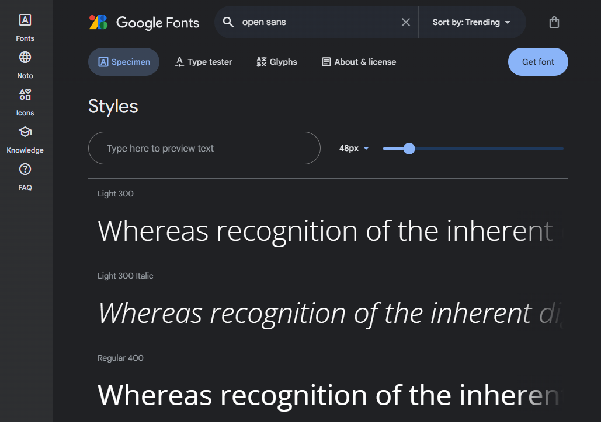
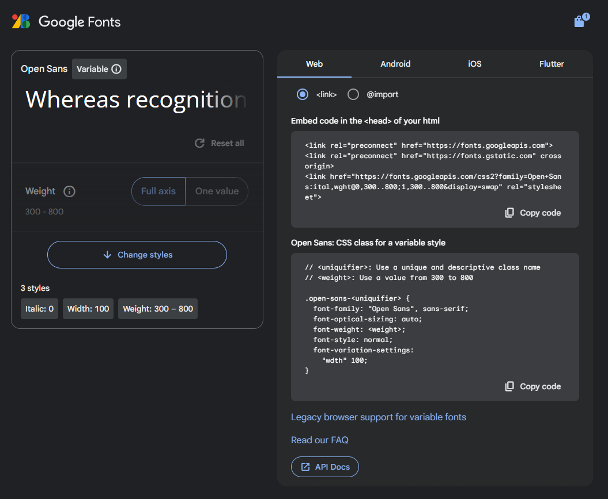
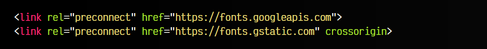
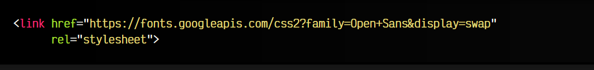
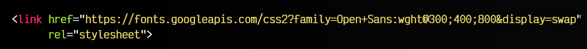
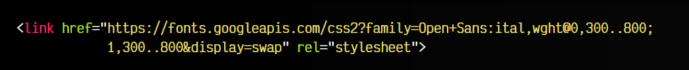
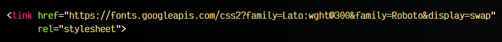
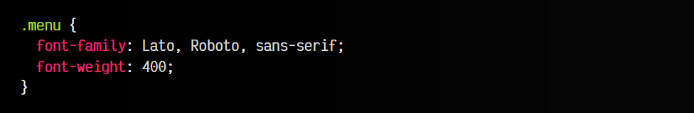

# 
Tipografías con Google Fonts

En la actualidad, es muy común utilizar Google Fonts como repositorio proveedor de tipografías para utilizar en nuestros sitios web por varias razones:

  Gratuitas: Disponen de un amplio catálogo de fuentes y tipografías libres y/o gratuitas.
  Cómodo: Resulta muy sencillo su uso: Google nos proporciona un código y el resto lo hace él.
  Rápido: El servicio está muy extendido y utiliza sus propios servidores.

En la propia página de Google Fonts podemos seleccionar las fuentes con las características deseadas y generar un código HTML con la tipografía (o colección de tipografías) que vamos a utilizar.

  Antiguamente, una de las ventajas de usar Google Fonts era el CDN compartido entre dominios, es decir, si la tipografía se usaba en una web, se compartía en otras. A partir de 2020, los navegadores han cambiado su https://developer.chrome.com/blog/http-cache-partitioning?hl=es-419, por lo que ya no aplica.

## Seleccionar la tipografía
Así pues, lo primero es acceder a Google Fonts y revisar la tipografía deseada o realizar una búsqueda para encontrarla. En nuestro caso, lo haremos con Open Sans. Una vez que encontremos la tipografía deseada, pulsamos en ella, y luego en el botón superior derecho «Get font»:

Esto nos llevará a una nueva página, donde se irán acumulando todas las tipografías que hemos ido seleccionando. En nuestro caso, solo tendremos una. Vamos a la zona derecha, y pulsamos en el botón «Get embed code». Nos mostrará varios fragmentos de código, que debemos comprender para utilizar la tipografía:

En la parte izquierda tenemos algunas opciones de personalización. En la parte derecha, se nos muestra una serie de pestañas dependiendo si queremos utilizar la tipografía en web o en apps (Android, iOS o Flutter). Nos centraremos en la de web, y vamos a analizar el fragmento de código que nos proporciona.

## Preconexión a Google Fonts
La etiqueta <link rel="preconnect"> es un fragmento de código para que el navegador haga una preconexión a los subdominios de descarga de las tipografías. Esto hace que el tiempo de descarga sea un poco más corta:

## Cargar la tipografía en HTML
Existen dos formas de incluir la tipografía en nuestra página. Mediante un fragmento de código HTML, marcando la opción <link>, o mediante un fragmento de código CSS, marcando la opción @import. Veamos el fragmento de código que nos aparece si marcamos la primera, <link> para añadirlo en nuestro código HTML, más concretamente, antes de cerrar la etiqueta </head>:

En el código anterior podemos ver una etiqueta <link rel="stylesheet">, que es un archivo CSS prefabricado de Google con reglas @font-face para cargar la tipografía Open Sans desde sus servidores.

Observa bien la URL de su atributo href, porque cada una de las partes de la URL hace referencia a algun detalle especial de esta tipografía, que vamos a analizar a continuación.

## Tipografía con múltiples pesos
Al añadir el código anterior, estaremos incluyendo código CSS para preparar nuestra página para utilizar la tipografía Open Sans con el peso 400 (el peso por defecto). Sin embargo, es posible que en la URL tengamos varios pesos diferentes de la tipografía. En ese caso, se vería así:

Observa que tenemos los pesos 300, 400 y 800. De esta forma, podremos utilizar la propiedad CSS font-weight para indicar que peso concreto queremos utilizar de los que hemos cargado.

## Tipografías con pesos variables
Es posible que con algunas tipografías nos ofrezcan el código de la tipografía variable. Esto es una modalidad que veremos más adelante, que se basa en que todos los pesos están en una misma tipografía, y no en tipografías diferentes. Esto, para web, suele ser mucho más adecuado.

Dependiendo de las opciones de personalización que mencionamos más atrás, el código que se nos proporciona aquí sería similar al siguiente:

   - El texto ital nos indica que queremos la tipografía con estilo italica.
   - El texto wght nos indica que queremos pesos variables.
   - El texto 300..800 nos indica que queremos pesos desde 300 hasta 800

Pero hablaremos más sobre esto posteriormente en el apartado de Fuentes variables. Volvamos a las tipografías individuales.

## Múltiples tipografías
Además, también podemos hacer lo mismo añadiendo diferentes tipografías, con diferentes pesos. Por ejemplo, en el siguiente fragmento seleccionamos la tipografía Roboto (por defecto, grosor 400), la tipografía Lato (con grosor 300). El código correspondiente sería el siguiente:

De esta forma conseguimos cargar varias tipografías desde el repositorio de Google de una sola vez, sin la necesidad de varias líneas de código diferentes, que realizarían varias peticiones diferentes a Google Fonts, especialmente importante cuantas más tipografías tengamos.

Nota que en este último ejemplo, en caso de no tener instaladas ningunas de las tipografías anteriores, estaríamos realizando 4 descargas:

   - Descargamos el CSS de Google Fonts.

   - Luego, el navegador lee las reglas @font-face del CSS de Google, y ahí encontrará 2 descargas: la tipografía Lato de peso 300 y la tipografía Roboto de peso 400.

## Cargar la tipografía en CSS
Recuerda que también podemos incluir las tipografías en nuestro CSS (en lugar del HTML), seleccionando @import en lugar de <link> en la página de Google Fonts. Normalmente se suele hacer en el HTML porque suele ser ligeramente más rápido, aunque hablamos de tiempos muy pequeños.

Ten en cuenta que Google Fonts te da este código entre etiquetas . En ese caso, el fragmento de código iría en HTML, pero si lo quieres añadir en CSS, debes eliminar dichas etiquetas y la regla @import siempre debe ir al principio del fichero .css.

## Definir la tipografía a usar
Por último, no hay que olvidar que necesitaremos añadir la propiedad font-family al selector CSS que deseemos, como hemos hecho hasta ahora, indicando la tipografía que queremos utilizar. Sin esto, tendremos cargada la tipografía pero no la estaremos utilizando en ningún sitio:

El parámetro display con valor swap que aparece en la URL de Google Fonts, corresponde a la propiedad font-display, la cuál se explica aquí Propiedades avanzadas de tipografías.

        No hay que olvidar que cuantas más tipografías (y pesos) incluyamos, más lenta será la experiencia del usuario, ya que más contenido tendrá que descargar. Salvo excepciones particulares, lo habitual suele ser elegir entre 1-4 tipografías, cada una con una finalidad concreta: encabezados o titulares, tipografía de lectura normal, tipografía monoespaciada y tipografía secundaria, por ejemplo.

