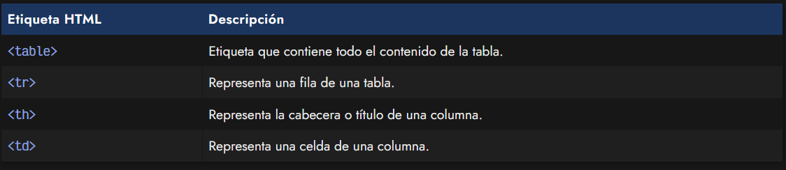
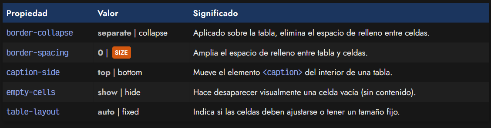
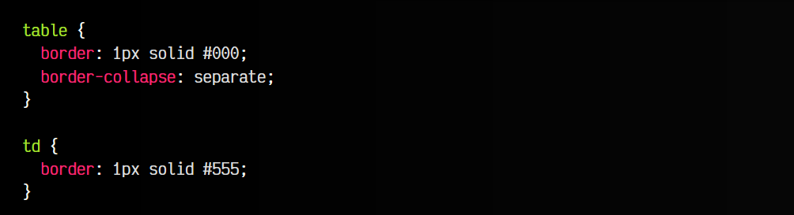
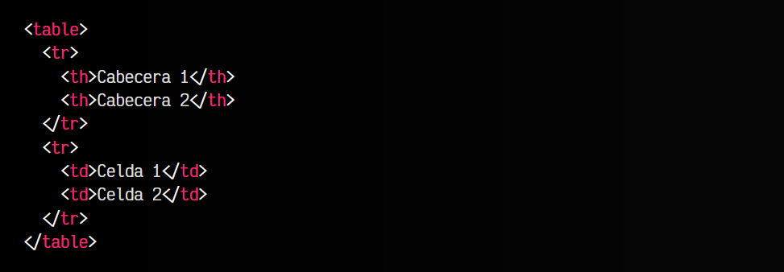
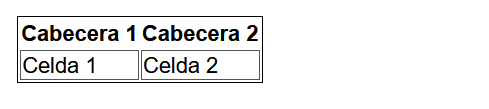
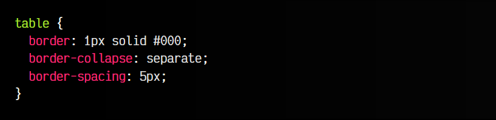
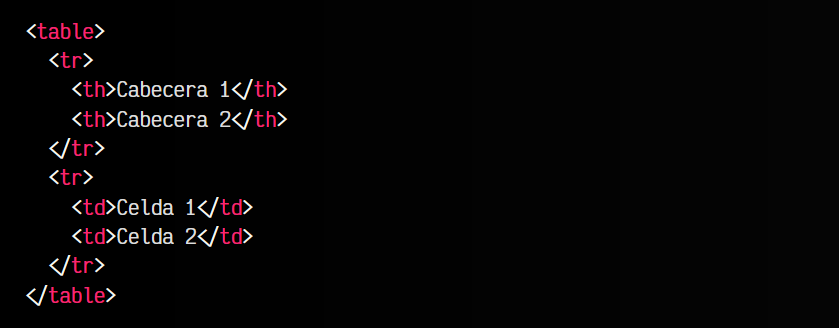
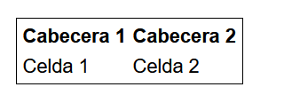

# 
Características personalizadas

## Variaciones en tipografías
Las tablas de HTML son un grupo de etiquetas que sirven para mostrar datos tabulares. En el pasado se utilizaron de forma errónea para crear diseños, debido a la ausencia de alternativas y a su facilidad de colocación al ser un esquema rectángular. Sin embargo, esta forma producía grandes problemas de rendimiento y accesibilidad. Afortunadamente, hoy en día hay mecanismos potentes y flexibles para maquetar, y ya se ha perdido esa percepción incorrecta de diseñar con tablas (aunque nunca está de más conocer un poco de historia para no repetir los errores del pasado).

Las tablas deben utilizarse para su finalidad: mostrar datos de forma organizada y legible. Para ello, recordemos que las tablas tienen varias etiquetas importantes, puedes aprender más sobre otras etiquetas relacionadas con las Tablas HTML, como "tfoot" o "thead":

Para dar estilo a la tabla o sus filas o columnas, podemos utilizar propiedades CSS genéricas que conocemos como border, background, color, font-family, padding, margin, entre otras. Sin embargo, también existen varias propiedades CSS específicas para alterar o modificar el comportamiento de ciertas características de una tabla HTML. Veamos cuales son esas propiedades:

Veamos cada una de ellas por separado.

## La propiedad border-collapse
La propiedad border-collapse permite especificar si los bordes de una tabla y sus celdas deben estar unidos (valor collapse) o separados (valor separate). El valor por defecto de esta propiedad es separate.

css:

html:

vista:

Si queremos tener una tabla compacta, quizás nos interese más la opción collapse.

## La propiedad border-spacing
En el caso que la propiedad anterior border-collapse esté establecida a separate, se puede también aplicar la propiedad border-spacing, que especifica el tamaño que medirán los espacios exteriores entre celdas.

css:

html:

vista:

Esto nos permitirá crear una separación más grande entre celdas, y permite indicar dos parámetros uno para el ancho y otro para el alto.

## La propiedad caption-side
La propiedad caption-side permite especificar donde se colocará el título o leyenda de la tabla. Este título o leyenda se crea dentro de una etiqueta "table", mediante la etiqueta "caption". Por defecto, esta leyenda aparece en la parte superior de la tabla, sin embargo, utilizando el valor bottom, podemos ubicarla en la parte inferior de la tabla, aunque esté colocado en otra zona.

## La propiedad empty-cells
La propiedad empty-cells se puede utilizar en una tabla para establecer si se debe mostrar o no una celda que no tiene contenido textual en su interior, es decir, si una etiqueta "td" o "th" sin contenido, debería mostrar sus bordes o simplemente ocultarlos. Por defecto, siempre se mostrarán (valor show), sin embargo, podemos utilizar el valor hide para ocultarlo en ese caso.

## La propiedad table-layout
Por último, disponemos de una propiedad denominada table-layout. Esta propiedad permite especificar si el navegador debería crear una versión de la tabla en la que se adapte el tamaño de las celdas automáticamente (valor auto) o, por el contrario, queremos que establezca un tamaño fijo (valor fixed).

En la mayoría de los casos, no necesitamos esta propiedad, pero podría ser especialmente útil cuando queremos que las tablas tengan un tamaño muy específico al generarse.