# Listas CSS

Al crear listas HTML mediante las etiquetas "ol" o "ul", dichas etiquetas poseen propiedades CSS específicas para alterar el estilo o características de las marcas o viñetas que se crean a la izquierda de los items de la lista, mediante la etiqueta HTML "li".

## Propiedades CSS para listas
Por ejemplo, a continuación tenemos las propiedades principales de las listas:

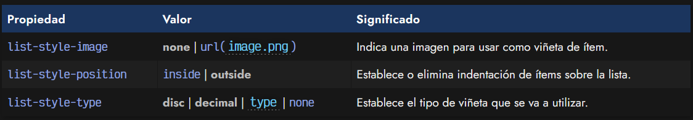

## La propiedad list-style-image
A través de la propiedad list-style-image podemos indicar la URL de una imagen para utilizarla a modo de icono o viñeta en cada ítem de la lista, es decir, en cada ítem "li". Esta propiedad, por defecto, tiene el valor none, o lo que es lo mismo, no establece ninguna imagen por cada ítem de la lista.

css:
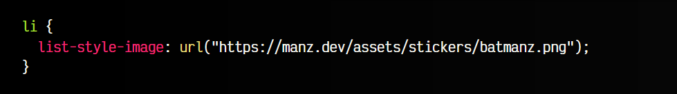

html:
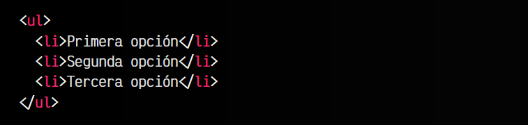

vista:
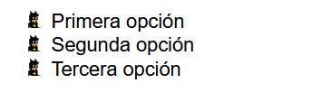

Un detalle a tener en cuenta, es que esta propiedad se puede usar tanto en los ítems "li" de cada punto de la lista, como en sus contenedores "ul" o "ol".

## La propiedad list-style-position
Por otro lado, la propiedad list-style-position permite establecer una indentación a todos los ítems de la lista, estableciendolos desplazados a la derecha (inside), el lado interior de la lista, o sin desplazar (outside), el lado exterior de la lista, opción por defecto.

css:
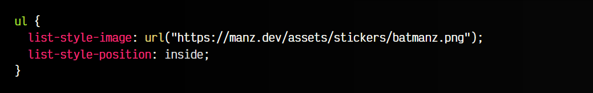

html:
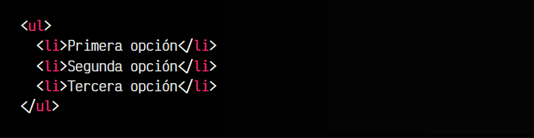

vista:
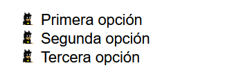

## La propiedad list-style-type
La tercera propiedad, list-style-type nos permite indicar que tipo de viñetas tendrán las listas (en el caso de no estar utilizando ningun imagen). Se establecen varios grupos que veremos en el siguiente apartado. Cada uno de ellos se puede utilizar con cualquier tipo de lista, pero generalmente, se recomienda tener en cuenta el tipo de lista. Por ejemplo, si tenemos una lista "ul" (no ordenada), aunque es posible, quizás una viñeta numerada no tenga mucho sentido.

Por defecto, las listas "ul" (no numeradas) utilizan la opción disc por defecto, mientras que las listas "ol" (numeradas) utilizan la opción decimal por defecto, mostrando una lista numérica decimal.

## Viñetas CSS para las listas
A través de la propiedad list-style-type que hemos mencionado podemos cambiar el tipo de viñeta que utilizaremos en una lista a nuestro antojo. Conviene conocer todos los tipos que existen, que aunque algunos son muy sencillos, tenemos muchos otros que dependen de los idiomas, sistemas numéricos u otros aspectos.

## Listas con símbolos
Este primer grupo, especialmente indicado para listas sin orden "ul", por ejemplo, donde se utilizará un símbolo como viñeta que no representa ningún orden específico:

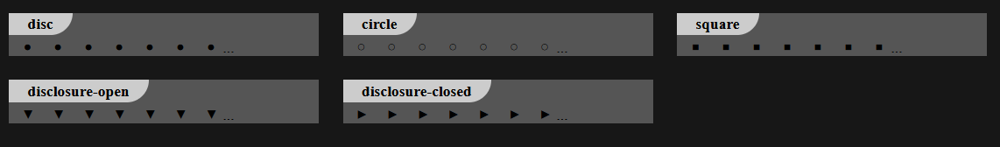

## Listas numéricas
Si lo que queremos es establecer una lista numerada "ol", los valores recomendados deberían ser uno de los siguientes:

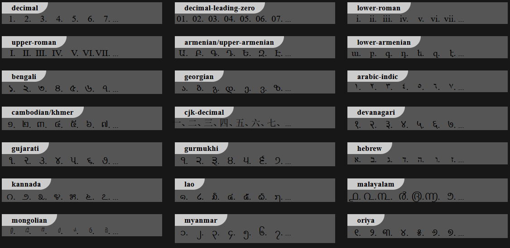

Ten en cuenta que en algunos navegadores o sistemas operativos puede que los apartados anteriores no se muestren correctamente, ya que los está generando a partir de la compatibilidad del navegador utilizado.

## Listas alfabéticas
En el caso de querer utilizar una lista numerada "ol", pero querer "numerarla" con letras, es posible con alguna de estas posibilidades:

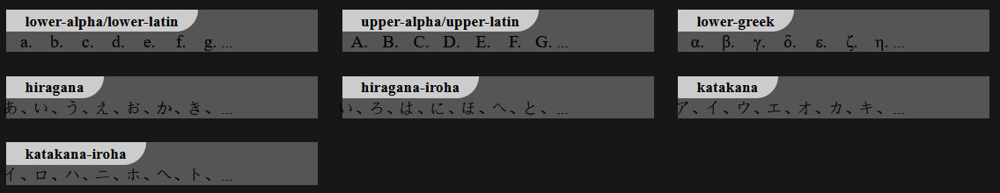

## Listas complejas
Dentro de las listas complejas podemos encontrar un primer grupo japonés, un segundo grupo coreano y un tercer grupo chino:

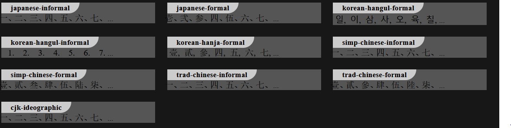

## El pseudoelemento ::marker
Al utilizar listas, puedes utilizar el pseudoelemento ::marker para hacer referencia a la viñeta en cuestión. De esta forma, podrás cambiar los estilos de dicha viñeta o retocarlos. Observa el siguiente ejemplo:

css:
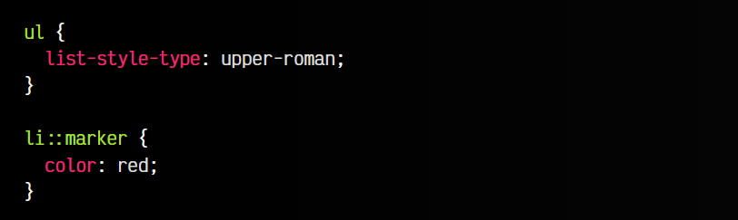

html:
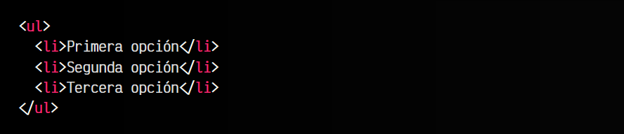

vista:
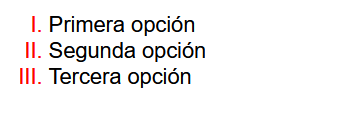

Ten en cuenta que no es posible utilizar cualquier propiedad en este pseudoelemento, y solo es posible utilizar algunas propiedades como color, content u otras.

## Atajo: La propiedad list-style
Como en la mayoría de propiedades de CSS, existe una propiedad "shorthand" de atajo que nos permite indicar los valores anteriores en una sola propiedad. Para ello, utilizaremos list-style con el orden aconsejado siguiente:

css:
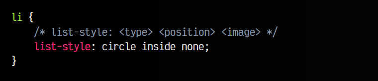

html:

vista:
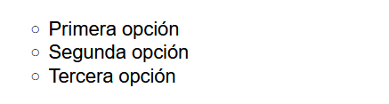

Observa que en primer lugar utilizaremos el valor de la propiedad list-style-type, en segundo lugar el valor de la propiedad list-style-position y en tercer y último lugar, el valor de la propiedad list-style-image. En caso de no necesitar indicar alguno de ellos, simplemente podemos omitirlo.

