# La propiedad display

Probablemente, una de las partes más complejas de CSS sea la creación de layouts, colocación y distribución de los elementos de una página. Sin embargo, es una parte fundamental dentro de CSS, y es necesario entenderla correctamente para que resulte más fácil de trabajar y crear nuestros diseños.

## ¿Qué es inline y block?
Antes de comenzar, debemos saber que cada etiqueta HTML tiene un «tipo de representación visual» en el navegador, lo que habitualmente se suele denominar el tipo de caja. Si no sabes nada sobre esto, te aconsejo echarle un vistazo antes al apartado Modelo de cajas.

Todos los elementos de una página web deben tener un tipo de representación, que es la forma en la que se va a comportar. En principio, partimos de dos tipos básicos y fundamentales llamados inline y block:

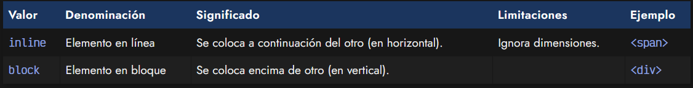

Como se menciona en la tabla anterior, por defecto, todos los elementos "div" se comportan como elementos de bloque (block) y todos los elementos "span" se comportan como elementos en línea (inline). Sin embargo, también podemos cambiar su comportamiento manualmente con CSS. Para entender esto facilmente, vamos a hacerlo todo con un "div" y alterarlo mediante la propiedad display:

css:
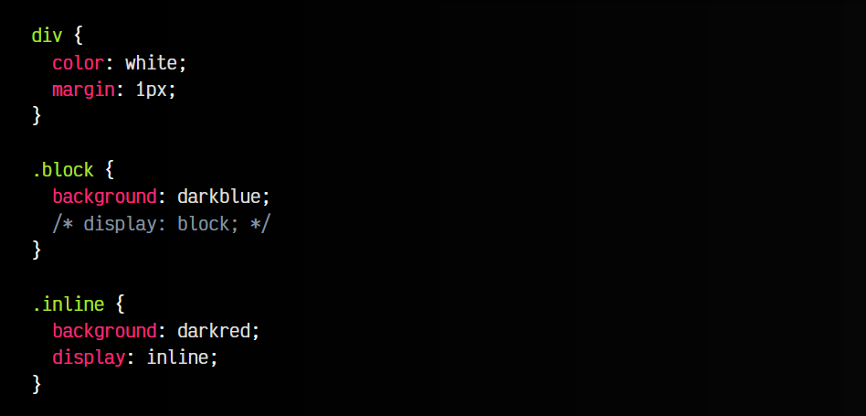

html:
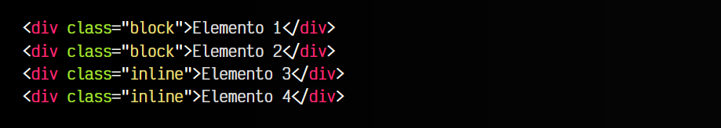

vista:
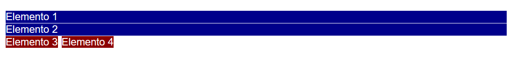

Observa que nuestro navegador muestra 4 cajas: dos azules y dos rojas. Este sería el comportamiento por defecto si utilizaramos dos "div" y dos "span". Sin embargo, si observas el código fuente, hemos utilizado cuatro "div", pero hemos alterado su representación mediante la propiedad display:

   - Los "div" por defecto tienen un display: block, por lo que no hace falta aplicarlo con display.
   - Los elementos en bloque ocupan el ancho completo del padre y se aplican uno debajo del otro.
   - Los "div" (rojos) con clase .inline se convierten en elementos en línea.
   - Los elementos en línea ocupan el ancho de su contenido y se aplican uno al lado del otro.

Pasemos a analizar detalladamente esto, para entenderlo mejor.

## La propiedad display
Como hemos dicho, por defecto cada elemento HTML tiene un tipo de representación concreto. Como norma general (con excepciones) los elementos que se utilizan dentro de un párrafo, son de tipo inline, mientras que los que se utilizan para agrupar otros elementos, son de tipo block.

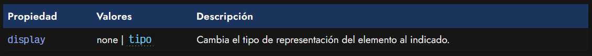

La propiedad display de CSS modifica la representación de un elemento HTML, cambiándolo al que le indiquemos; por ejemplo inline o block (u otros que veremos más adelante). Existe una amplia gama de tipos de representación de elementos HTML que podemos utilizar mediante la propiedad display.

Veamos cuales son en la siguiente tabla:

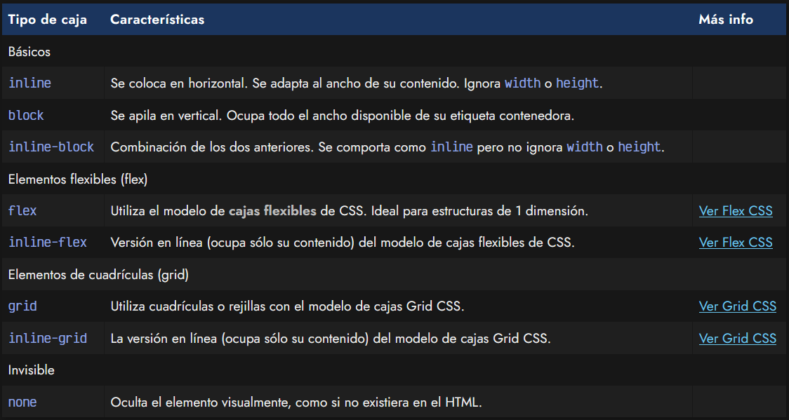

## ¿Qué es inline-block?
Si utilizamos la propiedad display con el valor inline-block, conseguiremos un elemento que funcionará como si fuera un elemento inline, pero haciendo caso a las propiedades width y height, las cuales se ignoran si estamos utilizando un display: inline.

css:
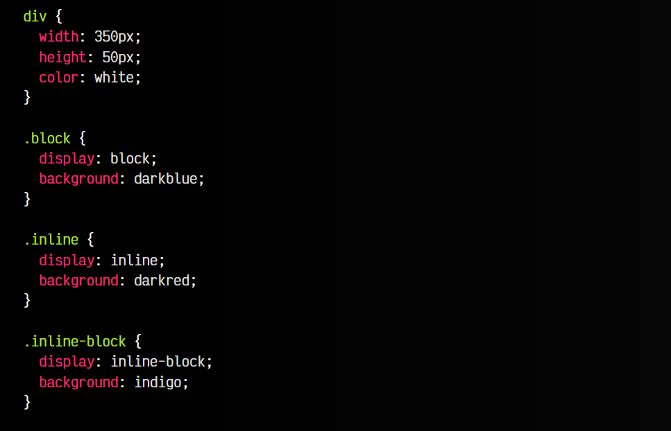

html:
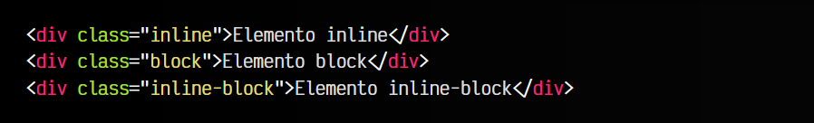

vista:
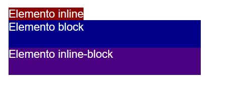

Observa que en el caso del elemento .inline, el navegador ignora las dimensiones de ancho que le hemos indicado, al contrario que los otros dos. El valor inline-block nos puede venir muy bien cuando necesitamos una mezcla de los dos tipos básicos, donde se comporte como un inline pero que haga caso a las medidas de dimensión.

## Otros valores
Como hemos podido observar, mediante la propiedad display podemos establecer diferentes mecanismos de maquetación, desde los básicos block e inline que hemos mencionado a otros que veremos más adelante como flex y grid, pero también tenemos otros menos utilizados:

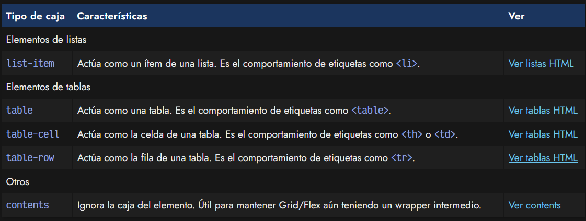

## El valor contents
Para este ejemplo, necesitaremos conocer previamente flex o grid. Utilizando display se puede conseguir un comportamiento muy especial, que puede ser realmente útil en algunas ocasiones, sobre todo cuando trabajamos con librerías de terceros, WebComponents o con Javascript (o ciertos frameworks).

Hay situaciones donde se puede arruinar el diseño de maquetaciones Grid o Flex, porque son sistemas que funcionan relacionando un elemento padre con su hijo, por lo que si se cambia el marcado HTML de forma que se rompa esa relación, el diseño deja de ser efectivo.

Imaginemos la siguiente situación, donde tenemos un layout creado con Grid:

css:
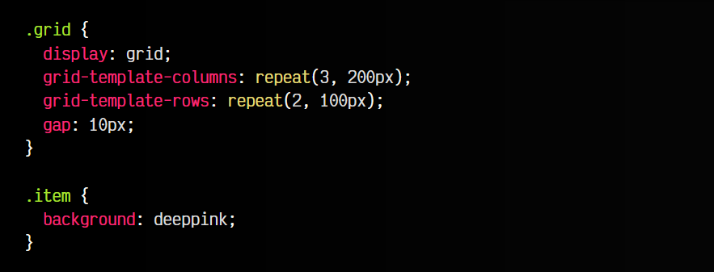

html:
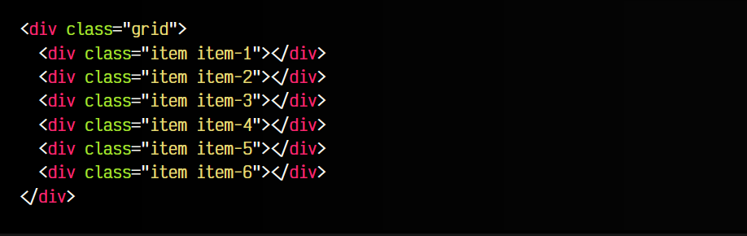

vista:
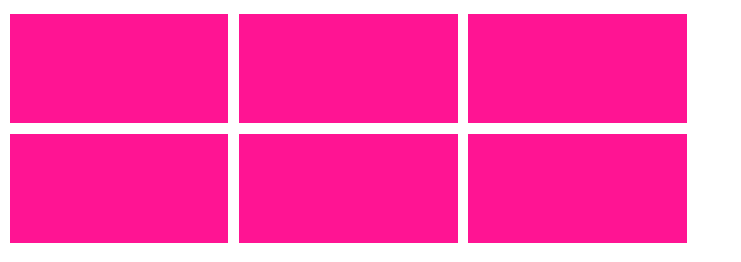

Si introducimos un elemento con clase .middle dentro del .grid, que envuelva a todos los .item, el grid dejaría de funcionar porque se ha eliminado la relación padre-hijo entre .grid y los elementos .item. Sin embargo, si añadimos un .middle con un CSS asociado .middle { display: contents }, el navegador ignorará ese elemento intermedio que insertamos por razones de funcionalidad (normalmente en situaciones de sólo diseño no ocurre) y hará como que no existe:

css:
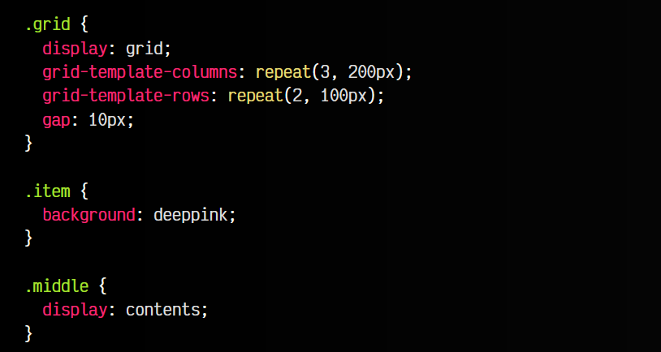

html:
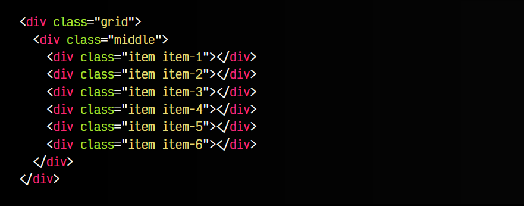

vista:
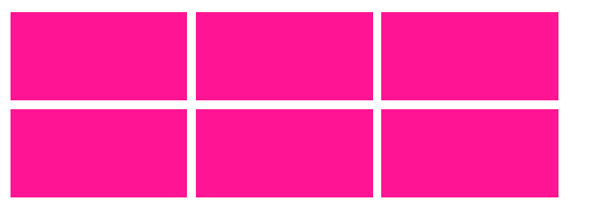

Observa que a pesar de que existe el "div" con clase middle entre .grid y los .items, sigue funcionando la relación entre ambos y conservando el estilo del grid.