# 
Alinear y centrar con CSS

Antes de comenzar a aprender a utilizar mecanismos potentes de CSS como Flex o Grid, es conveniente conocer las bases y como podemos centrar o alinear elementos con CSS, sin necesitar utilizar dichos mecanismos.

Para ello, vamos a partir de este ejemplo, donde vamos a alinear un elemento con clase .container en nuestra página sin utilizar ni Flex, ni Grid. Observa que dicho elemento no está centrado verticalmente (ni horizontalmente, pero como ocupa todo el ancho no se aprecia) ni su contenido tampoco está centrado:

css:
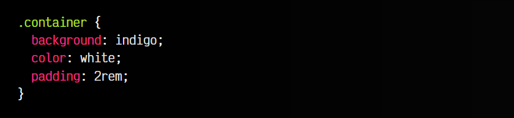

html:
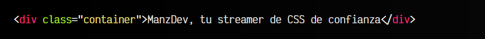

vista:

## Resetear los estilos por defecto
En primer lugar, vamos a resetear los estilos por defecto. Los navegadores tienen ciertos estilos por defecto, como por ejemplo ese margen en el "body" que hace que el recuadro no esté pegado a los bordes.

Podemos utilizar un reset CSS, sin embargo, para simplificar el ejemplo, vamos a aplicar un margin: 0 al "body". También le pondremos un fondo de color negro:

css:
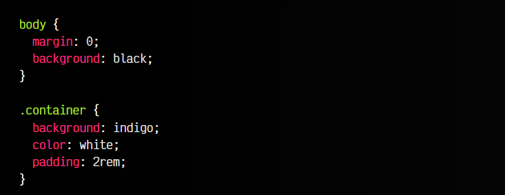

html:
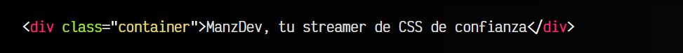

vista:

## Centrar horizontalmente
Para centrar horizontalmente un elemento sin Flex ni Grid, necesitamos cumplir algunas condiciones:

   - 1️⃣ El elemento debe tener un display: block (no sirve inline, inline-block o derivados)
   - 2️⃣ El elemento debe tener un tamaño de ancho.

Por lo tanto, vamos a darle un tamaño al .container de 300x250 y se mostrará a la izquierda de la página:

css:
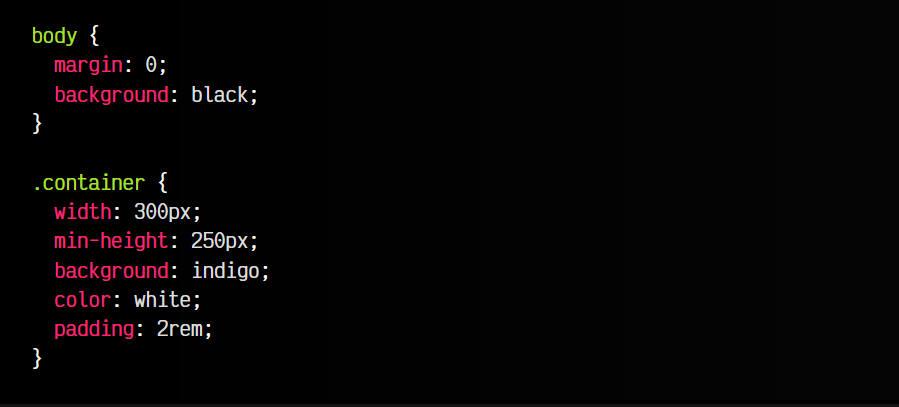

html:
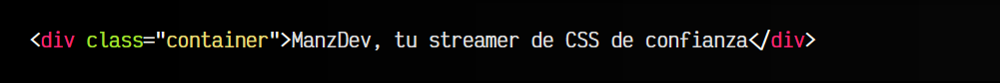

vista:
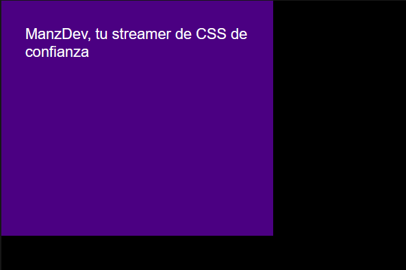

Observa que utilizado min-height en lugar de height. Con esto no obligamos a que sea siempre ese alto, sino que en el caso de tener mucha información, se pueda hacer más grande.

Ahora vamos a aplicar un margin al elemento. Observa todo el espacio sobrante a su derecha. Al aplicar un margin: auto lo que hacemos es decirle que ese espacio restante lo divida en dos: el primero lo colocará a la izquierda, y el segundo lo colocará a la derecha, y como efecto «colateral» el elemento se centrará en pantalla:

css:
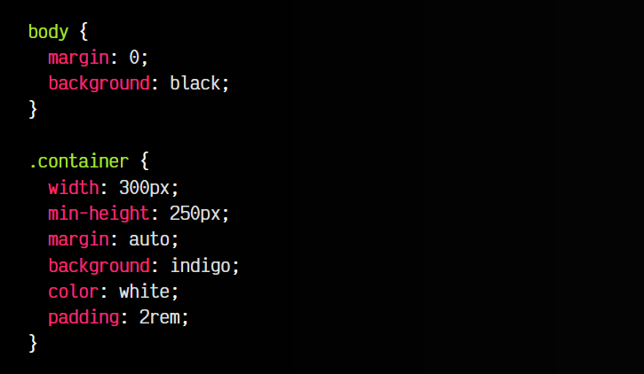

html:
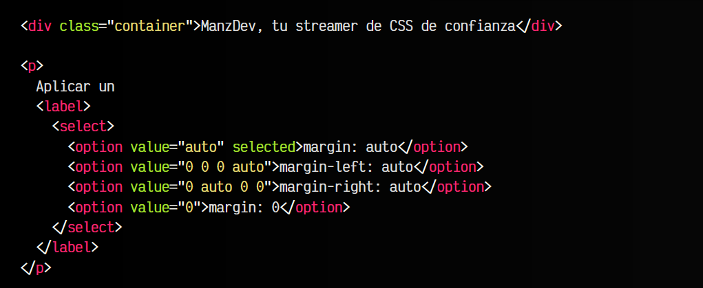

js:
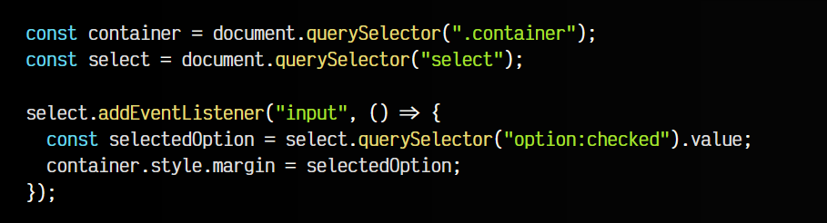

vista:
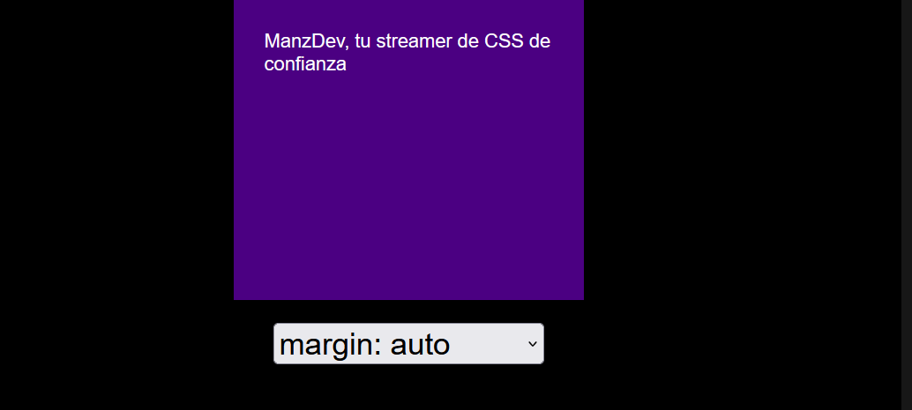
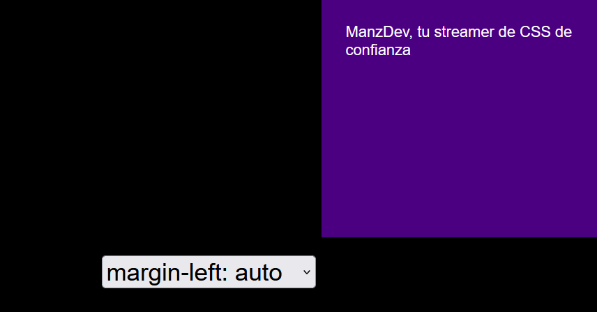
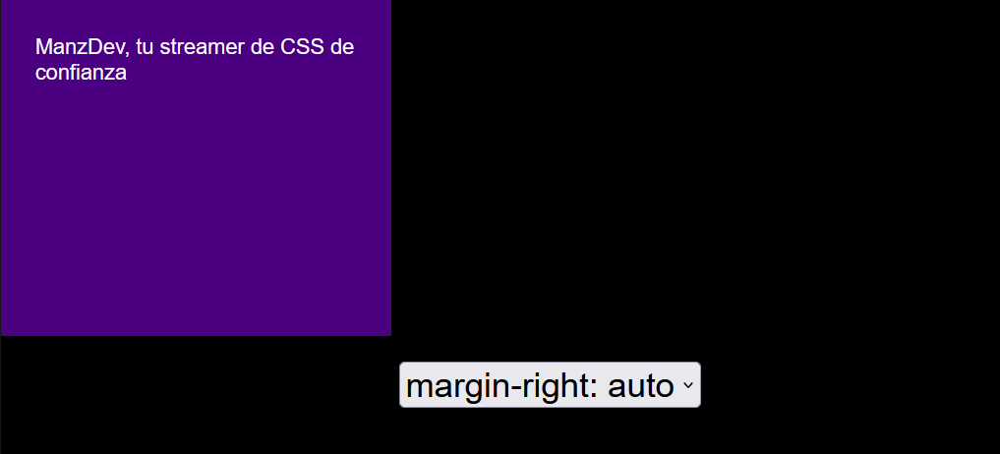
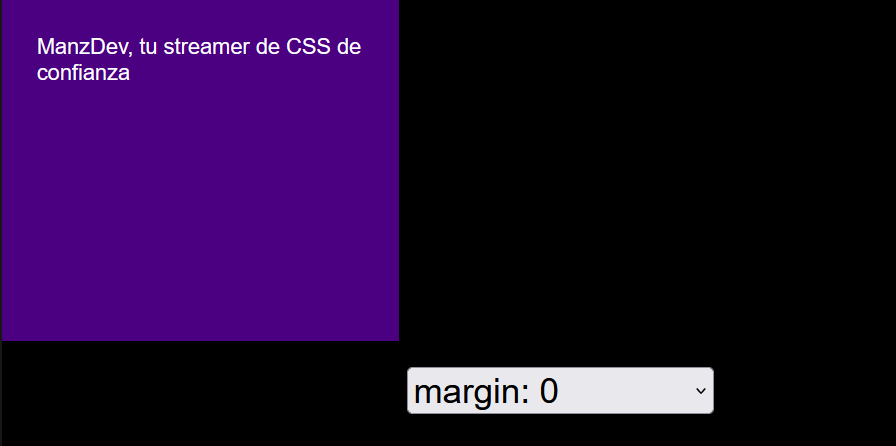

Ten en cuenta que al aplicar un margin-left: auto en el ejemplo, el margin-right permanece en 0 y viceversa. También podemos hacer híbridos como por ejemplo margin: 2rem auto, que establece un margen de 2rem arriba y abajo (verticalmente), mientras que utiliza auto a la izquierda y a la derecha (horizontalmente).

## Centrar verticalmente
Vamos ahora con el otro eje (vertical), que suele ser el más problemático, ya que se suele confundir con varios detalles adicionales. Recuerda que un documento HTML siempre tiene una etiqueta "html" que contiene una etiqueta "body", y aunque sólo se le suele dar estilo al "body", también se le podría dar al "html".

En este nuevo ejemplo, ahora tengo pintado de color negro el fondo de la etiqueta "body" y de color rosa el fondo de la etiqueta "html":

css:
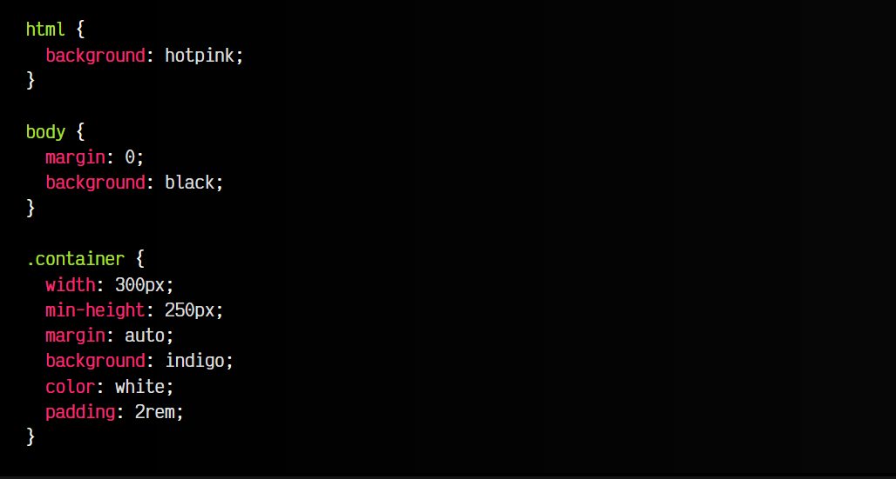

html:
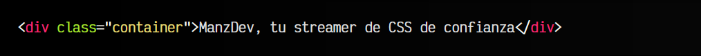

vista:

Como puedes ver, si intento centrar el elemento .container verticalmente, ya lo tendré centrado, porque "body", su padre inmediato, no tiene más espacio de alto como para poder centrarlo. Lo que suele ocurrir es que siempre tenemos el mismo color en el "body" y en el "html", por lo que no solemos darnos cuenta de este detalle.

Una sencilla forma de solucionarlo, es seguir estos 3 sencillos pasos:

   - 1️⃣ Le damos un alto de 100vh a "html". Ocupará exactamente el tamaño de alto de pantalla.
   - 2️⃣ Le damos un alto de 100% a "body". Tomará el alto del padre, o sea, de "html".
   - 3️⃣ Asegurate de tener reseteado el margen de "body" con margin: 0.

css:
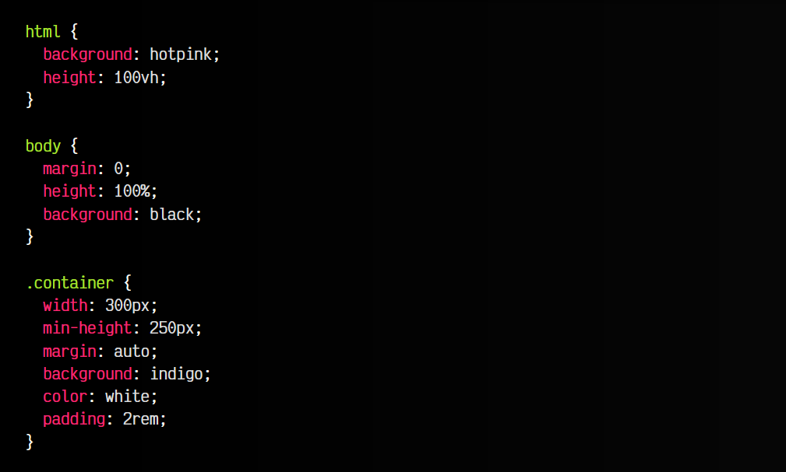

html:
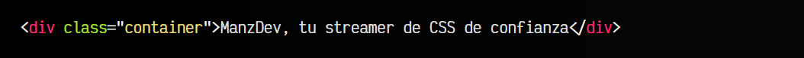

vista:
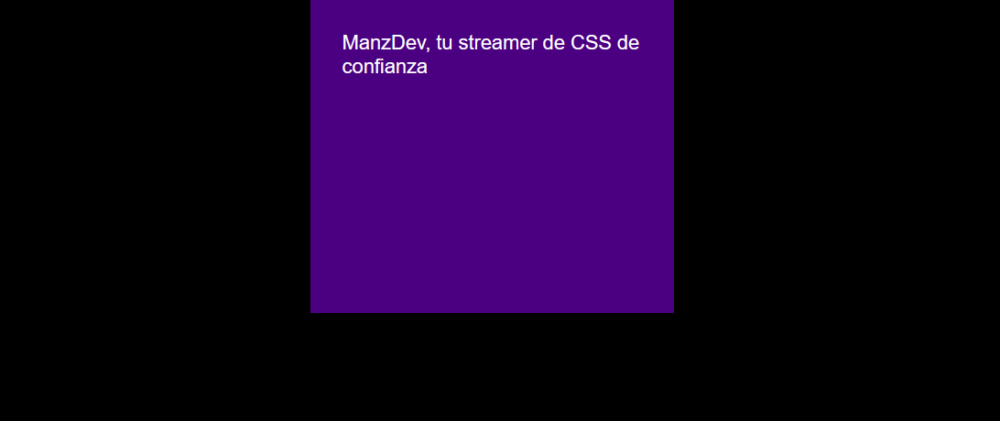

De esta forma ya hemos forzado a que la página tenga el alto del navegador, y por lo tanto haya espacio para centrarlo. Recuerda que he dejado el color de fondo diferente en "html" y "body" para que diferencies hasta donde llega cada uno, si decides modificar el ejemplo.

## La propiedad align-content en block
Aunque la propiedad align-content aparece por primera vez en contextos de Flex y Grid, recientemente se ha añadido la posibilidad de utilizarla en elementos con display: block, por lo que podemos utilizarla en este caso para centrar verticalmente de forma limpia.

Observa que al ejemplo anterior, hemos añadido al body un align-content: center, centrando así el elemento verticalmente.

css:
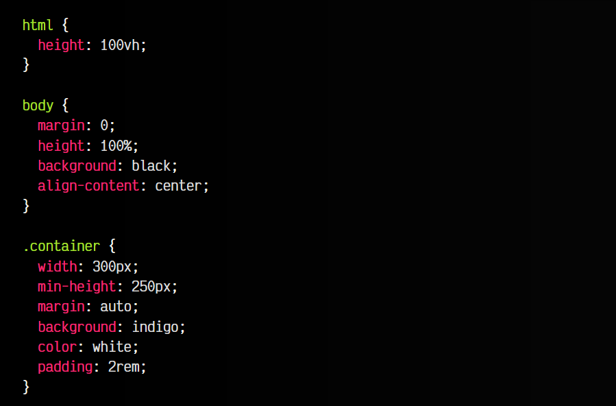

html:
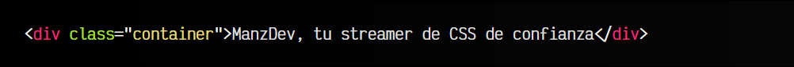

vista:
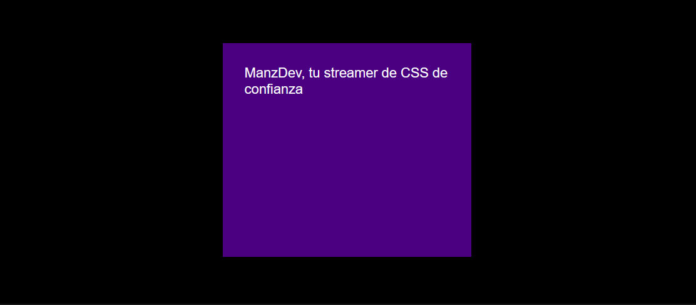

¡Ya tenemos nuestro elemento centrado verticalmente, con sólo una línea de CSS! La propiedad align-content como veremos en los próximos temas, puede tomar varios valores, pero de momento vamos a centrarnos en estos tres:

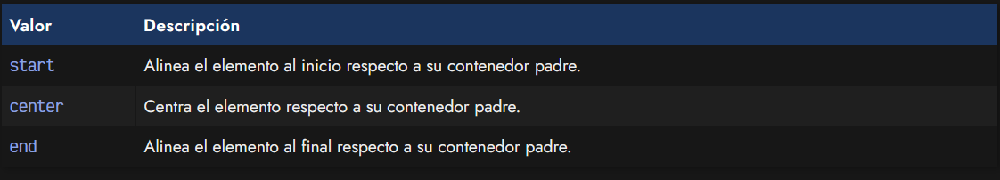

## Centrar contenido
Por último, nos queda el contenido del elemento. Observa que el texto del interior del elemento no está aún centrado. Esto ocurre porque lo que hemos hecho hasta ahora ha sido sólo para alinear el elemento respecto a su contenedor padre.

Si queremos hacer lo mismo con su contenido, estaríamos alineando su contenido (hijos) sobre su contenedor padre, el propio elemento. Para hacer esto, la forma más sencilla es aplicar en .container los siguientes estilos:

   - 1️⃣ Utiliza text-align: center para centrar el contenido horizontalmente
   - 2️⃣ Utiliza align-content: center para centrar verticalmente

css:
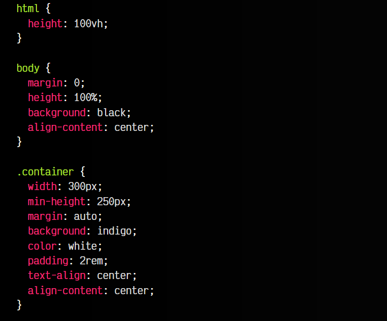

html:

vista:
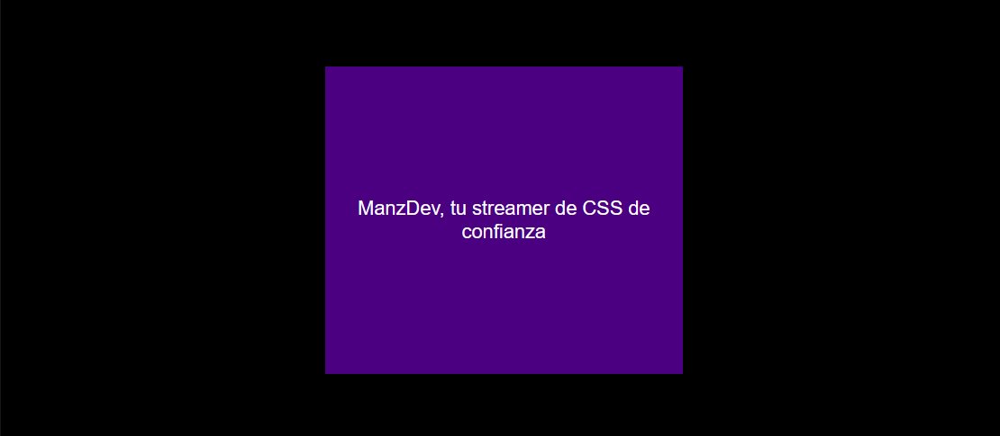

Recuerda que también puedes utilizar el truco que aprendimos de margin: auto, pero entonces tendrías que cumplir nuevamente las restricciones. Habitualmente, utilizar text-align suele cubrir muchos casos frecuentes.

Si buscas formas más sofisticadas de centrar o alinear elementos, echa un vistazo a [Centrar elementos con Flex CSS](https://lenguajecss.com/css/maquetacion-y-colocacion/flex-alinear/) y [Centrar elementos con Grid CSS.](https://lenguajecss.com/css/maquetacion-y-colocacion/grid-css-alinear/)

