# 
Multi-columnas CSS

El esquema de layouts en columnas es un antiguo sistema de maquetación de CSS en el que se puede dividir un texto o contenido en un número de columnas concreto, haciendo la tarea de división en columnas de forma automática por parte del navegador.

## Creando multicolumnas CSS
Para entender bien este sistema de maquetación, vamos a traer a nuestra mente un ejemplo donde se ve muy claro: los antiguos periódicos o panfletos de prensa escrita. Estos medios de prensa utilizaban un esquema de varias columnas para separar separar la información, aprovechar el espacio y crear múltiples columnas con contenido.

Justo esta idea es la que trae el sistema de columnas CSS a la web, utilizando principalmente las propiedades column-count y column-width que vemos en la siguiente tabla:

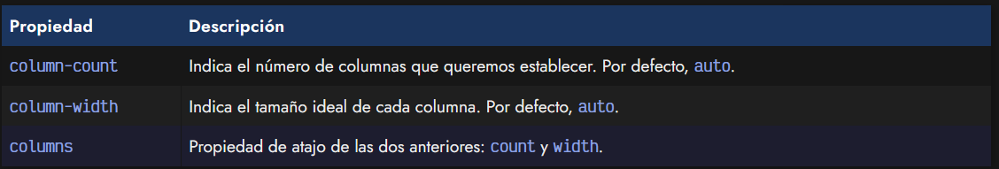

Así pues, partamos del siguiente ejemplo. Un contenedor con 3 párrafos y un titular, al que le añadimos un CSS:

html:
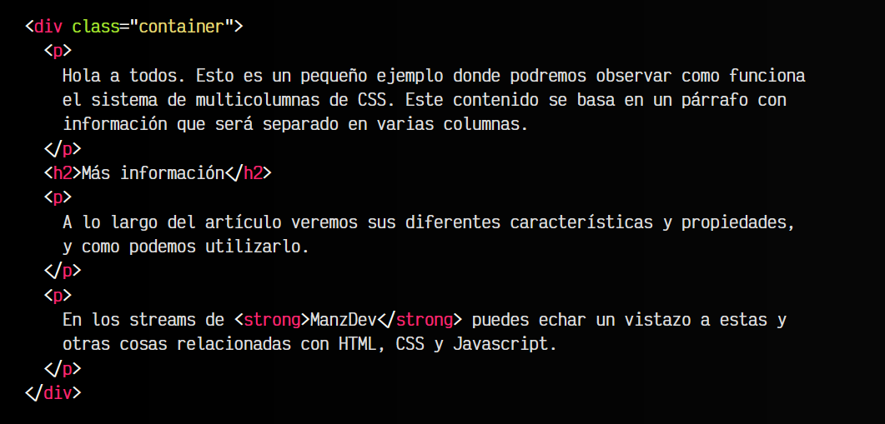

css:
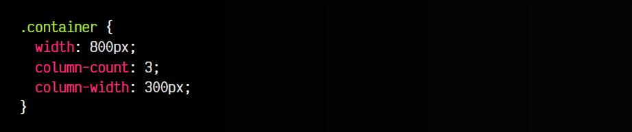

vista:
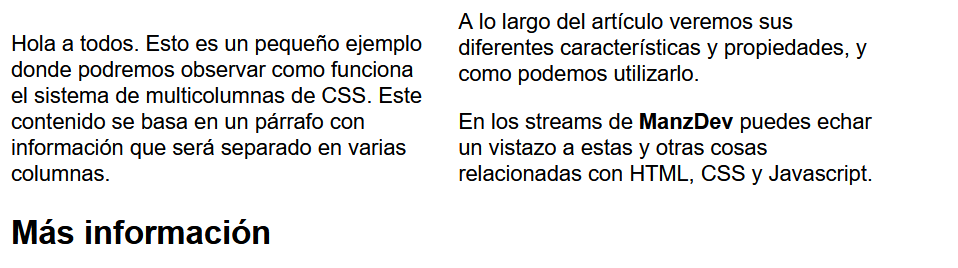

Comprobaremos que a pesar de haber indicado 3 columnas, al haberle dado un tamaño ideal de 300px a cada columna, que no cabrá en los 800px del contenedor, establece 2 columnas. Si reducimos el column-width a 200px, veremos que si crea las 3 columnas.

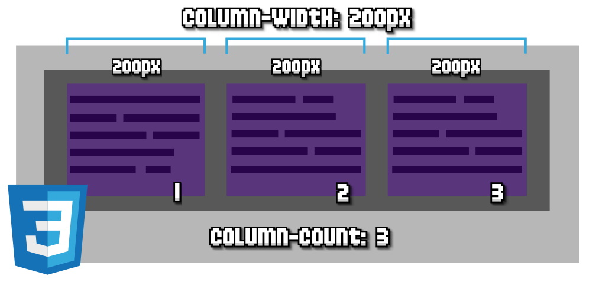

De igual forma, si establecemos column-count de 4 columnas, no veremos las cuatro columnas si no bajamos el column-width a al menos 185px.

## La propiedad de atajo columns
Mediante la propiedad columns podemos establecer las dos propiedades anteriores de una sola vez. El siguiente fragmento de código sería equivalente al ejemplo anterior:

## Separación de columnas
Retomando el ejemplo anterior, vamos ahora a intentar establecer un espacio entre las columnas. Para ello, tenemos a nuestra disposición la propiedad column-gap, que funciona de forma muy parecida a flex o grid. Con ella establecemos unos «huecos» entre columnas.

Pero a parte de esta propiedad tenemos algunas más con el prefijo column-rule:

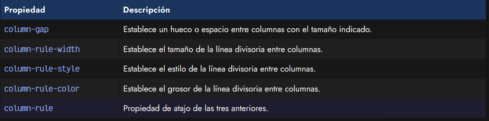

Las reglas de columnas son unas líneas divisorias que podemos establecer entre columnas para que se vea más claramente la división creada. Funciona de forma muy similar a los bordes CSS, ya que también podemos establecer color, estilo y grosor, incluso con su propiedad column-rulede atajo.

En el caso de indicar column-rule y column-gap juntas, observa que simplemente se colapsan en el mismo espacio, por lo que es ideal para añadir una separación si con la regla no es suficiente:

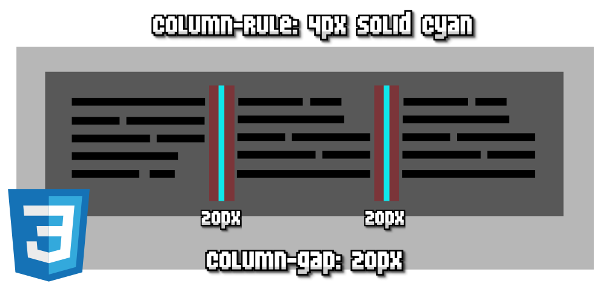

## Distribución entre columnas
Tenemos algunas propiedades más para distribuir el texto entre columnas con diferentes matices. Las propiedades son las siguientes:

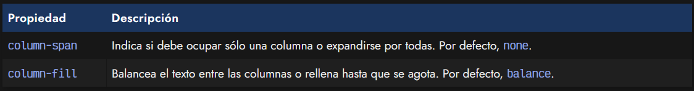

La propiedad column-span es muy interesante. Esta propiedad, puede indicarse a elementos hijos como, por ejemplo, titulares, para indicar si deben ocupar sólo su espacio dentro de la columna que le toque, o si debe extenderse a lo largo de todas las columnas.

Observa que en nuestro ejemplo anterior hay un "h2". Vamos a cambiarle el estilo y a indicarle que queremos que se entienda por todas las columnas:

html:
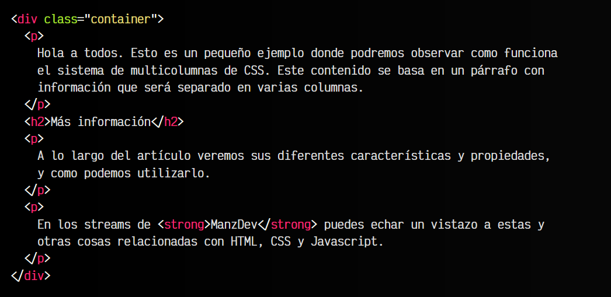

css:
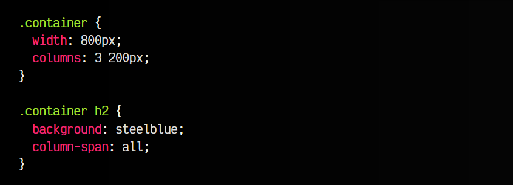

vista:
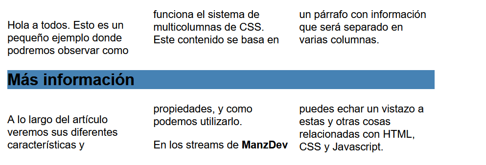

Con la propiedad column-span establecida a all, en lugar de que el "h2" ocupe sólo su columna, se establecerá que se extienda por encima, a lo largo de todas las columnas.

Por otro lado, la propiedad column-fill nos permite balancear y distribuir el texto de forma equivalente entre las diferentes columnas. Se aplica al padre y se puede indicar el valor balance (en algunos casos sólo balancea la última columna) o balance-all (balancea siempre todas las columnas). Sin embargo, también podemos indicar el valor auto, que no balancea, y distribuye el texto desde la primera columna hasta que se agote:

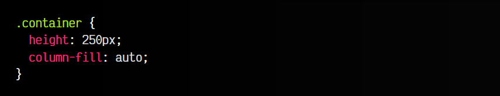

En este ejemplo, fijamos el tamaño de alto del contenedor para forzar a que podamos ver los resultados, y le aplicamos el valor column-fill a auto. Comprueba la diferencia de este valor y los valores balance y balance-all (casi siempre suelen ser los mismos).

En general, el soporte de column-fill es bueno en navegadores, sin embargo, cuidado con el soporte del valor balance-all que aún está en fase experimental.

## Fragmentación entre columnas
Puede ocurrir que al tener que establecer en varias columnas un contenido que a priori es muy extenso, el navegador tendrá que determinar en que parte «rompe» las columnas. Esto no siempre puede que resulte de la forma apropiada, por lo que tenemos las siguientes propiedades:

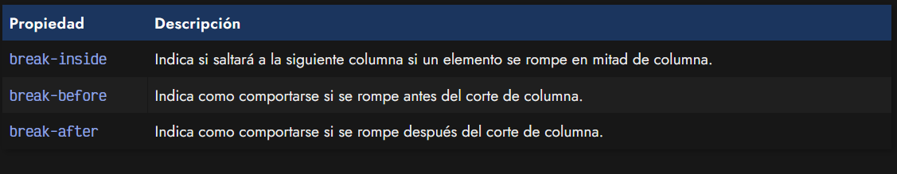

Si quieres saber más sobre este tema, visita el post sobre [medios paginados](https://lenguajecss.com/css/responsive-web-design/medios-paginados/), donde hablamos de estas propiedades para medios impresos, pero que se comportan exactamente igual en multicolumnas.