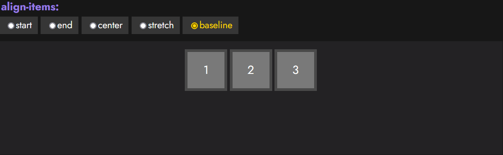
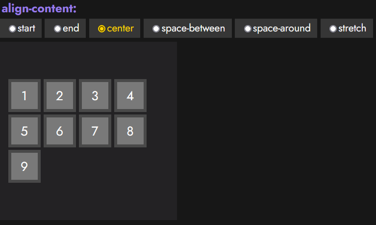

# 
Alinear y centrar con Flex CSS

Cuestiones habituales en el mundo de CSS suelen ser «Cómo centrar con Flex», «cómo alinear verticalmente» o «cómo alinear horizontalmente». En este artículo, vamos a dar un repaso a las propiedades de alineación de elementos, para que no se te vuelva a resistir como distribuir los elementos de un contenedor Flex.

## Propiedades de alineación
Ahora, tras el tema de [Introducción a Flex](https://lenguajecss.com/css/maquetacion-y-colocacion/flex/), tenemos un control básico de un contenedor con ítems flexibles. Pero para alinear correctamente, necesitamos conocer las propiedades existentes dentro de flex para disponer los ítems dependiendo de nuestro objetivo.

Vamos a echar un vistazo a las siguientes propiedades, donde algunas actuan en el eje principal 1️⃣ (recordemos que por defecto es el horizontal), mientras que otras actuan en el eje secundario 2️⃣ (por defecto, el eje vertical):

De esta pequeña lista, hay que centrarse en la primera y la segunda propiedad, ya que son las principales. La última propiedad, align-content solo tiene efecto si tenemos un contenedor flex multilinea.

Es posible que a veces hayas encontrado valores como flex-start o flex-end, en lugar de start o end. Antiguamente, las palabras claves de estas propiedades tenían el prefijo flex-, pero aunque funcionen, se recomienda usar la versión sin el prefijo.

## Alineación de elementos
Antes de comenzar con la alineación de elementos, un pequeño resumen:

   - justify-content: Se utiliza para alinear los ítems del eje principal (por defecto, el horizontal).
   - align-items: Usada para alinear los ítems del eje secundario (por defecto, el vertical).
   - align-content: Se utiliza para alinear el contenido del eje secundario entre líneas (sólo en contenedor multilinea).

## La propiedad justify-content
La primera propiedad, justify-content, sirve para colocar los ítems de un contenedor mediante una disposición concreta a lo largo del eje principal (por defecto, en horizontal). Los valores que puede tomar esta propiedad son los siguientes:

Con cada uno de estos valores, modificaremos la disposición de los ítems del contenedor donde se aplica, pasando a colocarse como se ve en el ejemplo interactivo siguiente (nótense los números para observar el orden de cada ítem):

## La propiedad align-items
Existe otra propiedad importante denominada align-items. Se encarga de alinear los ítems en el eje secundario del contenedor. Hay que tener cuidado de no confundir align-items con align-content, puesto que el segundo actúa sobre cada una de las líneas de un contenedor multilinea (no tiene efecto si no usamos flex-wrap), mientras que align-items lo hace sobre la única línea que tiene un contenedor flex sin wrap.

Los valores que puede tomar align-items son los siguientes:

Veamos un ejemplo interactivo con justify-content y align-items:

## Alineación multilínea
Una vez entendidos los casos anteriores, debemos atender a la propiedad align-content, que es un caso particular de align-items. Nos servirá cuando estemos tratando con un contenedor flex multilinea creado mediante flex-wrap. Los contenedores multilinea son un tipo de contenedor en el que, cuando los ítems no caben en el ancho disponible, el eje principal se divide en múltiples líneas.

## La propiedad align-content
De esta forma, align-content servirá para alinear cada una de las líneas del contenedor multilinea. Los valores que puede tomar la propiedad align-content son los siguientes:

Recuerda que estaremos modificando la disposición en vertical, salvo que estemos usando flex-direction: column, en cuyo caso, el eje principal sería horizontal.

En el ejemplo siguiente, veremos que al indicar un contenedor de 200 píxels de alto con ítems de 50px de alto y un flex-wrap establecido para tener contenedores multilinea, podemos utilizar la propiedad align-content para alinear los ítems de forma vertical de modo que se queden en la zona inferior del contenedor:

Observa como funciona la propiedad align-content en el siguiente ejemplo interactivo:

## Alineaciones específicas
Por otro lado, la propiedad align-self actúa exactamente igual que align-items, sin embargo es la primera propiedad de flex que vemos que se utiliza sobre un ítem hijo específico y no sobre el elemento padre contenedor. Salvo por este detalle, funciona exactamente igual que align-items.

## La propiedad align-self
Observa los valores que puede tomar la propiedad align-self:

Gracias a ese detalle, align-self nos permite cambiar el comportamiento de align-items y sobreescribirlo con comportamientos específicos para ítems concretos que no queremos que se comporten igual que el resto.

La propiedad align-self puede tomar los siguientes valores:

Como vemos, se comporta igual que la propiedad align-items, salvo con la adición del valor auto, que si se especifica, el navegador le asignará el valor de la propiedad align-items del contenedor padre. En caso de no existir, el valor por defecto será stretch.

## La propiedad align-self
Existe una propiedad de atajo con la que se pueden establecer los valores de las propiedades align-content y justify-content de una sola vez. Dicha propiedad es place-content y funciona de la siguiente forma:

## Orden de los elementos
Por último, y quizás una de las propiedades más interesantes, es order. Se trata de una propiedad mediante la cual podemos modificar y establecer un orden de los elementos mediante números:

Por defecto, todos los elementos hijos de un contenedor flex tienen establecido un order por defecto al valor 0, aunque no se especifique de forma explícita. Si indicamos una propiedad order con un valor numérico diferente, irá recolocando los ítems según dicho número, colocando antes los elementos con un número order más pequeño (incluso valores negativos) y después los elementos con números más altos.

Esta característica se vuelve muy potente en combinación con las estrategias de flex-direction o incluso [Media Queries](https://lenguajecss.com/css/responsive-web-design/media-queries/), ya que podríamos recolocar fácilmente elementos que son contenedores de secciones de la web, de modo que una zona concreta, por ejemplo, un submenú, aparezca arriba en escritorio y abajo en móvil.

