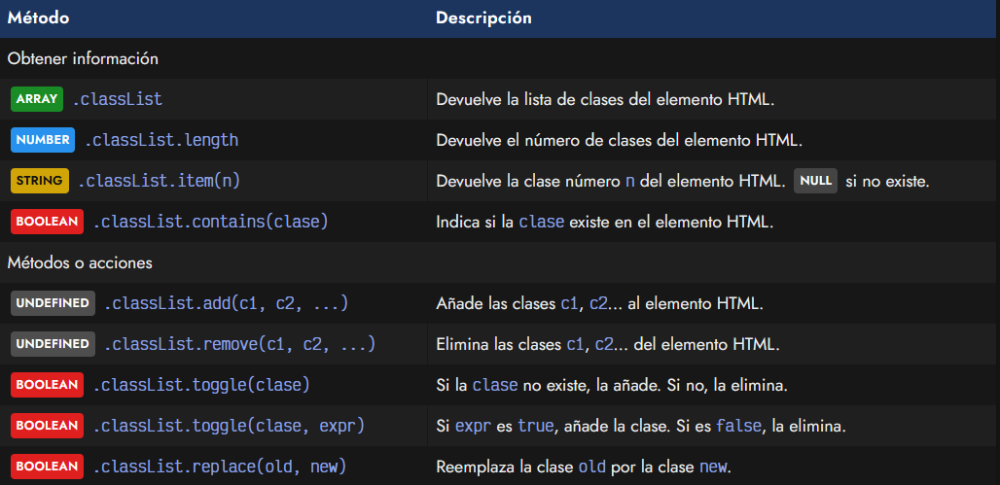
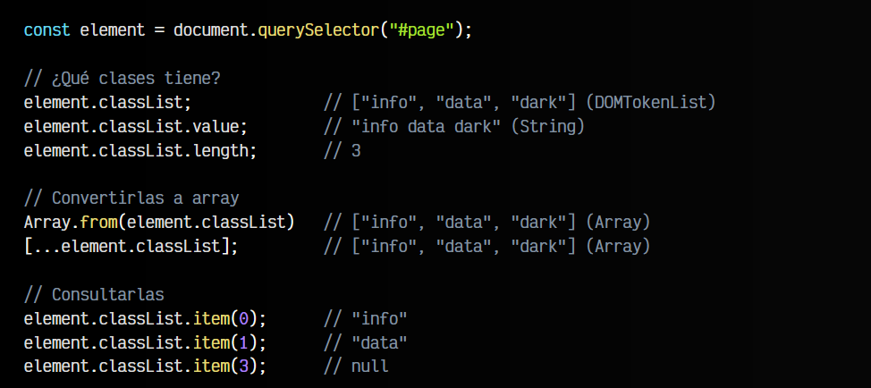
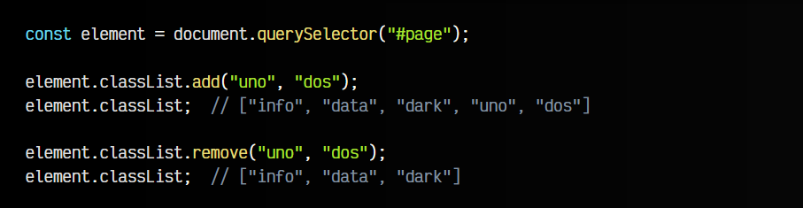
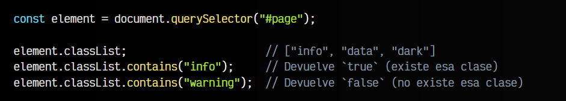
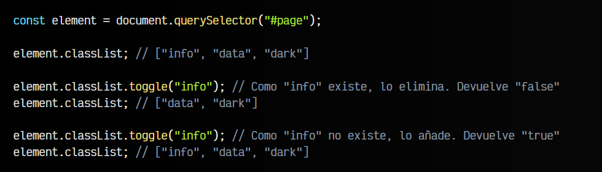
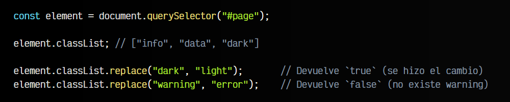

# 
Clases HTML: La API classList

Para trabajar más cómodamente, existe un sistema muy interesante para trabajar con clases: la propiedad u objeto .classList. Se trata de un objeto especial que contiene una serie de ayudantes que permiten trabajar con las clases de forma más intuitiva y lógica.

Si accedemos a la propiedad u objeto .classList, nos devolverá un ARRAY (un DOMTokenList, pero a efectos prácticos es un array) de clases CSS de dicho elemento. Además, incorpora una serie de métodos ayudantes que nos harán muy sencillo trabajar con clases CSS:

Veamos un ejemplo de uso de cada método de ayuda. Supongamos que tenemos el siguiente elemento HTML en nuestro documento. Vamos a acceder a el y a utilizar el objeto .classList con dicho elemento:

Observa que dicho elemento HTML tiene:

   - Un atributo id
   - Tres clases CSS: info, data y dark
   - Un metadato HTML data-number (también es un atributo)

## Acceder a clases CSS.
Al margen de acceder a la lista de clases mediante .classList y al número de clases del elemento con .classList.length, es posible acceder a la propiedad .classList.values para obtener un STRING como lo haría .className:

El objeto .classList aunque parece que devuelve un ARRAY no es un array, sino un DOMTOKENLIST que actúa de forma similar a un array, por lo que puede carecer de algunos métodos o propiedades concretos. Si quieres convertirlo a un array real, utiliza Array.from() o desestructuración con [...div.classList].

Por último, observa que disponemos del método .classList.item() que nos devuelve un STRING con la clase específica en esa posición. Si no existe una clase en esa posición, nos devolverá NULL.

## Añadir y eliminar clases CSS.
Los métodos .classList.add() y .classList.remove() permiten indicar una o múltiples clases CSS a añadir o eliminar. Observa el siguiente código donde se ilustra un ejemplo:

Al utilizar los métodos .add() o .remove(), en el caso de que se añada una clase CSS que ya existía previamente, o que se elimine una clase CSS que no existía, simplemente no ocurrirá nada.

## Comprobar si existen clases CSS.
Con el método .classList.contains() podemos comprobar si existe una clase en un elemento HTML, ya que nos devuelve un BOOLEAN indicandonos si está presente o no:

Esto puede resultar interesante en algunas situaciones, donde queremos averiguar mediante Javascript si existe una clase.

## Conmutar o alternar clases CSS.
Otro ayudante muy interesante es el del método .classList.toggle(), que lo que hace es añadir o eliminar la clase CSS dependiendo de si ya existía previamente. Es decir, añade la clase si no existía previamente o elimina la clase si existía previamente:

Observa que .toggle() devuelve un BOOLEAN que será true o false dependiendo de si, tras la operación, la clase sigue existiendo o no. Ten en cuenta que en .toggle(), al contrario que .add() o .remove(), sólo se puede indicar una clase CSS por parámetro.

## Reemplazar una clase CSS.
Por último, tenemos un método .classList.replace() que nos permite reemplazar la primera clase indicada por parámetro, por la segunda. Veamos este método en acción:

Con todos estos métodos de ayuda, nos resultará mucho más sencillo manipular clases CSS desde Javascript en nuestro código.

