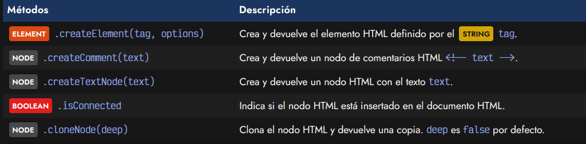
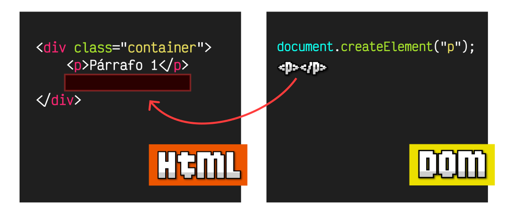
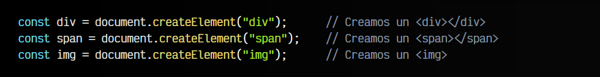
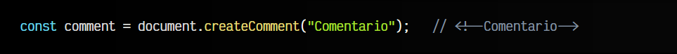
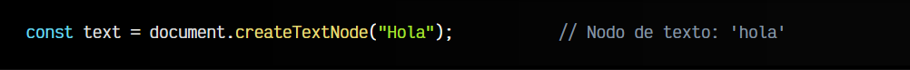
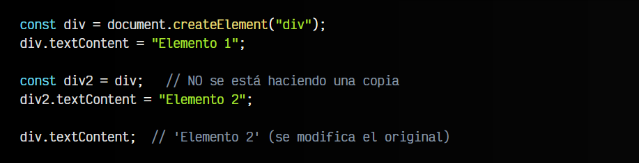
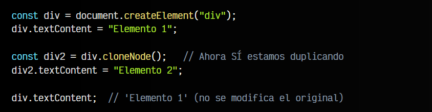

# 
El método createElement

Si te encuentras en fase de aprendizaje, lo normal suele ser crear código HTML desde un fichero .html. Sin embargo, a medida que vas avanzando, comenzarás a trabajar de forma dinámica con Javascript, donde puedes automatizar y flexibilizarlo todo. Con el auge de las páginas SPA (Single Page Application) y los frameworks/librerías Javascript, cada vez es más común crear código HTML desde Javascript de forma dinámica.

En este artículo vamos a ver como podemos crear elementos HTML desde Javascript utilizando la API del DOM y aprovechando su potencia para crear elementos HTML dinámicamente, con la lógica de Javascript.

## Crear elementos HTML.
Existe una serie de métodos para crear de forma eficiente diferentes elementos HTML o nodos. Dichos métodos nos ofrecen una forma muy sencilla de crear estructuras dinámicas, mediante bucles o estructuras definidas:

Para empezar, nos centraremos principalmente en la primera, que es la que utilizamos para crear elementos HTML en el DOM. Luego iremos viendo el resto.

## El método .createElement().
Mediante el método .createElement() podemos crear un ELEMENT HTML en memoria. Es importante tener en cuenta que al crearlo ¡no estará insertado AÚN en nuestro documento HTML!. Habitualmente, se almacena en una variable o constante, permitiéndonos modificar sus atributos o contenido, para posteriormente insertarlo en una posición determinada del DOM o documento HTML:

Vamos a centrarnos en el proceso de creación del elemento, y más adelante veremos diferentes formas de insertarlo en el DOM. El funcionamiento de .createElement() es muy sencillo: se trata de pasarle el nombre de la etiqueta tag a utilizar:

El método createElement() tiene un segundo parámetro opcional denominado options. Si se indica, se espera un OBJECT con una propiedad is para definir un elemento personalizado particular. De momento, no exploraremos ese camino, pero podemos abordarlo más adelante en el tema de Web Components.

Ten presente que en los ejemplos hemos creado elementos HTML en una constante en memoria, pero de momento no los hemos añadido al documento HTML. Lo veremos en próximos artículos.

## La propiedad .isConnected.
La propiedad BOOLEAN isConnected nos indica si el elemento en cuestión está insertado en el DOM (conectado), o por el contrario, sólo lo tenemos guardado en una variable (desconectado):

   - Si devuelve true, significa que el elemento está conectado al DOM.
   - Si devuelve false, significa que el elemento no está conectado al DOM.

En el ejemplo anterior, las etiquetas creadas están todas desconectadas (permanecen sólo en memoria). En los siguientes capítulos veremos como insertarlos en el DOM, de modo que aparezcan visualmente en la página, ya que teniéndolos en memoria existen, pero no se renderizan en el navegador.

## El método .createComment().
Aunque es menos frecuente, tenemos un método .createComment() que sirve para crear comentarios HTML, e insertarlos en el DOM, como hacemos con los elementos HTML que vimos anteriormente. No es algo muy práctico o habitual, pero en algunos casos concretos podría sernos de utilidad.

Hemos creado el comentario <!-- Comentario --> y lo hemos guardado en una constante comment.

## El método createTextNode().
De la misma forma, el método .createTextNode() nos permite crear un nodo de texto con el STRING texto indicado por parámetro. Esto nos permite crear fragmentos de texto sin necesidad de tener una etiqueta HTML contenedora:

Nuevamente, no es algo muy común, ya que normalmente añadimos los textos a través de etiquetas HTML. Sin embargo, a veces nos encontramos con situaciones en las que necesitamos crear un nodo de texto sin tener una etiqueta HTML contenedora, y en esos casos podría sernos de utilidad.

## Clonar elementos HTML.
Hay que tener mucho cuidado al crear elementos en el DOM que sean una copia de otros ya existentes. Un error muy común en programación (no pasa sólo con el DOM) es crear un nuevo elemento asignándole otro ya que teníamos pensando que es una copia.

En realidad, lo que estamos haciendo es referenciar al mismo elemento, de modo que si cambiamos algo de la supuesta copia o del original, también se modifica el otro. Esto es un clásico error común cuando se está aprendiendo a programar.

## El método .cloneNode().
La forma correcta de crear una copia de un elemento es utilizar el método .cloneNode() que, como su propio nombre indica, lo que hace es clonar y devolver el nuevo elemento duplicado del original.

Para aclarar los conceptos mencionados, observa este código:

Con esto, quizás pueda parecer que estamos duplicando un elemento para crearlo a imagen y semejanza del original. Sin embargo, lo que se hace es una referencia al elemento original. Esto ocurre así por por razones de rendimiento y eficiencia.

Para evitar que se cree una referencia, y duplicar el elemento como queríamos realmente, deberíamos usar el método .cloneNode():

Como ves, en este caso no se ha modificado el elemento original, puesto que son elementos diferentes.

## El parámetro deep.
Ten en cuenta que el método cloneNode(deep) acepta un parámetro BOOLEAN deep opcional, que se encuentra a false por defecto. Este parámetro indica el tipo de clonación que se realizará:

   - Si es true, clonará también elementos hijos. Se conoce como clonación profunda (Deep Clone).
   - Si es false, no clonará elementos hijos. Se conoce como clonación superficial (Shallow Clone).

Así pues, recuerda que si no indicas ningún parámetro, sólo estará duplicando el propio elemento. Si por el contrario, le indicamos true, se clonarán todos los elementos hijos del original, teniendo una duplicación de la estructura completa del DOM de su interior.

