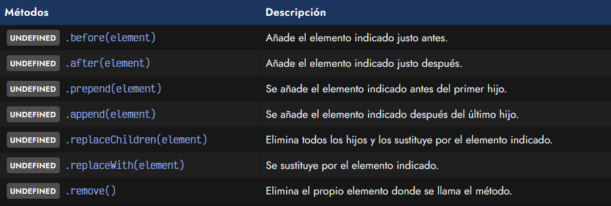
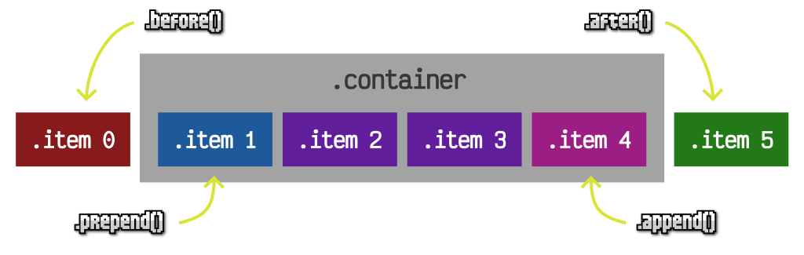
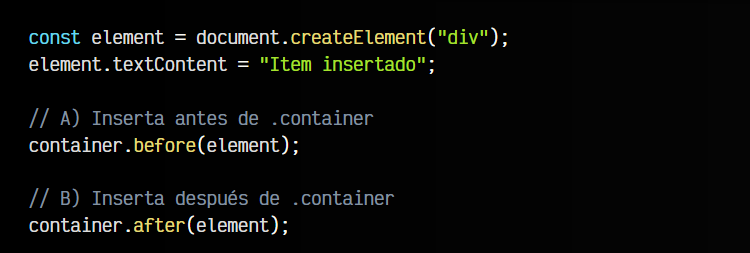
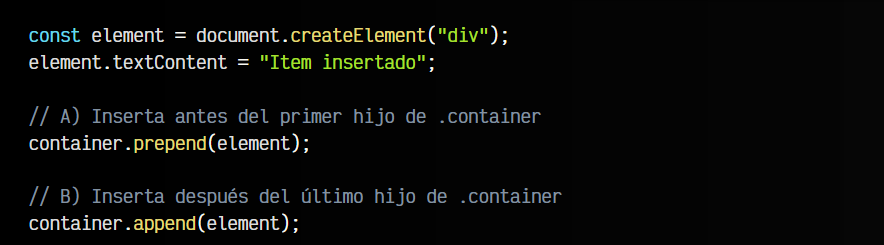
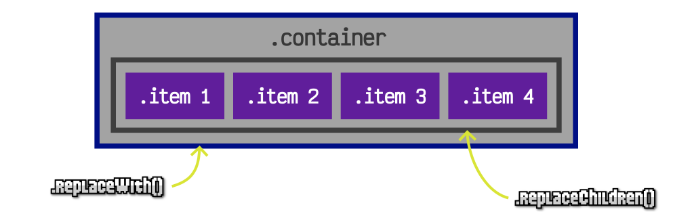
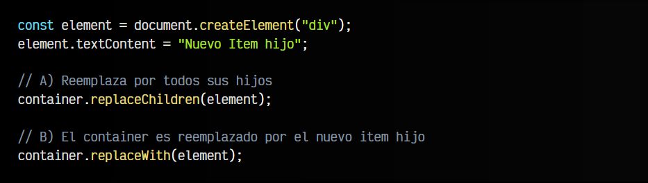
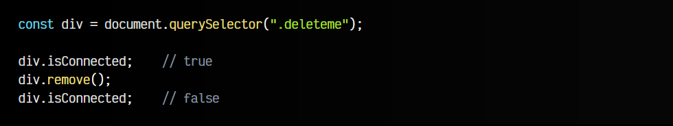

# 
La API de Elementos HTML

Javascript posee varias API para interactuar con el DOM y añadir, modificar o eliminar elementos HTML mediante Javascript. Una de ellas es la API de Nodos (a bajo nivel y más compleja) y otra es la API de Inserción Adyacente (a alto nivel y más simple). La API de Elementos que veremos en este artículo es justo una API intermedia entre las dos mencionadas.

## ¿Qué son los Elementos?.
Se conoce como Elementos ELEMENT a las etiquetas HTML que tenemos en una página web. Cuando trabajamos a nivel de elementos, reducimos todo a elementos HTML.

## API de Elementos.
Los métodos mencionados con anterioridad sirven en muchos casos, sin embargo, son poco específicos y puede que no cubran todas las posibles situaciones. Existe otra familia de métodos para añadir e insertar elementos que quizás sea mucho más versátil.

Todos los métodos permiten pasar por parámetro un elemento o una lista de elementos. También puedes pasar un STRING (para insertar un fragmento de texto). Echemos un vistazo a estos métodos:

En todos los casos que mencionamos element, se puede indicar un elemento, o varios elementos. Por ejemplo, un container.after(element1, element2) añadiría dos elementos. Vamos a repasar estos métodos, suponiendo que los vamos a ejecutar en base al elemento container, por lo que todo se hará respecto a él. Por ejemplo, container.before().

## El método .before() y .after().
Con el método .before() podemos insertar uno o varios elementos antes del elemento que llama al before (en el ejemplo, container). Con el método .after() ocurre exactamente lo mismo, pero después del elemento en lugar de antes:

Veamoslo con un ejemplo:

## El método .prepend() y .append().
Con estos dos métodos podemos insertar elementos en sus elementos hijos, al principio o al final. El método .prepend() permite insertar uno o varios elementos antes del primer elemento hijo de nuestro elemento base. En el caso de append() ocurre lo mismo, pero después del último elemento hijo:

El método .append() es equivalente al .appendChild() que vimos más atrás.

## El método .replaceChildren() y .replaceWith().
Por otro lado, también tenemos los métodos .replaceChildren() y .replaceWith(). El primero de ellos, replaceChildren() permite eliminar todos los elementos hijos del elemento base, y sustituirlos por uno o varios que indiques por parámetro.

El segundo método, replaceWith(), lo que permite es reemplazar el propio elemento base con uno o varios elementos que pasemos por parámetro, por lo que se realiza un reemplazo completo:

## El método .remove().
Al igual que podemos insertar o reemplazar elementos, también podemos eliminarlos. Ten en cuenta que al «eliminar» un nodo o elemento HTML, lo que hacemos realmente no es borrarlo, sino desconectarlo del DOM o documento HTML, de modo que no están conectados, pero siguen existiendo.

El método .remove() se encarga de desconectarse del DOM a sí mismo,

En este caso, lo que hemos hecho es buscar el elemento HTML < div class="deleteme" > en el documento HTML y desconectarlo de su elemento padre, de forma que dicho elemento pasa a no pertenecer al documento HTML, pero sigue existiendo en la constante div.

