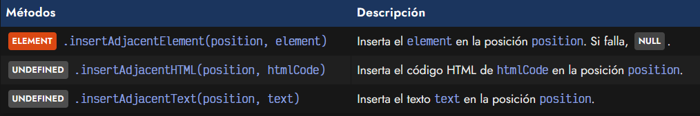
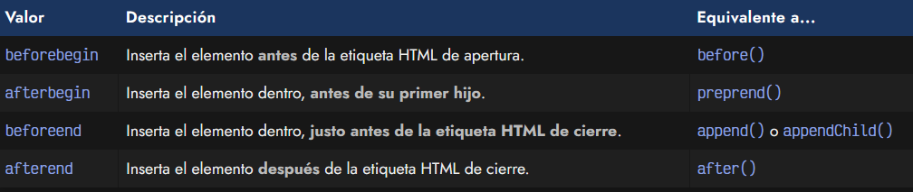
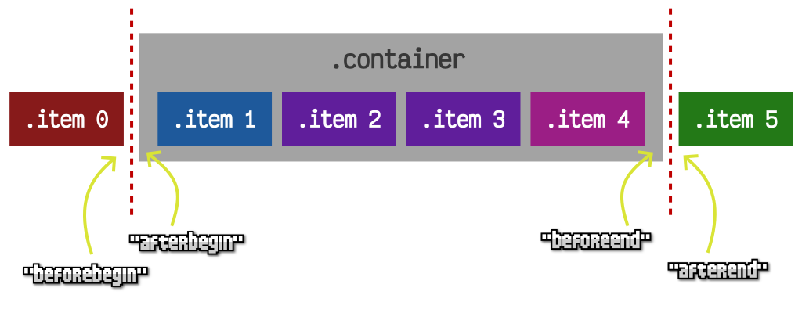
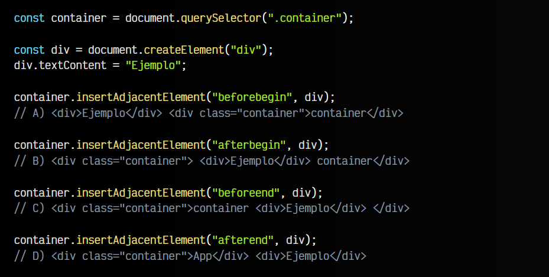
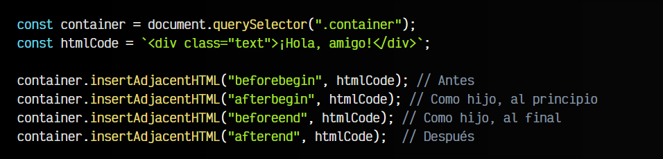
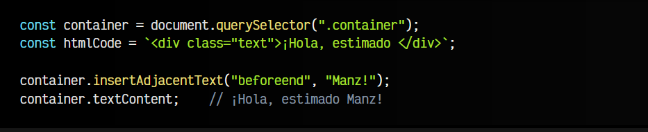

# 
La API de Inserción Adyacente

En Javascript hay 3 API para añadir, modificar y eliminar elementos del DOM. Las dos API anteriores (nodos y elementos) son las más populares, sin embargo, la API de Inserción Adyacente es la más reciente y, probablemente, la más flexible y potente.

## API de Inserción Adyacentes?.
Esta API, a la vez que es de las más desconocidas, es una de las más interesantes. Como verás en la siguiente tabla, tiene 3 modalidades diferentes enmarcadas en 3 métodos:

Estos 3 métodos permiten:

   - .insertAdjacentElement() para insertar elementos (etiquetas HTML)ELEMENT
   - .insertAdjacentHTML() para insertar código HTML directamente (similar a innerHTML)
   - .insertAdjacentText() para insertar textos directamente (similar a textContent)

## El parámetro position.
El parámetro position que tienen estos 3 métodos es un STRING que indica la posición donde se va a insertar el nuevo elemento, código HTML o texto. Debe indicarse uno de los siguientes valores:

Veamos en una imagen, para tenerlo mucho más claro, donde se insertaría un elemento dependiendo de la posición que le indiquemos por parámetro. Observa que el elemento .container (en gris) es la etiqueta donde estamos ejecutando el método .insertAdjacentElement():

El elemento < div class="container" > tiene un elemento antes, 4 elementos hijos en su interior y un elemento después. Dependiendo de la posición que indiquemos, se insertaría en la zona indicada con la flecha amarilla.

## El método .insertAdjacentElement.
Como vimos en la tabla anterior, tenemos tres modalidades de métodos, que en esencia hacen lo mismo, sólo que cada método lo hace con un tipo de elemento diferente. En el primer caso, tenemos el método .insertAdjacentElement(), al que le pasamos la posición y un ELEMENT:

Ten en cuenta que en el ejemplo muestro varias opciones alternativas, no lo que ocurriría tras ejecutar las cuatro opciones una detrás de otra.

## El método .insertAdjacentHTML().
El método .insertAdjacentHTML() funciona exactamente igual que el anterior, sólo que en lugar de pasarle un elemento HTML ELEMENT, le pasamos un STRING con un código HTML. El método se encargará de hacer la transformación necesaria para insertarlo en el DOM:

## El método .insertAdjacentText().
Por último, el método .insertAdjacentText() también funciona exactamente igual que los anteriores. En este caso, en lugar de un elemento o código HTML, lo que le vamos a pasar es un STRING de texto, que se insertará literalmente, como si estuvieramos utilizando .textContent:

Con estos tres simples métodos, podemos realizar prácticamente cualquier tarea en el DOM de una página, de forma sencilla, rápida, flexible y práctica.