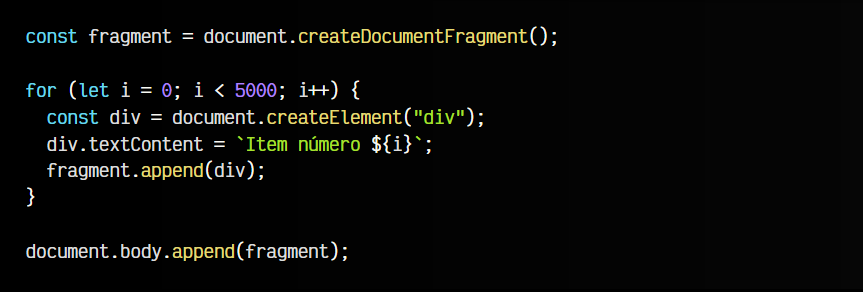

# 
Fragmentos del DOM

Hasta ahora, hemos visto como trabajar con elementos HTML e insertarlos en el DOM, modificar sus atributos, añadirle clases, etc. Sin embargo, ahora vamos a explorar un concepto que se denomina Fragmentos del DOM.

## ¿Qué es un fragmento del DOM?.
Como su nombre indica, un fragmento del DOM es una pequeña porción del DOM, que no se encuentra conectada al documento o DOM de la página, sino que está aislada en una variable o constante.

Este tipo de estructuras se utilizan como contenedores temporales de alto rendimiento para hacer operaciones repetitivas o intensivas en lugar de estar realizandolas sobre el DOM y que produzcan múltiples re-renderizados (repintados de la página) o situaciones costosas similares.

Sus principales características son:

   - No tienen elemento padre.
   - No está conectado al DOM. Está aislado de la página o documento.
   - Es mucho más simple y ligero (mejor rendimiento).

## Creando un fragmento?.
Para crear un fragmento del DOM, necesitaremos utilizar la siguiente función:

Así pues, el FRAGMENT que devuelve el método document.createDocumentFragment() es un fragmento que podremos utilizar para almacenar en su interior un pequeño DOM temporal donde haremos todas las operaciones intensivas, para luego, añadir el contenido del fragmento en nuestro DOM principal.

Como se puede ver, utilizamos el fragmento fragment generado como ubicación temporal donde hacer todos los cambios del DOM que necesitemos, sin que afecten al reflow del documento de forma independiente. Una vez terminemos nuestra lógica y tengamos el DOM definitivo, lo insertamos como hacemos siempre, por ejemplo, con un append.

Es entonces cuando se traslada todo el DOM del fragmento al lugar donde hemos indicado en el appendChild (*en nuestro ejemplo, a la etiqueta < body >), dejando nuevamente el fragmento vacío.

En los fragmentos, directamente, puedes utilizar métodos como .getElementById(), .querySelector() o .querySelectorAll(). Para insertar elementos, puedes usar .append() o .prepend(), o métodos como .appendChild(), .removeChild(), .replaceChild(), e .insertBefore(). También puedes clonar con .cloneNode() o acceder al contenido de texto con .textContent.

## Diferencias de usar fragmentos.
Es posible que te estés preguntando cuál es la diferencia clave de realizar 5000 inserciones utilizando fragmentos (desconectados del DOM) a realizar 5000 inserciones utilizando elementos normales, desconectados del DOM, simplemente creados y guardados en una variable.

Aunque en ambos casos, no tendríamos el problema del repintado, ya que ninguno está conectado al DOM, la diferencia clave es que en el caso de utilizar un elemento como contenedor, es que al añadirlo al DOM tendríamos un contenedor padre intermedio que no tendríamos de hacerlo con el fragmento.

Al añadir un fragmento a un elemento del DOM, lo que se añade es el contenido del fragmento, vaciándose este último.

Los elementos < template > utilizan fragmentos para crear un DOM desconectado del documento principal. Puedes ver más en[ Plantillas y DOM en WebComponents.](https://lenguajejs.com/webcomponents/dom/plantillas-html-webcomponents/)

