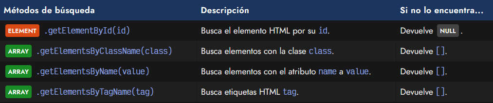
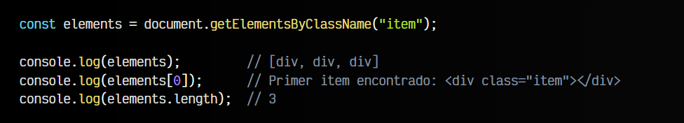
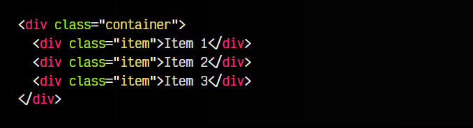
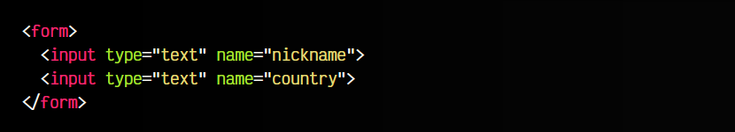
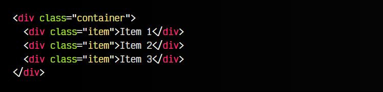
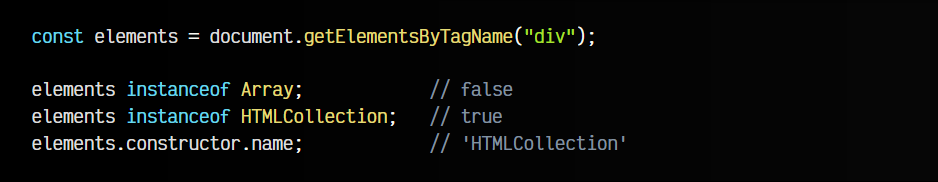
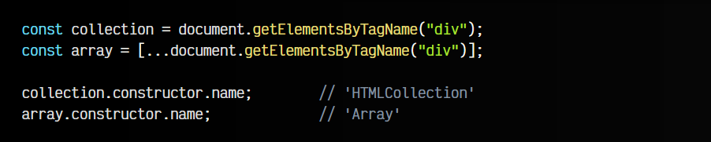
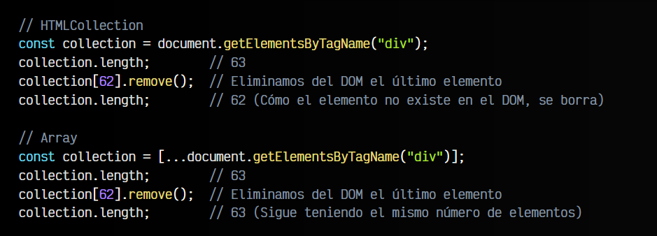

# 
getElementById: Buscar en el DOM

Si nos encontramos en nuestro código Javascript y queremos obtener información del contenido de nuestra página o hacer modificaciones en un elemento de la página HTML, lo primero que debemos hacer es buscar el elemento que nos interesa. Probablemente, la forma más sencilla de hacerlo suele ser intentar identificar el elemento a través de alguno de sus atributos más utilizados, generalmente el id o la clase mediante el atributo class.

Existen una serie de métodos que nos permiten buscar en el DOM de la página. El primer grupo son métodos más antiguos y tradicionales, que veremos en este artículo. El segundo grupo lo examinaremos en el siguiente artículo, son métodos más modernos, pero requieren conocer [selectores CSS](https://lenguajecss.com/css/selectores/selectores-basicos/).

## Métodos tradicionales de búsqueda.
Los métodos más clásicos y tradicionales para realizar búsquedas de elementos en el DOM son muy sencillos, pero menos flexibles que los modernos. Si lo que buscas es un elemento específico, lo mejor sería utilizar el método getElementById() e identificarlo por su id. En caso contrario, utilizaremos alguno de los otros tres métodos, que nos devuelven siempre un ARRAY de elementos:

Estos son los 4 métodos tradicionales de Javascript para manipular el DOM. Se denominan tradicionales porque son los que existen en Javascript desde versiones más antiguas.

## El método getElementById().
El primer método, .getElementById(id) busca un elemento HTML con el id especificado. En principio, un documento HTML bien construído no debería tener más de un elemento con el mismo id, por lo tanto, este método devolverá siempre un solo elemento, ya que no debería existir más de uno:

js:

vista:

En la constante element guardaríamos una referencia a ese elemento < div > con id con valor page. En el caso de no encontrar el elemento indicado, devolverá NULL.

Hay que tener en cuenta que este método sólo trabaja con id. Hoy en día, es más habitual localizar elementos por sus clases, ya que no todos los elementos son únicos o tienen un id establecido.

## El método getElementsByClassName().
Por otro lado, el método .getElementsByClassName(class) permite buscar los elementos que tengan la clase especificada en class. Es importante darse cuenta del matiz de que el método tiene getElements en plural, al contrario del anterior.

Esto ocurre porque en este caso buscamos clases, y puede devolver varios elementos, ya que al contrario que los id, pueden existir varios elementos con la misma clase:

js:

html:

Estos métodos devuelven siempre un ARRAY con todos los elementos encontrados que encajen con el criterio. En el caso de no encontrar ninguno, devolverá un ARRAY vacío: [].

## El método getElementsByName().
Exactamente igual que el caso anterior funciona el método getElementsByName(name). En este caso, estamos buscando elementos HTML por el valor que tienen en el atributo name, algo muy habitual en formularios HTML:

js:

html:

Observa que devuelve un ARRAY de elementos, ya que podría darse el caso de tener varios elementos HTML con ese mismo atributo name.

## El método getElementsByTagName().
En el caso del método getElementsByTagName(tag), lo que hacemos es buscar elementos por el tipo de etiqueta HTML. Es decir, si queremos buscar todos los elementos < div > de una página, podemos hacerlo indicándole el parámetro div:

js:

html:

Observa que en este ejemplo, obtenemos un con 4 elementos. Esto es así porque incluso el elemento < div > contenedor también es un < div >, por lo que es el primero que encuentra. Luego, añade los < div > de su interior, y así con todo los elementos < div > que encuentre.

En el caso de no encontrar ninguno, nos devolvería un array vacío [].

## El tipo HTMLCollection vs Array.
Los más avispados, habrán observado que en los métodos anteriores, algunos utilizan getElement (en singular) y el resto utilizan getElements (en plural). Esto es así porque mientras que el primero devuelve un elemento, el resto devuelve una ARRAY colección de elementos.

Además, quizás te habrás dado cuenta también, que aunque he dicho que devuelve un , realmente no es un array lo que devuelve sino un HTLMCOLECTION:

Los tipos de datos HTLMCOLECTION funcionan como un array, aunque no son exactamente arrays. Si intentas ejecutar sobre el array un método .forEach(), .map(), .filter() o similar, obtendrás un error porque no existen.

Para evitar este problema, podemos utilizar Array.from() o la desestructuración, y convertirlo fácilmente en un ARRAY real:

Te preguntarás entonces... ¿Y cuál es la diferencia entre un ARRAY y un HTMLCollection ? La estructura HTMLCollection es una colección viva de elementos, lo que significa que si modificas elementos del DOM, se actualizan en la estructura, al contrario que si tienes un ARRAY. Observa el siguiente ejemplo donde se ve claramente al utilizar el método .remove(), que elimina el elemento del DOM:

Aunque pueda parecer más interesante el primero, lo cierto es que es más frágil y mucho más difícil de predecir una estructura que puede cambiar sus elementos con el paso del tiempo.

En el próximo artículo explicaremos la diferencia entre el método tradicional getElementById() y el método moderno querySelector(). Puedes ver este video para adelantarte:

