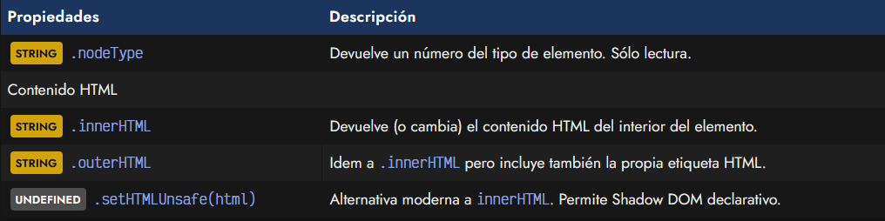
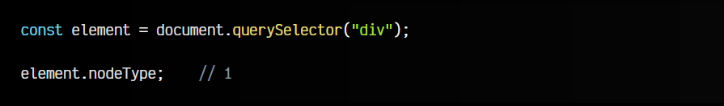
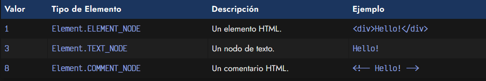
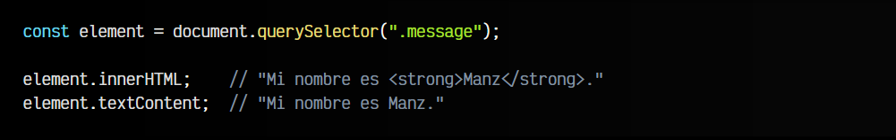
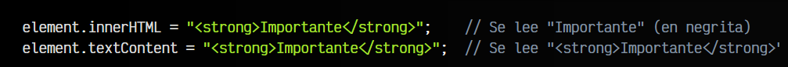
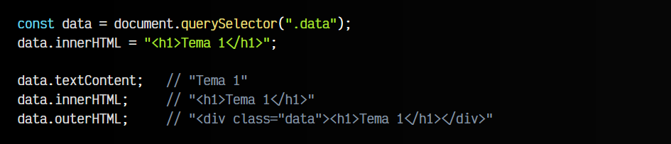
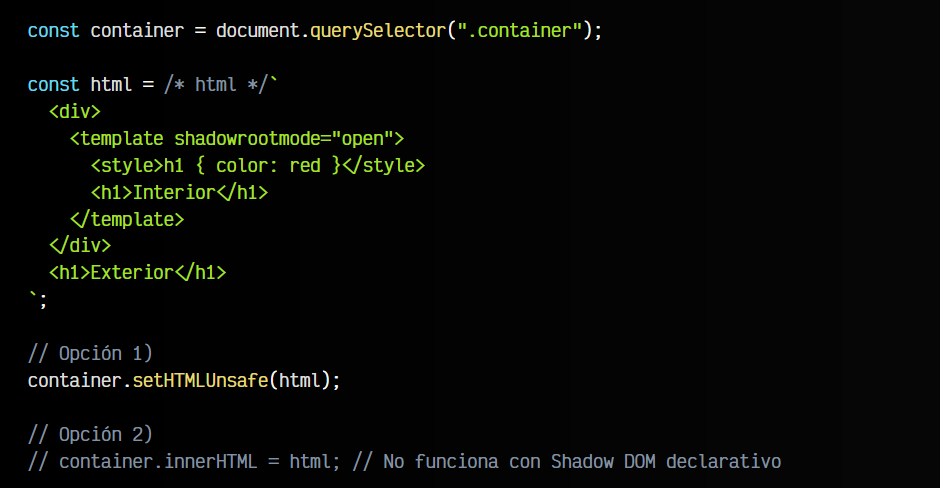

# 
HTML: innerHTML vs outerHTML

Es posible que necesitemos añadir contenido HTML a las etiquetas existentes que ya tenemos en el DOM. En el artículo anterior, vimos como añadir contenido de texto a nuestras etiquetas HTML, pero no como añadir contenido HTML. Para ello vamos a utilizar las propiedades y métodos que aprenderemos en este artículo.

## Acceder al HTML del DOM.
Antes de empezar, echemos un vistazo a las propiedades relacionadas que tenemos para esto:

Vamos a ir viéndolas detalladamente para comprender su funcionamiento y características.

## La propiedad .nodeType.
La propiedad .nodeType no tiene relación directa con este tema, pero es una forma excelente de identificar el tipo de elemento con el que estamos trabajando:

Ese valor numérico identifica el tipo de elemento con el que estamos trabajando. Los principales y más importantes, son estos tres, aunque existen algunos más que quizás veremos más adelante:

Esto nos puede servir en algunos casos donde no sabemos que tipo de elemento tenemos y queremos que actúe en consecuencia, dependiendo de su tipo.

## La propiedad .innerHTML.
La propiedad .innerHTML nos permite acceder al contenido de un elemento, pero en lugar de devolver su contenido de texto como lo hace .textContent, esta propiedad nos devuelve su contenido HTML, es decir, su marcado HTML. Esto tiene varias implicaciones que explicaremos más adelante.

Primero, un ejemplo con la diferencia entre .textContent y .innerHTML:

Observa que .textContent se enfoca en obtener el contenido de texto, mientras que .innerHTML se enfoca en el contenido HTML.

De la misma forma que .textContent, también podemos usar .innerHTML para modificar el contenido. Ten en cuenta que el contenido HTML suministrado a .innerHTML se interpretará, mientras que el suministrado por .textContent se inserta literalmente como texto:

Ten mucho cuidado a la hora de insertar contenido HTML utilizando .innerHTML puesto que si añades contenido que provenga del usuario sin revisarlo, podrían insertar HTML que realice acciones dañinas como inyección de código malicioso.

## Parseo de marcado HTML.
Ten en cuenta que la propiedad .innerHTML comprueba y parsea el marcado HTML escrito (corrigiendo si hay errores) antes de realizar la asignación. Por ejemplo, observa el siguiente código:

Aunque hemos insertado el HTML incompleto con .innerHTML, si examinamos el contenido, podemos ver que está completo. Esto ocurre porque el navegador parsea e intenta que el código HTML sea correcto en todo momento.

Esto puede provocar algunas incongruencias si el código es incorrecto o una disminución de rendimiento en porciones de código muy extensas o que hay que procesar múltiples veces.

## La propiedad .outerHTML.
La propiedad .outerHTML es muy similar a .innerHTML. Mientras este último devuelve el código HTML del interior de un elemento HTML, .outerHTML devuelve el código HTML desde el exterior, es decir, incluyendo al propio elemento implicado:

Al igual que hemos visto anteriormente, se puede utilizar .outerHTML asignando textos para modificar su contenido. Esto puede ser muy útil para reemplazar un elemento HTML, incluido el propio elemento HTML contenedor.

## El método .setHTMLUnsafe().
El método .setHTMLUnsafe() es una alternativa moderna para la propiedad .innerHTML. Su utilización es muy similar, pero tiene como ventaja el soporte de una característica moderna llamada [Shadow DOM declarativo](https://lenguajejs.com/webcomponents/shadow-dom/shadow-dom-declarativo/).

Observa el siguiente fragmento de código:

El código anterior crea un STRING con código HTML con un < div > que tiene una plantilla con un < h1 > y un código CSS que sólo afecta al interior de la plantilla. El método .setHTMLUnsafe() lo procesa y lo inserta en el interior del elemento .container. Si intentaramos hacer la misma operación con .innerHTML no funcionaría.

De la misma forma que tenemos un setter .setHTMLUnsafe() para modificar el contenido, tenemos un getter .getHTML() para obtener el contenido HTML, con la misma ventaja de ser compatible con Shadow DOM declarativo.

El texto unsafe del método es un recordatorio para el programador. Hace referencia a que el código insertado con este método puede ser inseguro, por lo que hay que tener precaución y no confiar en HTML ajeno.