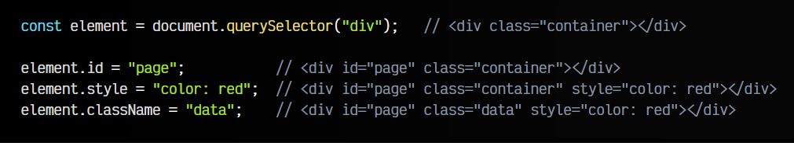
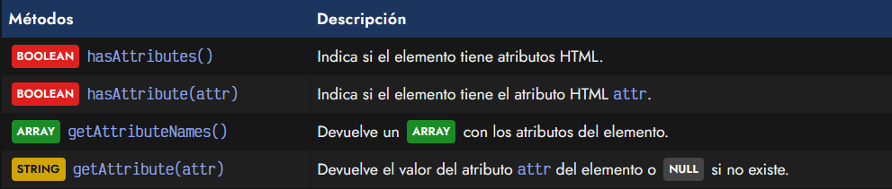
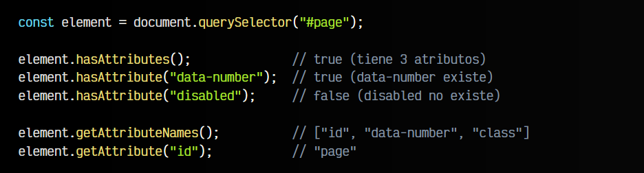
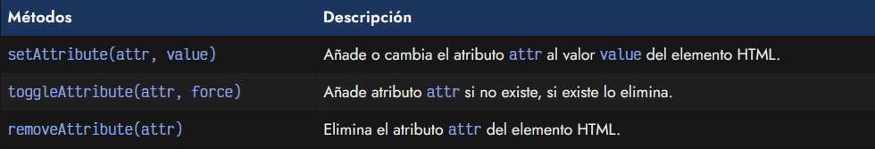
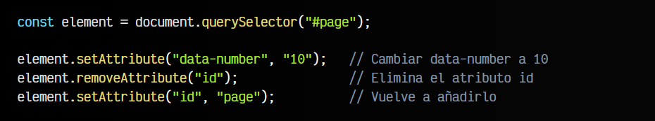
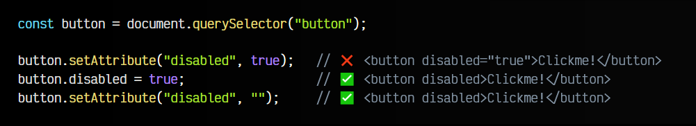
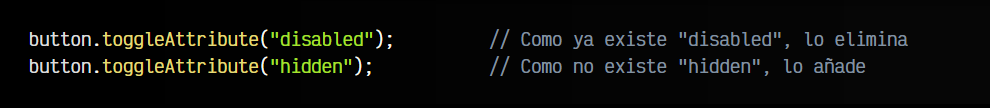

# 
Atributos HTML de elementos

Hasta ahora, hemos visto como crear elementos HTML con Javascript, pero no hemos visto como modificar los atributos HTML de dichas etiquetas creadas. Antes de nada, demos un repaso rápido a los conceptos de las etiquetas HTML para tenerlas claras y presentes.

## ¿Qué es un atributo HTML?.
Las etiquetas HTML tienen ciertos atributos que definen el comportamiento de la etiqueta. Existen atributos comunes a todas las etiquetas HTML, y atributos que sólo existen para determinadas etiquetas HTML. El orden de los atributos en HTML no es importante, da igual que este primero o segundo, no influye en nada.

Además, un atributo puede tener un valor o ser un atributo BOOLEAN, es decir, simplemente estar presente y no tener ningún valor indicado:

Observa que class y data-attr son ejemplos de atributos, y container y value son sus correspondientes valores. Por otro lado, disabled es un atributo booleano (no tiene valor).

## Acceder a atributos HTML.
En general, una vez tenemos un elemento sobre el que vamos a crear algunos atributos, lo más sencillo es asignarle valores como propiedades de objetos:

Hay que tener en cuenta que algunos casos como el del último ejemplo, se indica className en lugar de class. Esto ocurre porque es una palabra reservada para las clases de Javascript, como también ocurre con for para los bucles, etc.

Aunque es posible asignar a la propiedad className varias clases en un STRING separadas por espacio, recomendamos utilizar la propiedad classList para manipular clases CSS. La explicamos más adelante en el capítulo manipulación de clases CSS.

## Obtener atributos HTML.
Aunque la forma anterior es la más rápida, tenemos algunos métodos para obtener los atributos HTML de forma clara y literal, sin problemas como los de className:

En los dos primeros casos, podemos utilizar hasAttributes() o hasAttribute() para saber que atributos HTML tiene definidos una etiqueta. Por otro lado, el método getAttributeNames() nos devuelve la lista de atributos que tiene una etiqueta, y el método getAttribute(attr) nos da el valor que tiene un atributo HTML específico.

Consideremos el siguiente HTML:

Vamos a aplicar las siguientes lineas de Javascript, trabajando con ese elemento:

Como puedes ver, es muy sencillo de utilizar.

## Modificar o eliminar atributos HTML.
Por otro lado, tenemos algunos métodos para modificar atributos HTML existentes, o directamente, eliminarlos:

Estos métodos son bastante autoexplicativos y fáciles de entender, aún así, vamos a ver unos ejemplos de uso donde podemos ver como funcionan. Continuamos con el ejemplo HTML anterior:

Ahora, vamos a modificar sus atributos HTML utilizando dichos métodos. Observa que setAttribute() puede servir tanto para añadir nuevos atributos que no existían como para modificar los que ya existen:

Sin embargo, hay un caso especial que es digno de mención.

## Caso especial: Atributos booleanos.
Hay que hablar de un caso especial, que es el que comentamos en el que podemos establecer atributos HTML que son BOOLEAN, es decir, que no tienen indicado ningún valor.

Si esto lo hacemos con el método setAttribute() y le indicamos un booleano, no tendremos exactamente lo que buscamos. Recuerda que los atributos HTML son siempre de tipo STRING:

Por lo tanto, la forma correcta de establecerlos es indicar un STRING vacío. Automáticamente, el navegador sabrá que una cadena de texto vacía es un booleano y ocultará su valor. Por otro lado, si lo haces mediante una propiedad Javascript, si puedes usar un booleano, y añadirá el atributo HTML automáticamente.

Recuerda que atributo HTML no es lo mismo que propiedad Javascript, aunque muchos frameworks o librerías Javascript simplifican para que parezcan que son la misma cosa.

Normalmente, el método .toggleAttribute(attr, force) es más sencillo para estos casos. Añade el atributo que le pasas por parámetro si no existe, y lo elimina si ya existe:

Si se le proporciona el BOOLEAN force, si es verdadero: añade el atributo, si es falso: elimina el atributo.
