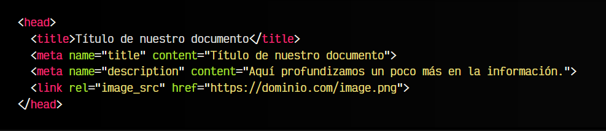
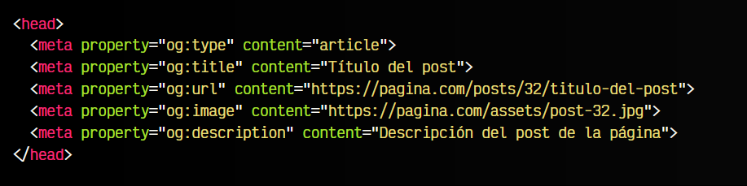
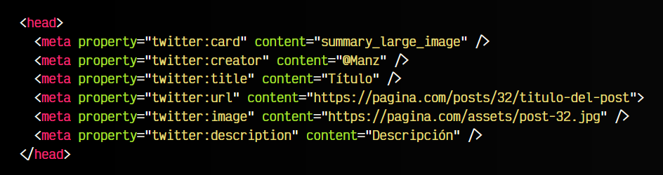

# 
Etiquetas para redes sociales

Al igual que vimos como establecer un título y descripción para un documento HTML, es posible definir una serie de etiquetas de metadatos orientadas a establecer información de previsualización para los usuarios que indiquen enlaces a nuestro sitio web desde herramientas o redes sociales que lo permitan, como por ejemplo, Twitter, Facebook, WhatsApp, Mastodon, etc...

Al margen de los datos que ya incorporemos en el documento HTML, también podemos indicar títulos, descripciones o imágenes de previsualización diferentes, de modo que incluso puedan estar orientadas a públicos determinados.

## Mediante HTML estándar.
Antes de nada, vamos a examinar algunas etiquetas más tradicionales para hacer estas tareas de la forma más básica posible. Recordemos, que en el HTML estándar tenemos las siguientes etiquetas:

   - La etiqueta < title > donde podemos indicar un título oficial. El navegador y Google lo utilizan.
   - Una etiqueta < meta name="title" >. Aunque cada vez se utiliza menos, se solía utilizar para ofrecer un título alternativo que ciertas redes podrían leer y utilizar.
   - Una etiqueta < meta name="description" >. Etiqueta oficial de metadatos donde podemos establecer una descripción. Google lo utiliza para las descripciones de sus resultados de búsqueda, aunque eso no garantiza que siempre los elija para los resultados.

Veamos todo esto en un ejemplo de código HTML:

Aunque es bastante antigua, hace tiempo se utilizaba también la etiqueta < link rel="image_src" > para indicar una imagen de previsualización que herramientas o redes sociales podrían utilizar. Sin embargo, actualmente y para este fin, se utiliza más uno de los métodos que veremos a continuación.

## Mediante Open Graph.
Meta (Facebook) utiliza Open Graph, un protocolo que permite dotar de metadatos orientados a redes sociales. Al compartir un enlace de una página en Facebook, WhatsApp, Instagram (o alguna herramienta o red que soporte este protocolo) de forma automática, analizarán el código HTML en busca de metadatos para utilizarlos.

En el caso de no encontrarlos, se podría crear sus propios metadatos en base a criterios internos (que podrían ser incorrectos) o simplemente no añade ninguna previsualización. Por ejemplo, Facebook o WhatsApp podrían analizar el enlace de una página y, como no existen metadatos, poner como imagen de presentación del enlace, una imagen que ha encontrado en la página, y no ser la imagen más apropiada para representarla.

Si tenemos los metadatos sociales de Open Graph especificados, podría aparecernos algo parecido a esto:

Utilizando Open Graph podemos personalizar los datos que queremos que se ofrezcan cuando un usuario comparta el enlace en Facebook o lo envíe por un mensaje privado. Un ejemplo básico para páginas genéricas (con título, imagen, descripción y tipo de página) utilizando Open Graph podría ser el siguiente:

Recuerda que la URL de la imagen de previsualización debe ser una ruta absoluta. Las URL relativas no serán procesadas correctamente.

Una vez hecho, es altamente recomendable introducir la URL de nuestra página en el [Open Graph Debugger](https://developers.facebook.com/tools/debug/), una herramienta de validación de Open Graph que nos permite revisar si el código Open Graph que hemos escrito es correcto y no hay ningún error en la utilización del protocolo.

## Mediante Twitter Cards.
Por su parte, Twitter incorpora un sistema similar denominado Twitter Cards. Twitter Cards permite integrar metadatos para su uso en la red social de Twitter (o cualquiera que la soporte) y enriquecer la información de tweets donde se mencionan o enlazan páginas de nuestro sitio web.

Datos como el formato y tipo de la información mostrada, el nombre del autor de la página del enlace, el título, descripción e imagen de presentación son perfectamente personalizables desde Twitter Cards, que mostraría una apariencia similar a la siguiente:

Para preparar nuestra página para que soporte Twitter Cards, debemos incluir el siguiente código HTML, personalizando el código y adaptándolo a la información de nuestra página:

En el caso de Twitter, se suele recomendar utilizar una imagen con un ratio de aspecto de 2:1 donde el tamaño mínimo sería 300x157 y el tamaño máximo 4096x4096 (5MB como máximo). En cuanto a formatos, se recomienda JPG, PNG, WEBP o GIF. En el caso de usar GIF animados se utilizará solo el primer frame y los SVG no están soportados.

De la misma forma, un buen consejo sería revisar la web [Twitter Cards Validator](https://cards-dev.twitter.com/validator), donde podemos encontrar una herramienta de validación para revisar si nuestro código de Twitter Cards es correcto o existen errores.

