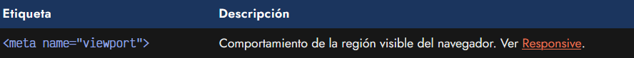
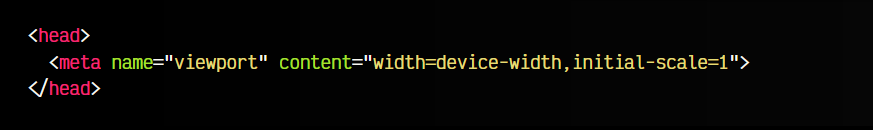
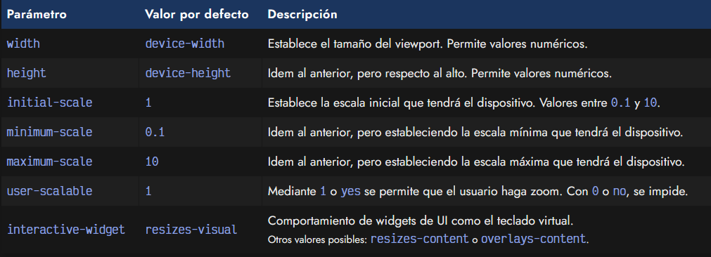

# 
Etiqueta para diseño responsive

Una etiqueta de metadatos muy usada hoy en día es < meta name="viewport" >. Para entenderla bien, hay que tener muy claro primero que significa exactamente la palabra viewport.

## ¿Qué es el Viewport?.
El viewport es la palabra clave con la que se define la región visible del navegador, es decir, la parte que se ve en este momento en nuestro navegador. Por lo tanto, al utilizar esta etiqueta, mediante el atributo content podremos indicar su comportamiento en dispositivos móviles:

En muchas ocasiones te habrás encontrado con páginas que en dispositivos móviles aparecen exactamente igual que en navegadores de escritorio, y la forma de navegar por ella es simplemente hacer zoom para ampliarla. Esto es el comportamiento por defecto de una página que no ha indicado una etiqueta < meta name="viewport" >.

Si añadimos esta etiqueta a una página, evitaremos dicho comportamiento y permitiremos que el navegador amplíe el tamaño con una escala más grande, y que sea más fácil navegador por ella. Luego, podremos aplicar código CSS para hacer más cómoda su visualización e interacción.

## Parámetros de viewport.
Veamos un fragmento de código típico que suele utilizarse con esta etiqueta. Observa que todos los parámetro se incluyen en el atributo content, separándose con comas y estableciendo sus valores con el signo =:

Así pues, la etiqueta < meta name="viewport" > nos permite indicar ciertos parámetros o comportamientos que queremos aplicar a dicha región visible del navegador, generalmente relacionados con el responsive.

Los parámetros que podemos utilizar son los siguientes:

Habitualmente, los valores indicados suelen ser width y initial-scale, sin embargo, el desarrollador puede especificar los que considere necesarios.