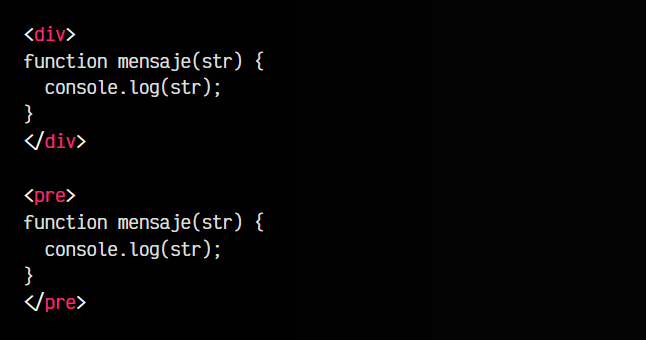
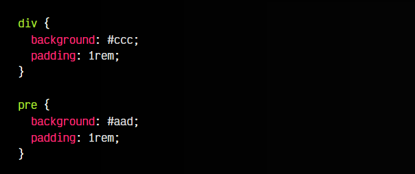
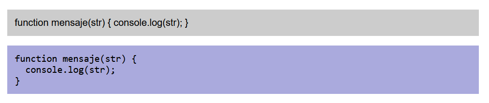
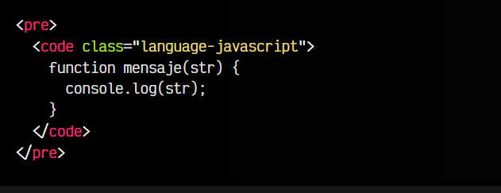
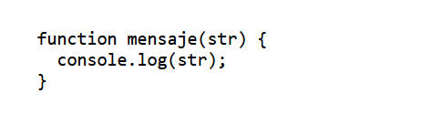
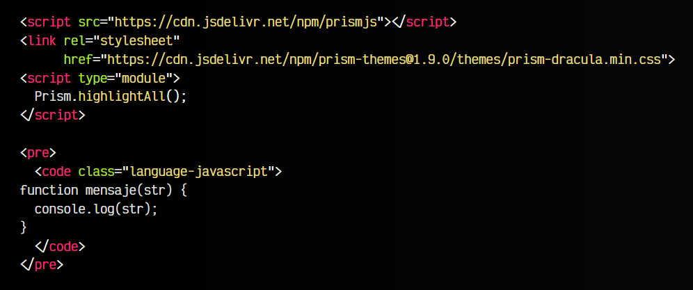
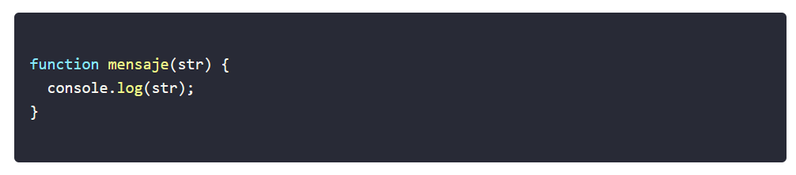
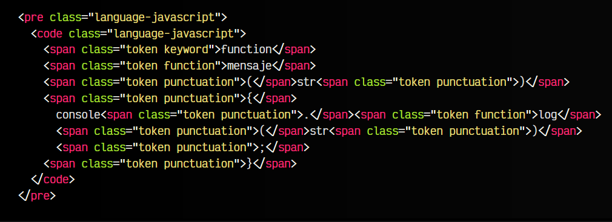
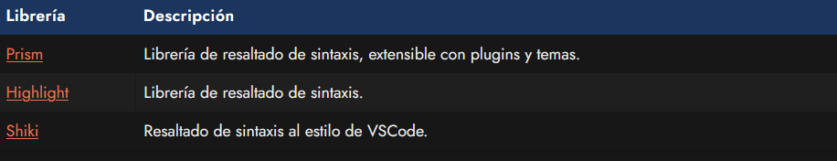

# La etiqueta HTML < pre >.

Quizás hayas comprobado que si quieres escribir un fragmento de código en HTML, el navegador no suele respetar los espacios consecutivos que escribes, así como otros carácteres especiales como los ENTER

(saltos de línea), colocándolos todos en la misma línea.

La etiqueta < pre > se puede utilizar para mostrar texto respetando el formato con el que está escrito (espacios en blanco, saltos de línea, etc...). Observa en el siguiente fragmento de código, en el primer lugar utilizamos un < div > y en el segundo lugar utilizamos un < pre >:

html:

css:

vista:

En el primero de los casos, el texto se mostrará todo en línea, eliminando los saltos de línea y espacios de indentado. Sin embargo, si utilizamos una etiqueta < pre > aparecerá formateado tal cual, respentando dicha estructura y, por defecto, colocando una tipografía apropiada para fragmentos de texto (monoespaciada).

## Bloques de código.
También es muy habitual utilizarlo junto a la etiqueta < code > anidada en su interior, de forma que tenemos un bloque de código preformateado. En esta situación, en la etiqueta < code > del interior, se suele incluir una clase específica, generalmente prefijada por language- o lang-, que a continuación indica el lenguaje que se indica en el fragmento de código:

html:

vista:

Realmente, esta clase no realizará ninguna tarea de forma nativa en HTML, pero suele ser un convenio muy utilizado para usar en conjunto a librerías Javascript que leerán el fragmento de código y lo convertirán a un marcado HTML listo y preparado para resaltar con colores el código del mismo.

## Librerías de resaltado de sintaxis.
Por ejemplo, utilizando Prism, incluyendo el código de la librería Javascript y añadiendo una hoja de estilos para el tema de colores de código, podemos prepararnos para utilizar esta librería:

html:

vista:

La línea de código Prism.highlightAll() indica a Prism que revise toda la página HTML y las etiquetas < pre > < code > sean modificadas para resaltarlas con colores mediante CSS.

El código anterior, es analizado texto a texto (token) y su marcado HTML es modificado a lo siguiente:

De esta forma, cada token está envuelto en una etiqueta con una clase concreta, con la que se le puede cambiar el color o estilo y conseguir que sea más sencillo de leer.

## Otras librerías de resaltado.
A continuación tienes alguna de estas librerías de resaltado de sintaxis para Javascript, donde podrás mejorar la legibilidad de los fragmentos de código que uses en tu web:

Por ejemplo, esta página utiliza una versión modificada de la librería [Prism.js](https://prismjs.com/) adaptada para resaltar la sintaxis teniendo en cuenta el rendimiento, en un sitio web desarrollado en [Eleventy](https://www.11ty.dev/).

