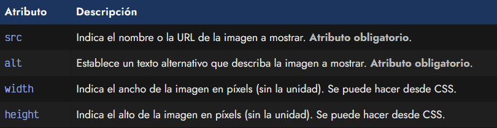
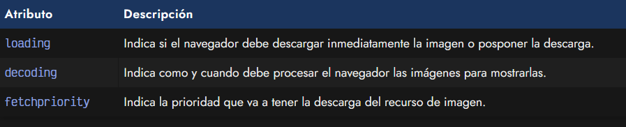
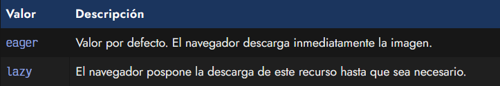
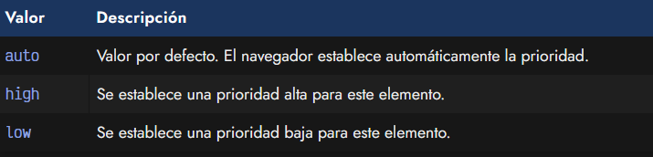
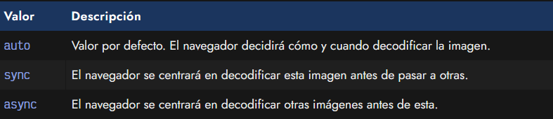
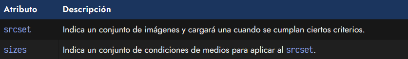
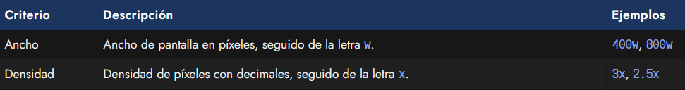
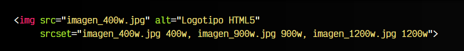
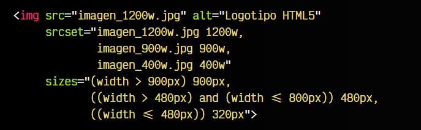

# La etiqueta HTML < img >.

Un tipo de recurso muy frecuente en nuestras páginas son las imágenes. Las imágenes son importantísimas para conseguir que nuestra página se vea bien y sea agradable (si son imágenes de decoración) o ayude a mostrar y ejemplificar lo que escribimos en ella (si son imágenes de contenido).

Antes de colocar una imagen en una página web debemos preguntarnos y tener claro cuál es el objetivo de dicha imagen en nuestro sitio web:

   - Imágenes mostradas como contenido de la web
   - Imágenes mostradas como decoración de la web

En el primer caso, si la imagen pertenece al contenido y tema tratado en esa página, sería conveniente incluirla mediante la etiqueta HTML < img >. Si por el contrario pertenece a la decoración de la página, sería más adecuado incluirla como un fondo mediante la propiedad CSS background-image.

## La etiqueta < img >.
Como hemos mencionado, para incluir imágenes en el contenido de una página utilizaremos la etiqueta < img >. Se trata de una etiqueta muy sencilla, que necesita al menos incluir obligatoriamente los atributos src y alt:

html:

vista:

Veamos que atributos pueden ser utilizados en esta etiqueta:

## El atributo src.
El atributo src sirve para indicar la dirección o URL de una imagen, ya sea mediante una ruta relativa o absoluta. El navegador descargará esa imagen y la mostrará en el lugar donde se indica en el documento HTML. Este atributo es obligatorio y debe ser indicado siempre en una etiqueta < img >.

La imagen puede estar en varios formatos diferentes, dependiendo del soporte del navegador, como por ejemplo .jpg, .webp, .png, .gif u otros.

► Más información: [Formatos multimedia (imagen, video y audio)](https://lenguajehtml.com/html/multimedia/formatos-multimedia/)

## El atributo alt.
El atributo alt sirve para indicar un texto alternativo a la imagen, que se mostrará en el caso que la imagen no pueda ser mostrada o descargada. Este atributo también es obligatorio en la etiqueta < img >, por lo que siempre debe ser utilizado.

Este atributo es muy importante en aspectos de accesibilidad, ya que en el caso de que estemos leyendo una página web con un lector de voz para invidentes, la imagen no podrá ser leída, por lo que leerá el texto alternativo.

## Los atributos width y height.
Aunque estos atributos no son obligatorios como los anteriores, es posible indicar los atributos width y height en la etiqueta < img > con valores numéricos (que se interpretarán como píxels) o porcentajes. De indicar sólo uno de estos atributos, los navegadores actuales adaptarán el otro para respetar la proporción de la imagen.

html:

vista:

Aunque pueda parecer lo contrario, indicar los atributos width y height en una etiqueta < img > se considera una buena práctica, ya que se fuerza a reservar el espacio necesario incluso antes de la descarga. Ten en cuenta que la imagen tendrá unas dimensiones específicas que el navegador desconoce hasta que descarga y procesa la imagen, por lo que durante ese tiempo las dimensiones serán 0 si no se indican y provocarán un molesto comportamiento de salto al cambiar el tamaño.

## Carga de imágenes.
En muchos casos, podríamos tener una página que está repleta de imágenes que deben descargarse y que, por lo tanto, ralentizarán la página y harán que la experiencia de usuarios sea peor. Existen ciertos atributos que tienen que ver con el rendimiento a la hora de cargar imágenes y mediante las cuales podemos ajustar la forma en que se van a procesar y descargar las imágenes de las etiquetas .

Son los siguientes atributos:

## El atributo loading.
El atributo loading es un atributo mediante el cuál podemos hacer Lazy Loading en imágenes. El término lazy loading (carga perezosa) se refiere a que podemos posponer la descarga de ciertas imágenes, para que el navegador le de prioridad a otras que son más importantes.

Se suele utilizar en páginas donde hay muchas imágenes que no están inicialmente en la región visible del navegador del usuario y, puede ser probable que nunca lo lleguen a estar, ya sea porque el usuario no llega hasta esa parte de la página o porque requiere una acción específica para que se muestren, por lo que no tiene sentido gastar recursos en descargarla si el usuario no la va a ver.

Los valores que se pueden indicar en este atributo son los siguientes:

Algunos navegadores permiten hacer lazy loading mediante el atributo loading en etiquetas < iframe >, y no sólo en etiquetas de imagen < img >.

## El atributo fetchpriority.
Mediante el atributo fetchpriority podemos establecer la prioridad con la que se descargará la imagen. Esto es útil para refinar el rendimiento de una página y darle prioridad a elementos que visualmente son muy importantes en el primer impacto visual de carga de la página, e incluso pueden ayudar para mejorar las Core Web Vitals (métricas de Google para determinar la velocidad de carga de una página).

Este atributo puede tomar los siguientes valores:

## El atributo decoding.
El atributo decoding permite indicarle al navegador como debe hacer el proceso de decodificación de la imagen, esto es, convertir los datos de la imagen en un formato más apto para representarlo visualmente en el navegador. Este proceso puede tardar tiempo, por lo que podemos modificar como actua el navegador para mejorar el rendimiento.

Los valores que puede tomar son los siguientes:

## Múltiples imágenes.
En algunas ocasiones nos podría interesar indicar al navegador que debe descargarse una imagen concreta si el dispositivo tiene una cierta resolución (por ejemplo, dispositivo móvil), pero en el caso de ser un dispositivo de alta resolución (por ejemplo, escritorio) descargue una imagen de mayor resolución. De esta forma no desperdiciamos recursos o tiempo de descarga. Lo mismo con pantallas que tengan una densidad de píxeles mayor, y pueda mostrar imágenes a mejores resoluciones.

## El atributo srcset.
Mediante el atributo srcset se puede indicar una lista de recursos (imágenes) separados por coma, que se utilizarán en situaciones concretas cuando se cumplan determinados criterios como los indicados anteriormente. Los valores de srcset tendrían el siguiente formato:

En este caso, observa que se indican 3 imágenes, cada una de ellas separada por espacio con un número y una letra que indica el criterio para cargar dicha imagen.

Dicho criterio se define de la siguiente forma:

Veamos un ejemplo real utilizando la etiqueta < img > con estos atributos:

Observamos varias cosas:

   - Los atributos src y alt son obligatorios, por lo que deben indicarse siempre.
   - Si el navegador es muy antiguo y no soporta srcset, hará lo definido en src.
   - Si el dispositivo cumple uno de los criterios definidos, usa esa imagen en src.

## El atributo sizes.
De la misma forma que vimos con el atributo srcset, con el atributo sizes se puede establecer una lista de condiciones de medios, ver media queries, que se aplicarán en cada uno de los criterios del srcset.

Estos seguirán el siguiente formato:

Observa que ahora estamos estableciendo una condición que en el caso de cumplirse, se aplicará el recurso correspondiente del atributo srcset. Observa que el atributo sizes está formado por una consulta de medios con el mismo formato que los media queries, y una medida optativa que se utilizará para la imagen cuando se cumpla una cierta consulta de medios.