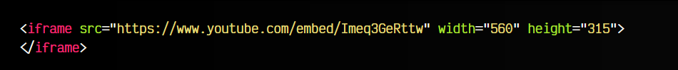

# La etiqueta HTML < iframe >.

Si queremos colocar contenido en una página, lo conveniente es utilizar formatos libres para garantizar que sean accesibles desde cualquier tipo de dispositivo, independientemente del navegador o el sistema operativo.

¿Pero qué ocurre si queremos colocar contenido de una web externa? Por ejemplo, servicios como Youtube, Vimeo, SoundCloud, SlideShare u otros sitios similares. Se trata de servicios que ofrecen contenido externo para incrustar en nuestra página web, pero lo que nos proporcionan no son imágenes, video o audio en formatos que reconozca el navegador, sino un enlace con contenido HTML muy diverso, que pueden incluir Javascript, CSS, imágenes, videos y muchos otros recursos.

En esas situaciones, lo más probable es que necesites una etiqueta que permita incluir contenido externo.

Antiguamente, en versiones antiguas de HTML, existían unas etiquetas llamadas marcos, mediante las cuales se permitía dividir la pantalla en varias secciones independientes. Actualmente, ese modo de desarrollo ya no se utiliza ya que acarreaba múltiples problemas de accesibilidad, posicionamiento, etc.

Sin embargo, de toda la familia de etiquetas de marcos, han sobrevivido los < iframe >, una etiqueta de marcos flotantes que sigue siendo útil hoy en día para incrustar contenido externo en una página.

Veamos un ejemplo, donde incrustamos un video externo de YouTube mediante un < iframe >:

html:

vista:

Al igual que con otras etiquetas anteriores como < img > o < video >, debemos utilizar el atributo src para indicar la URL del contenido que queremos referenciar, así como los atributos width y height para definir su tamaño de ancho y alto respectivamente.

Mediante esta etiqueta podremos incrustar contenido externo en nuestra propia página. Es decir, crearemos un recuadro que en su interior tendrá la página, documento o recurso externo que le indiquemos en el atributo src. Generalmente, es la etiqueta más utilizada para todo tipo de contenido externo.

Observa que la URL indicada en el iframe no es exactamente la misma URL que solemos utilizar para ver un video de Youtube. Se trata de una versión minimalista que carga específicamente el video en cuestión, preparado para usar en un iframe.

## El atributo name.
Es posible utilizar el atributo name en nuestro < iframe > para darle un nombre al marco y cargar direcciones URL diferentes a través de una etiqueta de enlace < a >, haciendo referencia al marco a través del atributo target:

html:

vista:

De esta forma podemos tener un pequeño marco accesible y navegable, sin necesidad de utilizar Javascript.

## El atributo srcdoc.
Por otro lado, el atributo srcdoc nos permite indicar directamente el código fuente del iframe en su valor, algo que puede ser interesante para crear contenido autogenerado a demanda:

Como se puede ver, en este caso hemos indicado el atributo srcdoc y el atributo src a la misma vez. El navegador dará prioridad al atributo srcdoc, y mantendrá el atributo src como fallback, para navegadores que no soporten srcdoc muestren el contenido indicado en src.

## El atributo allowfullscreen.
Es posible indicar el atributo allowfullscreen en nuestra etiqueta < iframe >. De esta forma, se le indica al navegador que se permite la posibilidad de llamar a la función Javascript requestFullscreen(), o lo que es lo mismo, la posibilidad de poner el video a pantalla completa.

De no indicarlo, el navegador no permitirá que se pueda establecer.

## El atributo loading.
Al igual que con las imágenes, algunos navegadores soportan el uso del atributo loading para hacer lazy load del contenido del < iframe >. Un iframe, al cargar contenido externo, puede repercutir negativamente en el rendimiento y velocidad de carga de la página, puesto que puede necesitar cargar una gran cantidad de recursos. Esto se agrava si tenemos múltiples elementos < iframe > a lo largo de la misma página.

Para paliarlo, podemos utilizar el atributo loading con el valor lazy, de modo que el navegador no cargará el contenido del iframe hasta que la región visible del navegador esté próxima a él.

Los valores que se pueden indicar en este atributo son los siguientes:

## Etiquetas externas (legacy).
Al margen de los < iframe >, existen otras etiquetas para utilizar contenido externo en una web. Sin embargo, siguen permaneciendo por motivos históricos y de compatibilidad, ya que actualmente no se utilizan demasiado.

Dichas etiquetas son las siguientes:

## La etiqueta < embed >.
La etiqueta < embed > se ideó antiguamente como una etiqueta no estándar para incluir contenido que requería el uso de un plugin externo para funcionar, ya que se trataba de tecnologías propietarias y los navegadores no las soportan.

La etiqueta fue retirada en HTML4, pero en HTML5 fue incluída de nuevo. Se podía utilizar, por ejemplo, para incrustar contenido flash en una página web:

La tecnología flash en sitios webs dejó de utilizarse sobre los alrededores del año 2007, donde empezó a ser reemplazada por HTML5, CSS y Javascript.

## La etiqueta < object >.
Tradicionalmente, otra etiqueta interesante fue la etiqueta < object >, muy útil también para incrustar contenido flash o contenido de otro tipo. Una de las ventajas interesantes que incorporaba, es que se trataba de una etiqueta contenedora, a la cuál podías añadir etiquetas < param > en su interior para especificar parámetros.

El siguiente fragmento de código es equivalente al anterior:

Así pues, la etiqueta < object > se ofrecía como una alternativa más apropiada para cargar todo tipo de contenidos. Permitía la posibilidad de indicar el tipo de formato del que se trataba, así como añadir múltiples parámetros o la opción de añadir etiquetas a modo de fallback.

Otro ejemplo utilizando la etiqueta < object >:

