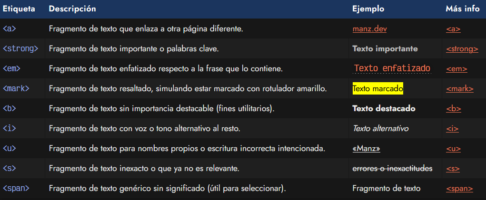
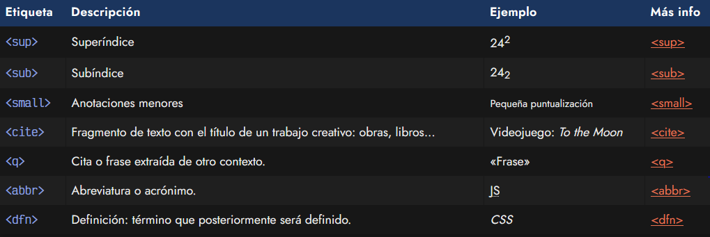
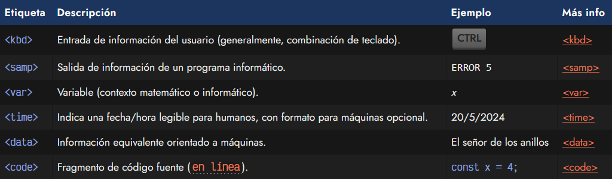
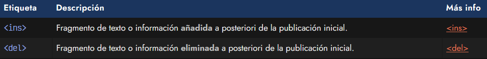

# Etiquetas semánticas de texto.
Hemos hablado que existen múltiples etiquetas HTML dentro del lenguaje HTML5. Y la mayoría pertenecen a dos grupos principales:

   - Las etiquetas que contienen fragmentos de texto (dan significado o contexto a esos fragmentos)
   - Las etiquetas que agrupan otras etiquetas (contienen y agrupan información variada)

En este apartado vamos a hablar del primer grupo, que son las etiquetas que utilizamos para separar fragmentos de textos por motivos semánticos (lo más importante de entender) y/o motivos visuales.

En el siguiente fragmento de código, tenemos la etiqueta < p >, que pertenece al segundo grupo (agrupación), mientras que la etiqueta < strong > forma parte del primer grupo (semántica de texto):

Hay que entender que las etiquetas de agrupación, por lo general son etiquetas de bloque. Por otro lado, las etiquetas que permiten dar semántica a los textos son etiquetas en línea. Esto es muy importante entenderlo, ya que nos ayudará a diferenciarlas rápidamente.

Si no conoces la diferencia entre etiquetas de bloque (block) y en línea (inline), echa un vistazo a la documentación de LenguajeCSS, concretamente a la [propiedad display de CSS](https://lenguajecss.com/css/maquetacion-y-colocacion/propiedad-display/).

## Fragmentos de texto.
En primer lugar, existe una serie de etiquetas HTML simples para seleccionar un fragmento de texto y dotarlo de un significado semántico especial. Lo principal es entender que no se hace sólo por mera intención visual, sino porque se le quiere dar un significado semántico, y además, quizás también por una cuestión visual:

Estas son unas de las etiquetas más utilizadas para separar fragmentos de texto en HTML. Sin embargo no son las únicas, hay algunas más que veremos a continuación.

OJO: Algunas de estas etiquetas, en versiones anteriores de HTML tenían un significado diferente, como por ejemplo las etiquetas < b >, < i > o < u >.

## Fragmentos con significado.
Las siguientes etiquetas HTML también nos permiten modificar el significado semántico de la información que contienen de una forma muy particular. Son menos utilizadas que las anteriores, sin embargo, también forman parte de la lista de etiquetas semánticas de texto:

## Fragmentos técnicos/informáticos.
Existen una serie de etiquetas HTML ligeramente orientadas a aspectos matemáticos o informáticos como combinaciones de teclado del usuario, mensajes de programas o representación de variables matemáticas o informáticas:

## Fragmentos de edición
Por último, tenemos unas etiquetas orientadas a la edición posterior a la publicación de un texto o página web. Son útiles para saber rápidamente los cambios o modificaciones que se han realizado:

