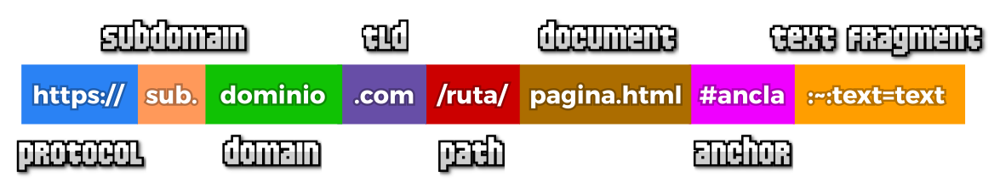
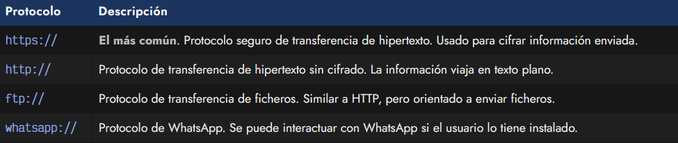
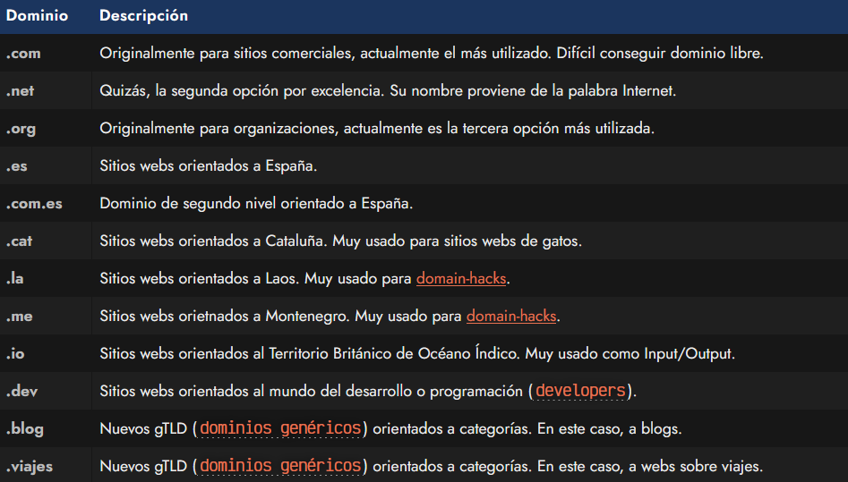
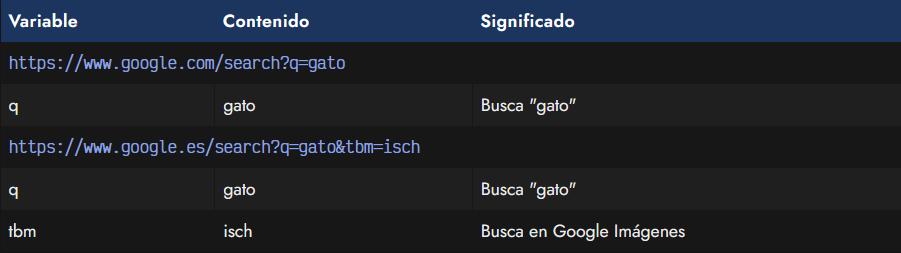
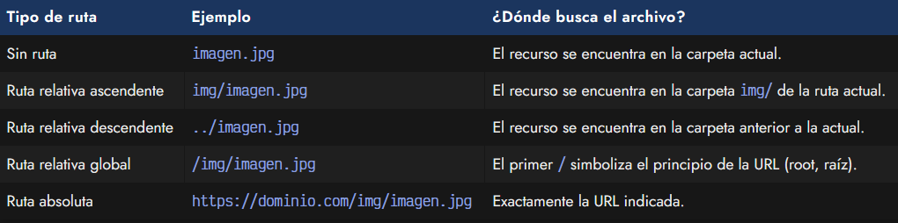

# Enlaces o hipervínculos.

Para crear enlaces (o hipervínculos, vaya palabra fea) en una página web utilizaremos la etiqueta < a >, pero antes de empezar a ver esa parte, es conveniente entender lo que son las URL (o direcciones web).

La palbra URL proviene de Uniform Resource Location, es decir, una dirección única para hacer referencia a un documento o fichero concreto. Es la forma que tenemos de referenciar elementos en Internet como ficheros .html, .css, .js, .jpg, etc. Sin embargo, hay muchos factores que influyen a la hora de crear o indicar una URL, vamos a dar un repaso y a entenderlos.

## Esquema URL.
Al escribir una URL, tenemos que respetar un formato de modo que la URL sea válida y no tenga errores. Conviene conocer bien la estructura de una URL, para diferenciar cada una de sus partes. Lo que veremos a continuación, es una URL dividida en varias secciones o partes, que vamos a comenzar a explicar:

## Protocolo.
La parte inicial de la URL es el denominado protocolo. Hay varios protocolos que podemos establecer una URL, pero probablemente, el más utilizado sea https://, aunque http:// también es bastante utilizado. En el primer caso, la información viaja cifrada, por lo que la transmisión es más segura. En el segundo caso, no hay cifrado, por lo que los datos enviados van en texto plano y es una comunicación que será menos segura.

Al escribir una URL nunca debemos olvidarnos del protocolo y escribir sólamente la dirección, ya que el vínculo podría no funcionar correctamente en algunos navegadores.

Veamos algunos protocolos de ejemplo:

¿Sabías que puedes utilizar la abreviatura // en lugar de https:// en las URL de tu documentos web? Al indicar // al inicio de un enlace, le decimos al navegador que establezca http:// o https:// dependiendo del protocolo del documento actual cargado. Si el documento actual se cargó como http:// reemplazará // por http://, pero si el documento se cargó como https:// reemplazará // por https://. Esto nos permite más flexibilidad a la hora de cargar documentos o recursos.

## Dominio.
La siguiente parte de la URL es el dominio del sitio web que queremos enlazar. El dominio generalmente se compone de un subdominio (opcional), el nombre de dominio y el dominio de nivel superior o TLD. Por ejemplo, las famosas www no son más que un subdominio utilizado tradicionalmente para páginas webs.

Existen muchísimos TLD para sitios web:

Para utilizar un dominio para tu página web debes adquirir uno. Su precio depende del tiempo por el que lo compres, el registrador que elijas y el TLD elegido. Existen multitud de registradores para comprar estos dominios. Algunas buenas opciones podrían ser [DonDominio](https://www.dondominio.com/es/) o [PorkBun](https://porkbun.com/).

## Ruta o path.
Cuando hablamos de la ruta de una URL, podemos estar haciendo referencia a la estructura de carpetas incluyendo o excluyendo el documento final referenciado (si lo existe, algunas URL pueden omitirlo). Aún así, en nuestra explicación vamos a diferenciar bien estas dos partes:

   - Ruta: Es la parte de la URL que es equivalente a las carpetas o directorios donde almacenamos nuestros archivos. Puede tratarse de una sola carpeta o varias de ellas, siempre separadas por el carácter /.

   - Página o documento: La última parte de la URL suele ser un documento HTML como el del ejemplo: pagina.html. En algunos casos, la extensión .html es abreviada como .htm. Dependiendo del servidor web utilizado, es posible que se utilicen otro tipo de documentos con lenguajes de programación del lado del servidor, como podría ser por ejemplo pagina.php u otros. Si se trata de otro documento, como un archivo PDF o un video, el navegador intentará abrirlo directamente, y si no puede, lo descargará para que el usuario lo abra con alguna aplicación de su sistema.

   - En el caso que una dirección termine y no indique una página o documento, generalmente, el servidor que aloja la página web dirige al usuario a una página llamada index.html o index.htm por defecto. Esto es configurable en la parte del servidor, y depende de totalmente de la configuración del servidor web utilizado.

## Parámetros o query strings.
Una parte no mencionada en el esquema anterior son las cadenas de consulta del usuario, más frecuentemente utilizadas en lenguajes como Javascript o lenguajes de programación del servidor (backend). Básicamente, son variables que contienen información y se envían en la URL, como por ejemplo, en la búsqueda de Google:

Como puedes ver, estas query strings se indican al final de la URL, utilizando un ? para comenzar a definir las variables, y utilizando & como separador entre una variable y la siguiente. Cada variable indicará su valor tras su nombre seguido del símbolo =.

## Anclas.
Las anclas (anchors) en una URL no son más que un fragmento de texto precedido por el carácter # que indica al navegador que debe buscar una etiqueta HTML con un atributo id con ese texto. Una vez encontrado, posicionará al usuario en esa parte de la página. Se utiliza para acceder directamente a permalinks (enlaces permanentes) o secciones concretas de una página.

## Fragmentos de texto.
Recientemente también ha aparecido una nueva característica llamada scroll to text fragments. Se basa en escribir el texto #:~:text= < palabrainicial >,< palabrafinal > a continuación de la URL. Con esto, el navegador hace scroll a la parte de la página donde se encuentra el fragmento de texto que comienza por la palabra inicial y termina por la palabra final. También se pueden indicar frases en lugar de palabras.

Habitualmente, el navegador marca y resalta estas palabras, lo que lo hace ideal para usuarios que realizan una búsqueda de algún texto específico y el navegador puede destacarselo para que lo encuentren lo antes posible.

## Estado de un enlace.
Por defecto, los enlaces pueden tener 3 estados diferentes:

   - Enlaces sin visitar: Un enlace que no ha sido visitado aún es representado por los navegadores como un enlace de color azul y subrayado. Se pueden modificar sus estilos mediante la pseudoclase :link de CSS.

   - Enlaces ya visitados: Un enlace que ha sido visitado previamente es representado por los navegadores como un enlace de color lila y subrayado. Se pueden modificar sus estilos mediante la pseudoclase :visited de CSS.

   - Enlaces activos: Se considera activo un enlace cuando el usuario está pulsando sobre él con el ratón (y no ha dejado de pulsar). Se suele utilizar para destacar el clic visualmente. Aunque no es exclusiva de los enlaces, se pueden modificar sus estilos mediante la pseudoclase :active de CSS.

Un buen consejo es que no realices cambios bruscos en los estilos de los enlaces, ya que los usuarios no lo percibirán como enlaces al no estar acostumbrados. Se recomienda que los enlaces tengan tonalidades de azul y estén subrayados, así como lila los ya visitados.

## Estado de un enlace.
Un detalle muy importante que no hay que infravalorar, es cómo indicar las rutas en atributos como href en un enlace, en src de imágenes o videos, etc. Aunque a priori parece muy sencillo, hay que tener muchas cosas en cuenta para realizar enlaces de forma correcta.

Vamos a analizar las diferentes formas:

El usuario puede utilizar la forma de indicar la ruta que prefiera, eso sí, se aconseja ser coherente y utilizar siempre que se pueda un mismo formato de ruta. Particularmente, tiendo a utilizar el tipo de ruta relativa global siempre que pueda, ya que funciona independientemente de donde se encuentre el documento actual. Eso sí, hay que tener bien clara la estructura de la web.

En algunos editores como VSCode, se puede utilizar el formato de ruta que proviene de Linux, donde se prefija la ruta con un ./ que simboliza la carpeta actual. Esto hace que el editor dispare el selector de ficheros y carpetas y sea más fácil para nosotros indicar una ruta.
