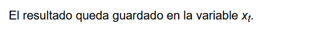
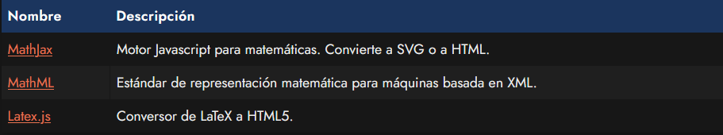

# 
La etiqueta HTML < q > ycite 
. 

Imaginemos el caso en el que estamos escribiendo un texto, y en una de las cifras tenemos que indicar un superíndice para hacer referencia a una exponenciación: 10 elevado a 2, por ejemplo.

Podríamos ser avispados y buscar la combinación de teclas apropiada para escribir dicha cifra (10²), esto es, pulsar la combinación de teclas ALT+253. De la misma forma podríamos conseguir algunas más, pero... ¿Qué ocurre si necesitamos hacer lo mismo con un texto o alguna cifra más específica que no tiene equivalente mediante esta forma?

En HTML se puede conseguir mediante las siguientes etiquetas.

## La etiqueta < sup >.
La etiqueta HTML < sup > se utiliza para indicar superíndices. De esta forma tenemos un mecanismo que nos permite diferenciar el número 242 del número 242. Observa el siguiente fragmento de código:

html:

vista:

Esto nos puede servir tanto para números como para letras:

html:

vista:

## La etiqueta < sub >.
De la misma forma, podemos utilizar la etiqueta < sub > para hacer referencia a subíndices.

html:

vista:

## Fórmulas complejas>.
Si buscas un sistema más complejo para representar fórmulas o ecuaciones matemáticas, quizás deberías profundizar en alguno de estos sistemas:

