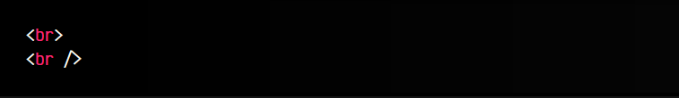
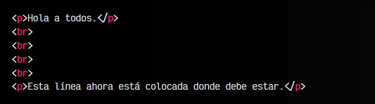
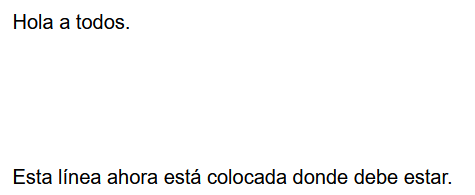
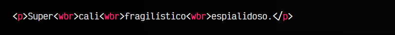
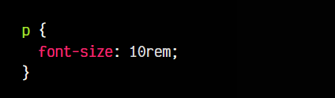
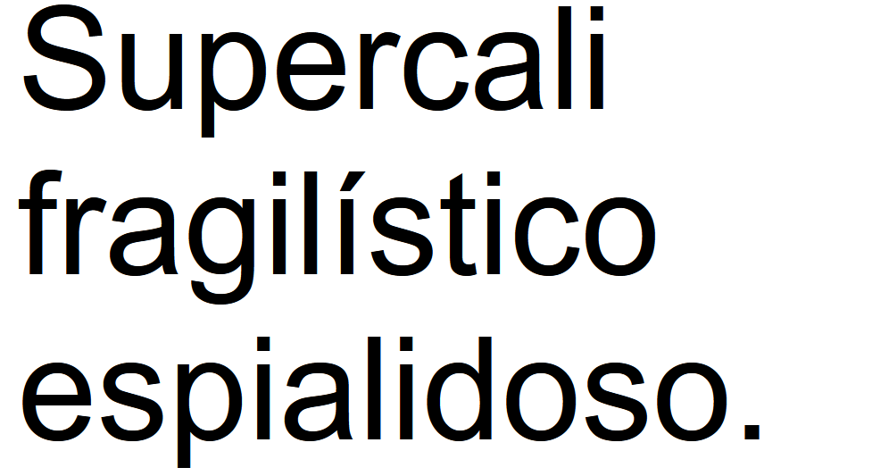
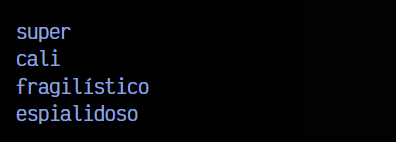

# 
La etiqueta HTML < br > y < wbr >.

Los denominados saltos de línea son comportamientos en los que se salta a la siguiente linea para emular el comportamiento de pulsar ENTER

en un documento web. Este comportamiento, en Windows, se suele representar con los carácteres especiales \r\n, donde el \r es un retorno de carro y el \n es un nueva línea.

Estos comportamientos provienen de las antiguas máquinas de escribir, donde cuando terminabas de escribir una línea, tenías que volver al inicio de la misma (retorno de carro) y luego avanzar a la siguiente línea para seguir escribiendo y no escribir encima de lo que ya habías escrito.

## La etiqueta < br >.
La etiqueta < br > representa el mencionado salto de línea, para avanzar a la línea siguiente y continuar escribiendo en una nueva línea, pero llevado a un documento web, ya que un ENTER

no realizará esa acción en el documento renderizado en el navegador.

Al contrario que otras etiquetas de HTML, las etiquetas < br > son etiquetas que no necesitan etiqueta de cierre, por lo que sólo se escribe la etiqueta de apertura, en algunos casos con el carácter / de autocierre:

Ambas formas de escribir la etiqueta son correctos. El primero es la forma de escribir una etiqueta sin cierre en HTML5, mientras que la segunda es la forma de cerrar una etiqueta sin cierre en XHTML, una versión más antigua de HTML, pero que se admite por retrocompatibilidad en HTML5.

Su utilización correcta es la de forzar a saltar a la siguiente línea cuando ese contexto es el adecuado, como por ejemplo, en un poema donde debes saltar a la siguiente línea en determinados versos o similares.

## Uso de < br > para maquetar.
Un error frecuente en desarrolladores nóveles es el de utilizar las etiquetas < br > para forzar a colocar elementos en una página web, debido a que estas etiquetas mueven el flujo de la página hacia abajo:

html:

vista:

Esto se considera una mala práctica que denota inexperiencia, ya que para maquetar y colocar elementos en una página, lo que realmente se debe hacer es utilizar mecanismos de CSS como [flex](https://lenguajecss.com/css/maquetacion-y-colocacion/flex/) o [grid](https://lenguajecss.com/css/maquetacion-y-colocacion/grid-css/), por ejemplo.

## La etiqueta < wbr >.
Por otro lado, existe una etiqueta HTML menos conocida: la etiqueta < wbr >. Esta etiqueta se denomina oportunidad de salto de línea (o división silábica), y funciona de forma muy similar a < br >, sólo que en este caso el salto de línea no se realiza de forma obligatoria.

Imaginemos una palabra que no cabe dentro de un elemento y se quiere evitar que desborde el contenido. Utilizando la etiqueta < wbr > podemos establecer los cortes de la palabra que, en el caso de tener la oportunidad de cortarla, lo hará. En caso contrario, permanecerá junta.

html:

css:

vista:

La palabra anterior, si está en un contenedor muy pequeño, podrá ser cortada de forma que aparezca de la siguiente forma:

De la misma forma, la etiqueta < wbr > no tiene etiqueta de cierre.

