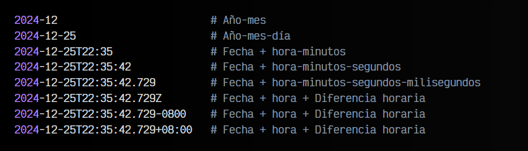
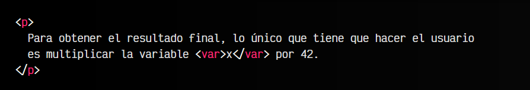

# 
La etiqueta HTML < time > y < data >.

n un documento web podríamos necesitar representar de forma adecuada una fecha, hora o alguna información relacionada con el tiempo. Sin embargo, debemos tener en cuenta varios aspectos:

   - Necesitamos que el lector del documento entienda la información de una forma legible y agradable.
   - Necesitamos que una máquina sea capaz de leerla e indexarla.
   - Necesitamos que la información sea lógica y carezca de ambigüedades.

Para ello vamos a utilizar la etiqueta < time >.

## La etiqueta < time >.
La etiqueta < time > permite indicar una fecha, hora (o una información relacionada con el tiempo) en formato legible para humanos.

Por ejemplo:

html:

vista:

Sin embargo, escribir una fecha como 2024-12-25 puede ser algo incómodo de leer para una persona. Sería mejor que tuvieramos la fecha de una forma más lógica, pensada para la lectura humana, y a la vez para una máquina. Aquí es donde entra el atributo datetime.

## El atributo datetime.
De forma opcional, se puede establecer un atributo datetime con la información de tiempo en un formato orientado para máquinas, es decir, con el formato que definimos anteriormente. Esto puede ser muy útil cuando queremos mostrar una fecha legible para humanos (4 de Enero de 2024), pero queremos que una máquina pueda leerlo sin ambigüedades (2024-01-04).

Observa el siguiente ejemplo:

html:

vista:

Para una máquina, leer e interpretar la cadena de texto 4 de Enero de 2024 es complejo. Cada idioma tiene una forma de escribir las fechas, nombres de meses en ese idioma, comas, puntos o separaciones diferentes, etc. Hacer que una máquina pueda leer e interpretar todos estos formatos es difícil. Sería mejor establecer un formato sencillo y lógico para máquinas.

Una recomendación sobre las fechas, es escribirlas en un formato de mayor a menor, de modo que empecemos por el año y acabemos por los segundos. De esta forma, formatos válidos podrían ser los siguientes:

bash:

Aún así, no es necesario empezar siempre por el año. Hay algunas excepciones donde nos podemos saltar algunos valores que no son relevantes (aún así, fijate que respetamos el orden de mayor a menor):

bash:

## La etiqueta < data >.
De la misma forma que hemos utilizado la etiqueta < time > para temas relacionados con fechas, horas o duraciones, podemos utilizar la etiqueta < data > para datos genéricos donde también necesitamos representar el concepto de una forma legible para humanos, y de otra forma diferente para máquinas.

Para ello, utilizamos el contenido de la etiqueta como texto para humanos, y el valor del atributo value como contenido orientado para máquinas:

En este ejemplo, observa que El retorno del Rey, la tercera película de El Señor de los Anillos es el contenido de la etiqueta < data >, sin embargo, el valor del atributo value es ESDLA3, ya que son las siglas de la película y además el número 3 que indica que es la tercera parte.

## La etiqueta < var >.
Continuando con etiquetas que definen datos, tendríamos la etiqueta < var >, que se utiliza para definir variables o incógnitas matemáticas. Si necesitamos hacer referencia a una variable informática o una variable matemática, podemos utilizar esta etiqueta para hacer referencia. Por defecto, establecerá una tipografía monoespaciada (utilizada en terminales de texto o programas informáticos) y así se entenderá mejor que es una variable:

