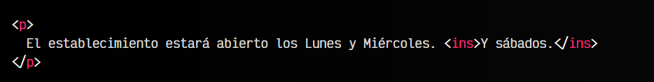
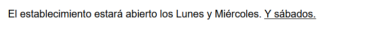
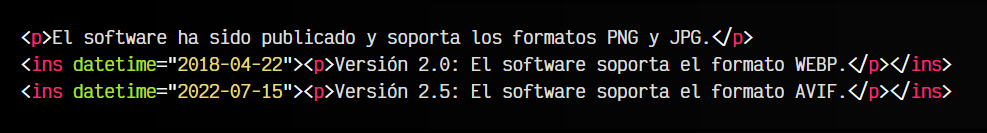
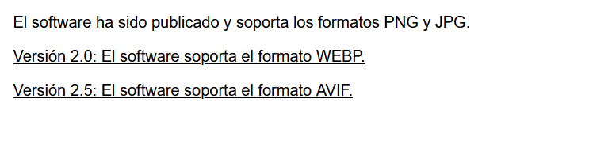
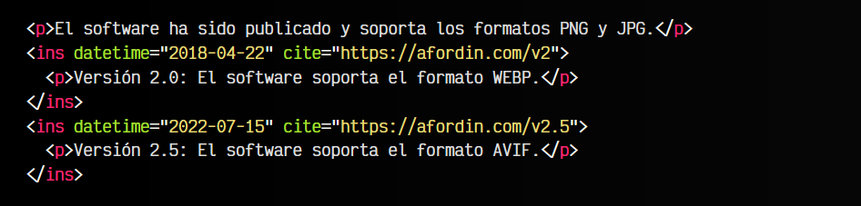
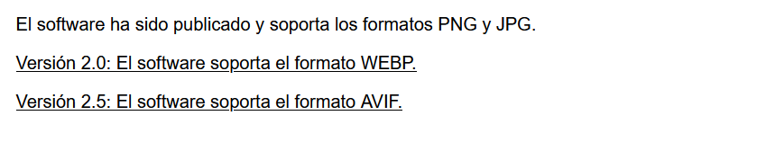
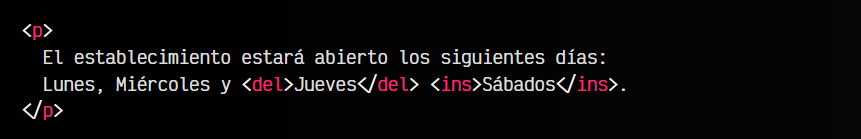
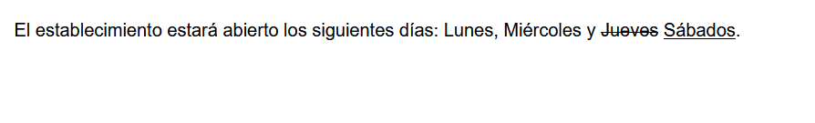

# 
La etiqueta HTML < ins > y < del >.

La publicación de textos en Internet es un proceso continuo donde el momento de publicación importa. Por ejemplo, un usuario podría leer un artículo recién publicado con ciertos datos incorrectos o irrelevantes que su autor pasó por alto y descubrió posteriormente a su publicación.

Sería interesante tener una forma de indicar nueva información, o la retirada de información incorrecta, de modo que se vea literalmente para que un usuario que vuelve a leer o consultar el artículo, se de cuenta que ha sido modificado o corregido. Aquí es donde entran las etiquetas < ins > y < del >.

## La etiqueta < ins >.
Mediante la etiqueta < ins > podemos agrupar un fragmento de texto añadido al texto global, indicando que es información nueva. Además, desde CSS podemos asociarle unos estilos CSS determinados para resaltarlo o destacarlo de alguna forma.

Veamos un ejemplo:

html:

vista:

Observa que el texto añadido está rodeado por la etiqueta < ins >.

## El atributo datetime.
Tanto si estamos realizando una sola modificación como múltiples modificaciones, podemos utilizar el atributo datetime para indicar la fecha de modificación. Funciona exactamente igual que el atributo datetime que se explicó en el artículo de [la etiqueta < time >](https://lenguajehtml.com/html/texto/etiqueta-html-time/). Esto podría permitirnos diferenciar el momento en el que fue actualizada la información:

html:

vista:

Observa que aunque el elemento < ins > es una etiqueta en línea, en algunos casos se puede utilizar para incluir elementos en bloque como < p >.

## El atributo cite.
También es posible añadir el atributo cite que permite incluir una URL con más información sobre la información añadida/eliminada. Funciona de forma idéntica al atributo cite de la etiqueta < q >.

html:

vista:

## La etiqueta < del >.
De la misma forma que utilizamos la etiqueta < ins >, podemos utilizar la etiqueta < del > para indicar que una información ha sido eliminada del documento por alguna razón: ya no es relevante, se ha detectado información incorrecta, etc.

html:

vista:

