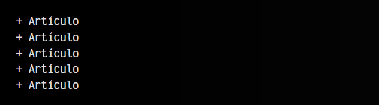
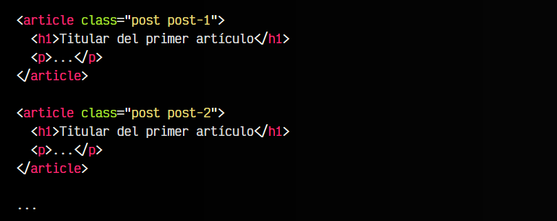
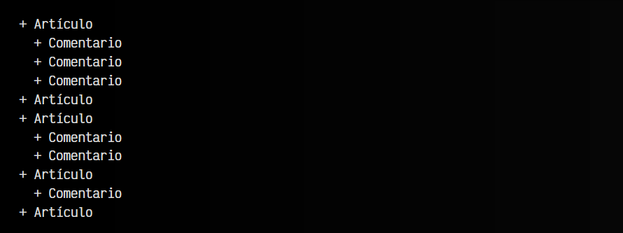
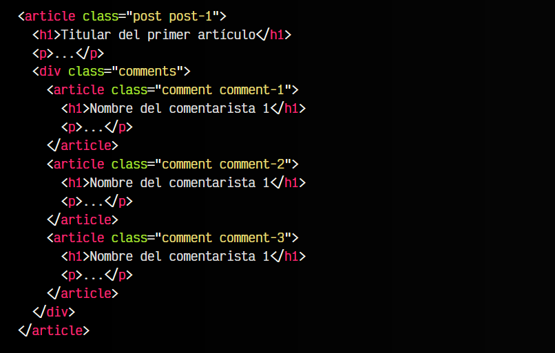

# 
La etiqueta HTML < article >.

Una de las etiquetas semánticas de sección más importantes de HTML5 es la etiqueta < article >. A diferencia de lo que muchos creen, no se trata de una etiqueta para definir artículos, como literalmente parece que indica, sino que sirve para definir partes con la suficientemente importancia como para considerarse una entidad destacable con información a su alrededor.

## La etiqueta < article >.
La etiqueta HTML < article > se utiliza para agrupar información muy relevante de una página o documento concreto. Lo primero, es pensar en nuestro documento y reducirlo a la mínima expresión en una lista. Por ejemplo, si pensamos en la página principal de un medio de prensa que muestra los últimos 5 artículos publicados:

bash:

En este caso, veamos un fragmento de código muy resumido para mostrar el caso anterior:

Observa que la etiqueta < article > se utiliza como una especie de < div > que agrupa todo el contenido, dotandole de algo más de semántica, ya que un < div > es mucho más genérico, pero con < article > le damos algo de importancia y representación dentro de este contexto.

Cada uno de esos artículos sería una entidad con suficiente importancia como para considerarla < article >, sin embargo, podríamos detallarlo más, según nos interese. Observa el siguiente ejemplo:

bash:

## Etiquetas < article > anidadas.
Observa que en esta nueva lista, el primer artículo tiene 3 comentarios, el segundo ninguno, el tercero 2 comentarios, el cuarto sólo uno y el último ninguno. En este caso, a la hora de representar semánticamente, estaríamos hablando de un < article > por cada artículo, pero también de un < article > anidado por cada comentario, dentro del < article > anterior, ya que son comentarios que hablan sobre el artículo que lo contiene.

Esto en nuestro ejemplo podría ser algo así:

Esto ocurre porque los comentarios pueden dar información interesante como para considerarlo una entidad importante de la página, aunque no sean literalmente un artículo.

La naturaleza del < article > dependerá del tipo de página: un artículo en un blog, una receta de cocina, una canción o video, un canal de Twitch, un widget personalizado en la página, etc...

