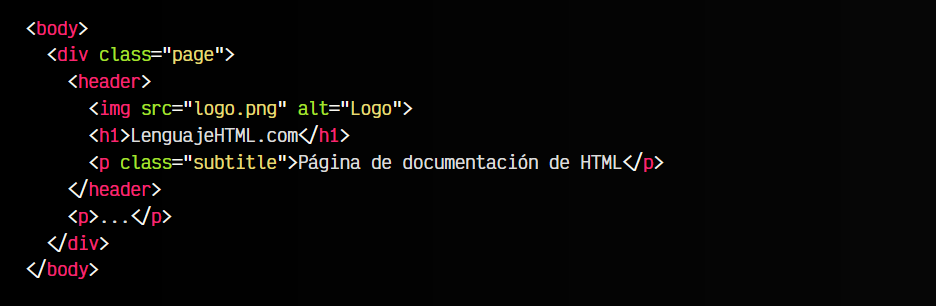
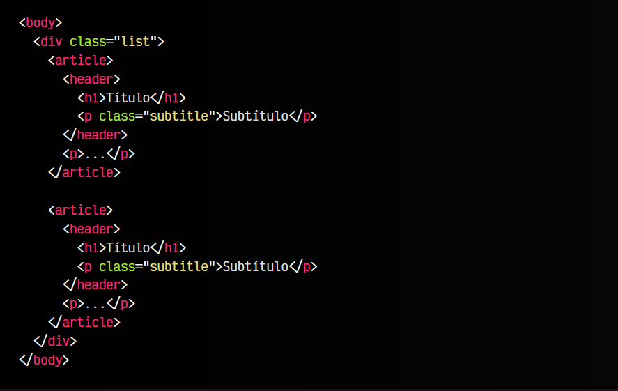
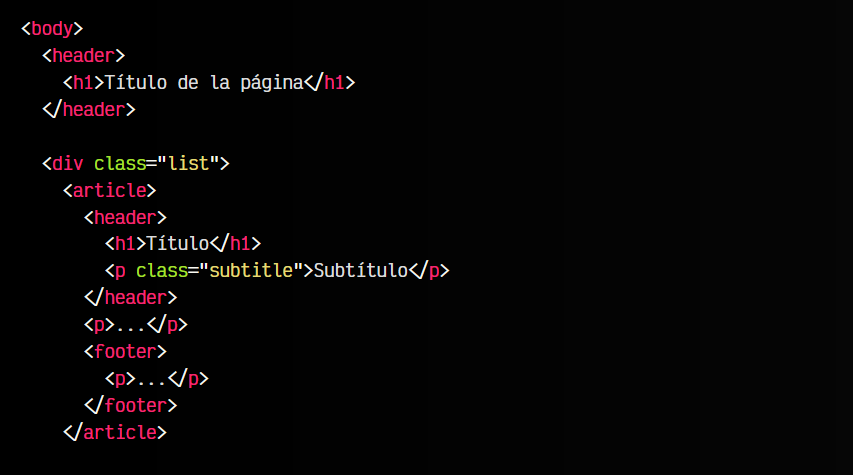
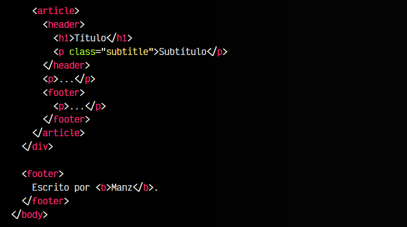

# 
La etiqueta < header > y < footer >.

Cuando hablamos de semántica en HTML, uno de los principales objetivos que buscamos es el de localizar y agrupar de forma correcta y con sentido la información de una página, intentando cubrir todos los casos posibles. Antes de continuar, si no lo has hecho aún, echa un vistazo a la etiqueta < article >, ya que será necesaria para lo que vamos a explicar.

## La etiqueta < header >.
La etiqueta < header > nos permite identificar la cabecera de una página o documento concreto, igual a como lo haríamos con un < div div class="header" >< /div>, pero añadiendo esa semántica implícita y eliminando la necesidad  de añadirle una clase.

Es importante no confundir la etiqueta < head > con la etiqueta < header >, ya que la primera es la etiqueta de cabecera del documento HTML, pero la cabecera que se utiliza para almacenar metadatos y datos adicionales, que no se mostrarán visualmente en el renderizado del navegador. Por otro lado, la cabecera < header > es la que visualmente suele incorporar un logo, o detalles que van en la zona superior de la página.

Observa que en este caso hemos colocado la imagen de logotipo de la página, el título < h1 > y un subtítulo < h2 > dentro de la cabecera, ya que hemos interpretado que son los elementos que pertenecen a la cabecera del sitio web.

## Cabeceras de elementos específicos.
No obstante, aunque en el ejemplo anterior hemos definido una etiqueta < header > para la página actual, esta etiqueta < header > puede ser definida múltiples veces en la misma página, ya que actuaría como cabecera < header > del elemento semántico padre que lo contiene.

Veamos esto en un ejemplo, donde se verá mejor:

Observa que en esta ocasión, tenemos dos elementos < article >, cada uno de ellos con su propio < header >, por lo que es la cabecera de cada uno de ellos. De esta forma, es posible tener múltiples cabeceras por página.

## La etiqueta < footer >.
De la misma forma que hemos visto la etiqueta < header >, tenemos la etiqueta < footer >. Mientras que la primera se utiliza para indicar cabeceras, esta última se utiliza para agrupar los elementos a pie de página o elemento. La forma de utilizarla, es exactamente igual que la etiqueta < header >, incluso utilizándola como hija de un elemento semántico.

En este nuevo ejemplo, tenemos múltiples elementos < header > y < footer >. Por un lado, tenemos el < header > y < footer > a nivel de documento, por lo que pertenecen a la página HTML completa, sin embargo, luego tenemos dos elementos < article > que cada uno tiene su propio < header > y < footer >.

Además, observa también que cada uno de estos elementos < header > tiene un elemento titular < h1 >, por lo que también rompe el clásico mito de que un documento HTML sólo debe tener un < h1 >.

