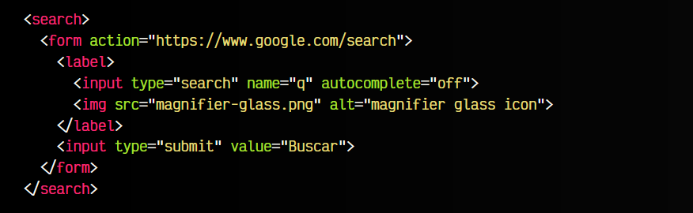

# 
La etiqueta HTML < search >.

Es posible que queramos delimitar una sección de la página destinada a la búsqueda de información. Para ello, tenemos a nuestra disposición la etiqueta < search >.

## La etiqueta < search >.
La etiqueta < search > representa una agrupación de elementos orientados a realizar búsquedas u operaciones de filtrado. Ejemplos podrían ser formularios de búsqueda, operaciones para filtrar contenido o incluso búsquedas globales en Internet.

Observa el siguiente fragmento de código:

En este ejemplo podemos observar varios detalles:

   - La etiqueta < search > contiene toda la parte relacionada con la búsqueda
   - En su interior encontramos un campo de entrada de datos y un icono de una lupa
   - Ambos relacionados con una etiqueta < label > para indicar que tienen relación semántica
   - Un botón para realizar la búsqueda y ejecutar la acción del formulario

Como se puede ver, simplemente cubre la responsabilidad de un contenedor destinado a tareas de búsqueda o filtrado. También, en el caso de tener varias zonas de búsqueda, se podrían utilizar múltiples etiquetas < search >.

En el caso de necesitar mostrar unos resultados de búsqueda en la propia página, estos deberían ser incluidos dentro de la etiqueta < search >, ya que tienen relación con la búsqueda.

