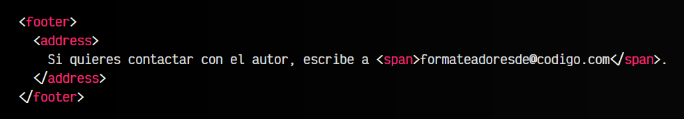

# 
La etiqueta HTML < address >.

Es posible que necesitamos indicar una información de contacto, no sólo virtual como un correo electrónico, sino también información de contacto física, como una dirección física o ubicación. Para ello, vamos a utilizar la etiqueta < address >.

## La etiqueta < address >.
La etiqueta < address > nos permite representar información de contacto de una persona. Generalmente, cuando se utiliza se asume que hace referencia a su elemento padre más cercano, como por ejemplo el elemento < article > que lo contiene, o su elemento < body > si no hay < article > (referencia al documento en sí).

Observa que en este caso, hacemos referencia a una vía de contacto virtual (correo electrónico). Si la forma de contacto fuera una dirección física, podríamos incluirla también en la etiqueta < address >.

No obstante, no conviene utilizar la etiqueta < address > para agrupar vías de contacto que no sean relevantes para el documento general o la entidad importante que estemos tratando.

