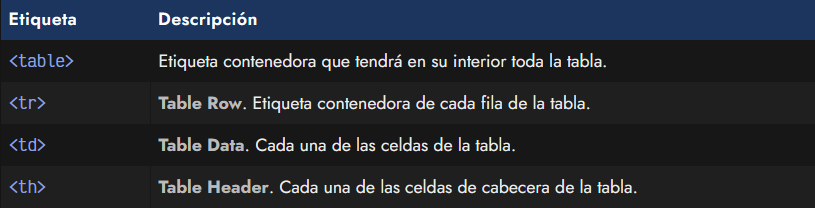
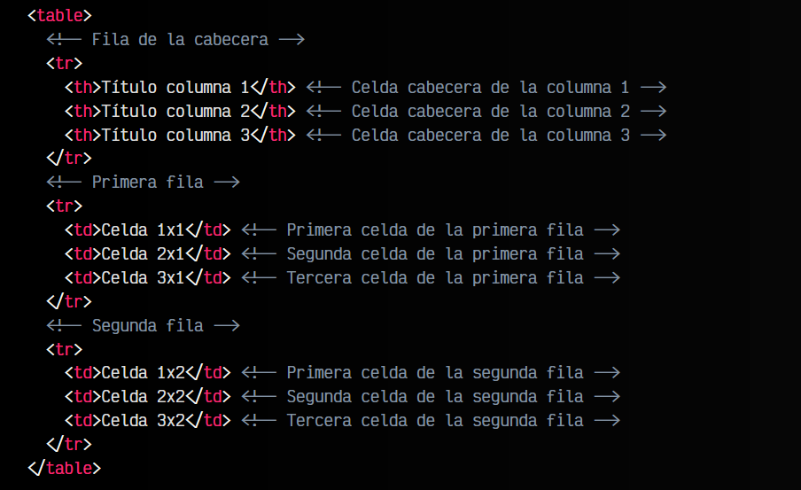
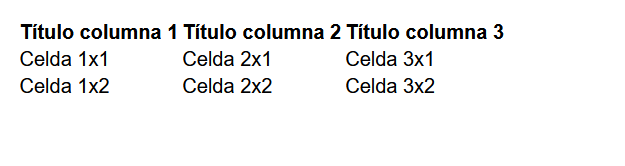
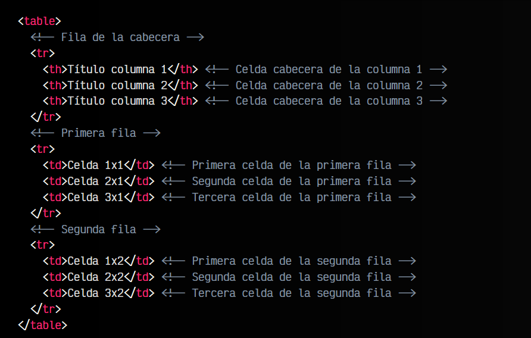
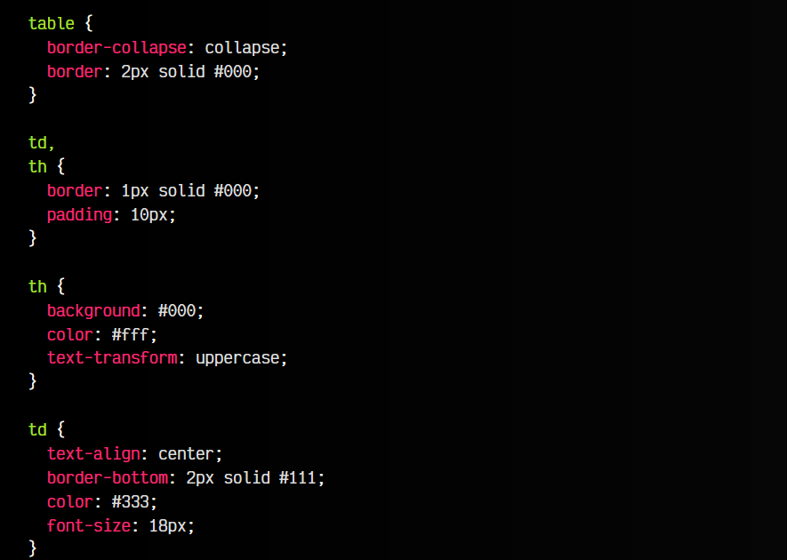
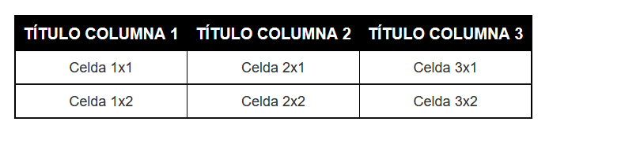

# 
La etiqueta HTML < table >.

Las tablas están incluidas en HTML desde sus primeras versiones y son una forma fantástica de mostrar datos claramente. Además, si las construimos de forma semántica y correctamente, es muy sencillo darle estilos desde CSS y cambiar su diseño con unas cuantas propiedades CSS, puesto que mediante las etiquetas que la componen se puede hacer referencia a cada parte de la misma.

Sin embargo, debemos tener claro que las tablas son un mecanismo para mostrar datos tabulares, es decir, para mostrar cierta información de forma más cómoda, pero no es un mecanismo de maquetación para colocar elementos.

## La etiqueta < table >.
Una tabla puede ser sencilla o compleja, dependiendo de nuestro objetivo y la cantidad de etiquetas o atributos a utilizar. Así pues, veamos primero las etiquetas básicas para crear una tabla de la forma más sencilla posible:

Estas son las etiquetas básicas principales de una tabla. La etiqueta < table > sería el elemento que contendría todos los elementos de la tabla, mientras que < th > y < td > se utilizarían para cada uno de los campos de la tabla (celdas de cabecera y celda de datos respectivamente). Cada vez que se quisiera añadir una nueva fila, habría que incluirlo todo dentro de una etiqueta < tr >.

Estas cuatro etiquetas serían las etiquetas mínimas necesarias para crear una tabla. Un ejemplo muy sencillo de una tabla de 3x2 celdas (exceptuando las cabeceras), sería la siguiente:

html:

vista:

En este caso de ejemplo tendríamos una sencilla tabla de 3x2 celdas. Por defecto, en la tabla se crea de forma que se adapta al número de celdas que tiene la primera fila. Es decir, si en el primer elemento < tr > se indican 3 elementos < th >, la tabla esperará siempre 3 elementos en cada fila. Si indicaramos menos, las celdas correspondientes donde deberían estar aparecerían vacías (sin celda). Si añadieramos una de más, se saldría de la tabla.

## Estilo para una tabla.
Además, si al código HTML anterior le aplicamos unos apropiados[ estilos CSS de tablas](https://lenguajecss.com/css/representacion-datos/tablas-css/), junto a cambios de colores, fuentes, márgenes, rellenos y otros aspectos visuales, podremos cambiar el diseño de la tabla en poco más que un par de líneas.

El siguiente código CSS puede ser utilizado para mostrar esos cambios sobre la tabla anterior:

html:

css:

vista:

Existen una serie de atributos de etiquetas relacionadas con las tablas que están obsoletos y ya no se deben utilizar, como por ejemplo align, bgcolor o valign. Tienes más información en [etiquetas HTML obsoletas](https://lenguajehtml.com/html/introduccion/etiquetas-html-obsoletas/).