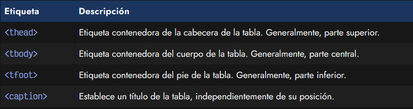
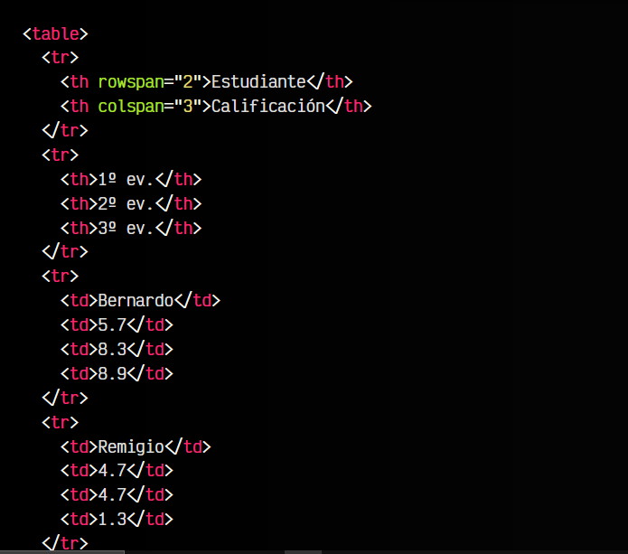
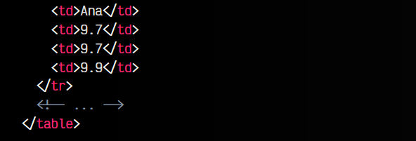
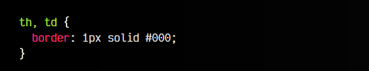
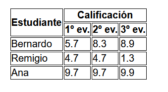
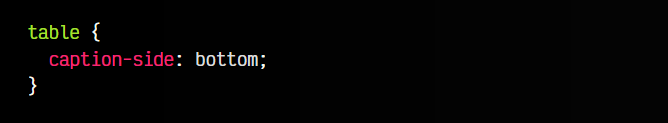
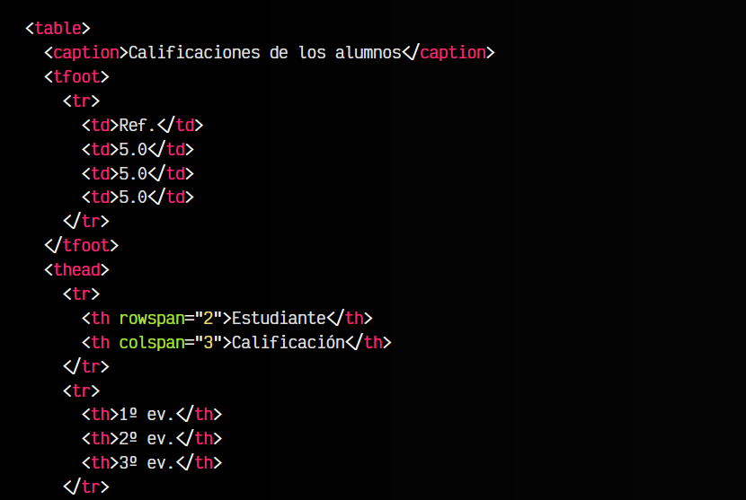
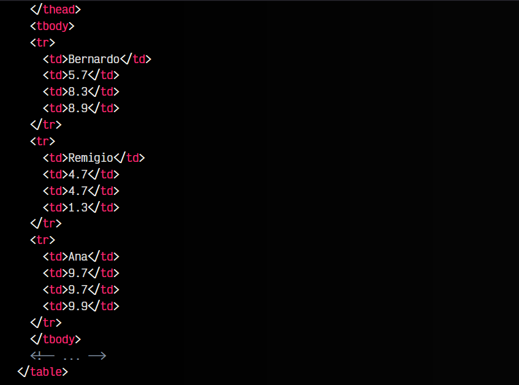
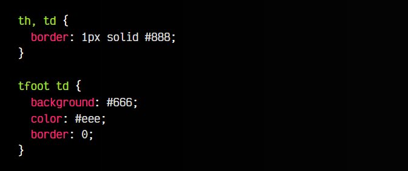
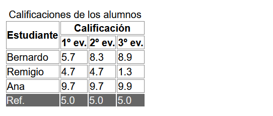

# 
Organización de tablas HTML.

Por defecto, al crear una tabla, el navegador se encarga de irla creando a medida que va leyendo las etiquetas, por lo que la tabla se crea en el orden que se han especificado sus elementos, desde arriba hacia abajo.

Sin embargo, podemos utilizar una serie de etiquetas contenedoras semánticas para tablas que nos permitirán incluso establecer la zona de la tabla donde deben aparecer, de forma que el navegador se encarga de reorganizarla a la hora de renderizar.

Estas etiquetas semánticas son las siguientes:

Supongamos la siguiente tabla:

html:

css:

vista:

A estas etiquetas de tabla y atributos que ya hemos visto en artículos anteriores, podemos añadir las mencionadas nuevas etiquetas, definiendo así la zona donde aparecerán las diferentes partes de la tabla, aunque no tengan el orden correcto.

## La etiqueta < caption >.
La etiqueta < caption > debe aparecer en el interior de la tabla < table > y como primer elemento inmediato. En su interior, se establece una leyenda que hará referencia a la tabla, donde podemos describirla o dar contexto sobre los datos que contiene.

Si visualmente queremos que el < caption > aparezca en otra parte, podemos utilizar una propiedad CSS para ello:

Por defecto, esta propiedad caption-side viene establecida a top, pero podemos darle valor bottom para colocar abajo la leyenda.

## Agrupaciones de partes de la tabla.
Las etiquetas < thead >, < tbody > y < tfoot > son las etiquetas semánticas de agrupación de las tablas. Con ellas podemos definir mediante estas etiquetas "invisibles", la zona donde queremos que aparezca cada parte de la tabla.

Por ejemplo, observa que en el siguiente fragmento de código, se ha colocado intencionadamente la etiqueta < tfoot > al principio de la tabla, antes de < tbody > y < thead >. Aunque lo normal no es hacer esto, comprobarás que aunque el footer esté en primer lugar, en la tabla será renderizado al final.

Veamos el fragmento de código:

html:

css:

vista:

Esto nos puede servir para crear tablas de forma más precisa sin tener que mantener una estructura lógica y realista (aunque siempre se recomienda hacerlo). En algunos lenguajes de programación puedes necesitar construir la tabla de forma dinámica a medida que se procesan ciertos detalles, por lo que esto podría ser bastante útil e interesante.

