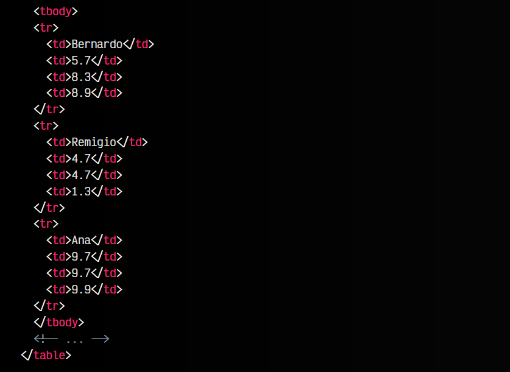
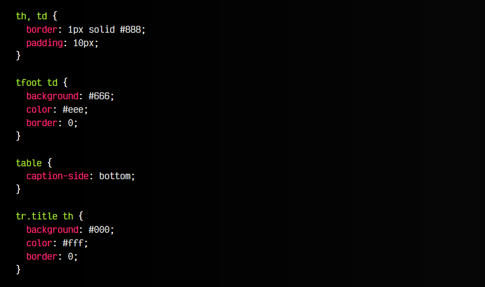

# 
Columnas en tablas HTML.

Las tablas, al definirse en el código siguiendo una estructura horizontal, como por ejempo con las etiquetas < tr >, hacen que resulte complejo el aplicar o realizar una serie de cambios exclusivamente a una columna.

Aunque esto podría hacerse también con CSS, puede resultar complejo para desarrolladores que no conozcan en profundidad CSS. También puede darse el caso de que queramos aplicar detalles semánticos y no visuales a una columna, por lo que en este caso CSS no nos serviría.

Existe una serie de etiquetas para agrupar o seleccionar columnas y así poder realizar tareas sobre ellas, como por ejemplo, asociarle una clase específica o darle estilos CSS a una columna concreta de la tabla, sin necesidad de ir celda por celda.

Estas etiquetas son las siguientes:

## La etiqueta < col >.
La etiqueta < col > nos permite definir columnas con comportamientos específicos, ya sea semánticos o de estilo visual. Además, estas etiquetas pueden tener un atributo span indicado para así aplicar el comportamiento al número de columnas adyacentes que se indiquen en el valor de dicho atributo.

Recuperemos un ejemplo anterior, en el que aún no hemos aplicado la etiqueta < col > y añadámosle algunos estilos CSS:

html:

css:

vista:

Ahora nos gustaría que cada columna con las calificaciones estuviera de un color, para facilitar la lectura. Para ello, vamos a incluir una etiqueta < colgroup > para agrupar todas las columnas < col > (la detallaremos más adelante) y en su interior varias etiquetas < col >, una por cada columna.

El ejemplo quedaría así:

html:

css:

vista:

Observa las tres últimas líneas, donde hemos coloreado las columnas de cada evaluación con los atributos que le marquemos a cada elemento < col >, en este caso en las clases CSS .first, .second y .third.

## Atributo span.
Recuerda también que al igual que en los elementos < th > o < td > que vimos anteriormente, es posible utilizar en < col > el atributo span para indicar cuántas columnas van a abarcar el comportamiento indicado. Esto puede ser útil para evitar el tener que repetir elementos que van a tener el mismo estilo y están contiguos.

## Alternativa con CSS.
Otra forma alternativa, sin utilizar < colgroup > o < col >, podría ser la siguiente:

Sin embargo, en nuestro ejemplo no colorearía las cabeceras, ya que habría que complicarla un poco más para eso.

## La etiqueta < colgroup >.
Si nos fijamos en el ejemplo anterior, la etiqueta < colgroup > es una etiqueta de agrupación que permite agrupar múltiples columnas en un grupo para organizarlas, o aplicar comportamientos a todos el grupo de elementos. Esta etiqueta debe aparecer en el interior de una etiqueta < table >, nunca antes de una etiqueta < caption > ni después de una etiqueta < thead >, < tbody > o < tfoot >, si las hubiera.

Ten en cuenta que si este elemento tiene un atributo span, no debería contener etiquetas < col >.