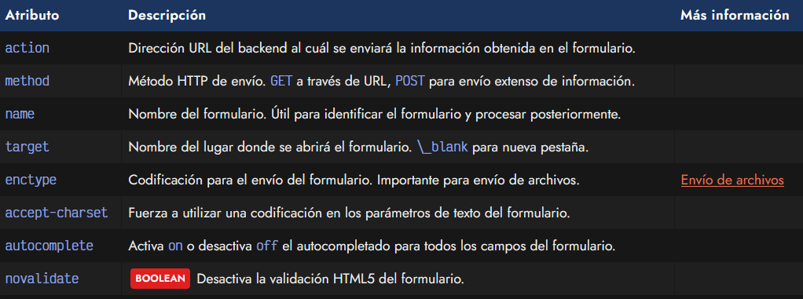

# 
La etiqueta < form >.

HTML proporciona una serie de etiquetas, atributos y conceptos muy útiles para la entrada de información por parte del usuario y enviarla a través de una página. Una de las problemáticas que existen a la hora de que el usuario envíe información es la de eliminar la ambigüedad, o conseguir que la información del usuario cumpla ciertas restricciones y pueda utilizarse o procesarse de la mejor forma posteriormente.

## ¿Qué es un formulario?.
Se conoce como formulario a los mecanismos para enviar información por parte del usuario, a través de unos campos visuales de forma sencilla e intuitiva, que determinan la naturaleza del tipo de información que se va a enviar y como hacerla llegar a otro extremo donde se procesará esa información.

Nuestros objetivos al crear un formulario HTML deben ser los siguientes:

   - Hacer lo más sencillo posible el proceso de inserción de datos por parte del usuario.
   - Intentar que la experiencia de usuario sea lo más agradable y cómoda posible.
   - Intentar que los datos introducidos estén en un formato predecible y esperado.
   - Reducir los errores al introducir datos en la medida de lo posible.
   - Comunicar clara y rápidamente si ocurren errores al introducir datos.

## La etiqueta < form >.
ara comenzar con la creación de un formulario, el primer paso es indicar una etiqueta contenedora < form >, que incluirá toda la información que se quiere recoger en ese formulario:

De esta forma, incluso se pueden crear varias etiquetas < form > por página, pudiendo así crear varios formularios con diferentes objetivos, como por ejemplo, uno para realizar una búsqueda en la página, otro para dejar un comentario y otro para enviar un email al autor, etc.

Es posible crear formularios sin utilizar una etiqueta < form >, sin embargo, tendrían que manejarse desde Javascript y probablemente, tengan peor rendimiento de cara a la accesibilidad.

La etiqueta < form > dispone de varios atributos que se pueden indicar:

### Ejemplo básico 1.
Así pues, vamos a ver un primer formulario base de ejemplo (aún vacío, sin campos de entrada de datos, sólo con la etiqueta contenedora) para ejemplicar su utilización:

Nótese que en este primer ejemplo se definen 3 atributos base en < form >:

   - El atributo name define el nombre del formulario para diferenciarlo de otros.
   - El atributo method define el método HTTP a utilizar. Usaremos GET cuando nos interese enviar datos a través de la URL. En caso contrario, POST.
   - El atributo action se usa para indicar la URL a donde se enviarán los datos cuando el usuario pulse el botón de enviar. En caso de omisión, se enviarán a la propia página actual, volviéndola a cargar. En este caso, se estarían enviando a la ruta absoluta https://dominio.com/send/.

### Ejemplo básico 2.
Veamos un nuevo ejemplo utilizando otros campos de formulario:

En este caso enviamos a través de método GET a la URL https://dominio.com/search/:

   - Se ha indicado el atributo target con valor _blank, esto significa que se abrirá en una nueva pestaña.
   - Se ha indicado el atributo accept-charset. Esto forzará a que el texto enviado en el formulario sea interpretado como codificación UTF8. Útil si tienes problemas de carácteres extraños o similar.

### Ejemplo básico 3.
Un último ejemplo con los atributos restantes:

   - El atributo autocomplete indica el valor off. Por defecto, este atributo está a on. Desactivado, todos los campos del formulario no mostrarán sugerencias anteriores de autocompletado.
   - El atributo novalidate hará que el usuario pueda saltarse todas las validaciones HTML del mismo. Lo veremos más adelante en la sección de validaciones HTML.

Sin embargo, aún solo hemos definido la etiqueta contenedora del formulario que determina como se comportará globalmente. Posteriormente, habría que indicar los campos para obtener la información que queremos que el usuario proporcione, de la mejor forma posible.

## Información de un formulario.
Para que un usuario pueda introducir información en un formulario, requiere que se le indiquen una serie de campos que le permitan introducir la información de la forma más cómoda y rápida posible. Para ello, debemos saber a priori que tipo de dato le vamos a pedir al usuario (texto, cantidades numéricas, fechas, etc...), y así saber que tipo de campo de entrada de datos es más conveniente utilizar.

Esto es una lista de los tipos de datos que podemos utilizar:

Cada uno de estos campos tiene particularidades específicas, por lo que conviene aprenderlos por separado y entender como funciona cada uno de ellos. En cada uno de esos artículos explicaremos como funcionan.

En el caso de necesitar algo mucho más específico, tendríamos que crearnos nuestras propias etiquetas personalizadas o utilizar alguna librería que nos proporcione la funcionalidad deseada.

## Sintaxis básica de un formulario.
Como hemos mencionado, la etiqueta < form > es sólo la etiqueta contenedora del formulario. Luego, hay que ir añadiendo campos para crear un formulario extenso y personalizado. Una de las etiquetas que más utilizaremos es la etiqueta < input >.

Por ejemplo, en el siguiente formulario, establecemos dos etiquetas < input >, una de ellas para obtener información de texto y la otra para incorporar un botón para enviar los datos del formulario:

En este ejemplo tenemos un pequeño formulario en el cuál:

   - Se pide al usuario su nombre con la etiqueta < input type="text" >
   - Botón para permitir enviar el formulario con la etiqueta <  input type="submit">

Aunque vemos que se trata de la misma etiqueta < input >, dependiendo del valor indicado en el atributo type realizará una tarea u otra. En los siguientes artículos veremos como crear formularios mucho más personalizados, con más información, semánticos y que sean accesibles.

