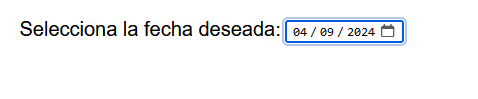

# 
La etiqueta < input > con fechas.

Si nuestra intención es que el usuario introduzca una fecha concreta, en lugar de utilizar un campo de texto genérico < input >, lo ideal sería utilizar uno relacionado con las fechas, que desplegará un control denominado frecuentemente date picker. Básicamente, se trata de un campo especial donde el usuario puede seleccionar el día, mes y año que desee, simplemente a golpe de clic, mostrando un calendario adaptado y ahorrándose el escribir la fecha, además de simplificar el formato a utilizar, ya que puede ser muy complicado guardar siempre la fecha en un mismo formato.

Existen ciertos atributos type del campo de la etiqueta < input > que nos permitirán obtener fechas/horas por parte del usuario. Son los que encontraremos a continuación:

Recuerda que estos controles variarán visualmente dependiendo del sistema operativo utilizado. Veamos varios ejemplos para determinar como funcionan.

## El atributo type="date".
Mediante la etiqueta < input type="date" > podemos obtener fechas e incluso indicar una fecha por defecto en el campo value. Las fechas las indicaremos de mayor a menor magnitud, de modo que primero indicaremos el año, luego el mes y luego el día. El navegador se encargará de darle el formato adecuado visualmente según el país, pero en código lo indicaremos siempre de esta forma:

html:

vista:

Por otro lado, los atributos min y max en este tipo de campos < input > se encargarán de limitar la fecha mínima y la fecha máxima que el usuario puede seleccionar en el date picker. Las fechas que estén en el exterior de este rango, aparecerán grises o desactivadas, de modo que el usuario no podrá seleccionarlas:

html:

vista:

De la misma forma, el atributo step se utiliza para delimitar el incremento entre fecha y fecha. Por ejemplo, en el siguiente ejemplo hemos indicado un 2, por lo que teniendo en cuenta el atributo min, el usuario solo podrá seleccionar las fechas de dos en dos: 2024-02-25, 2024-02-27, 2024-02-29, etc...

html:

vista:

## Campos de fecha derivados.
Al margen de los campos de fecha < input type="date" > tenemos también otros campos relacionados, con ligeras modificaciones, como por ejemplo, un calendario de meses, semanal o de horas. Veamos cada uno de ellos.

## El atributo type="month".
Aunque puede que no tan frecuentemente, es posible que necesitemos que el usuario seleccione un mes en lugar de una fecha específica porque, por ejemplo, el día no es relevante. Para ello, tenemos a nuestra disposición el campo < input type="month" >:

html:

vista:

De la misma forma que hemos visto antes, podemos establecer una fecha mínima, una fecha máxima, e incluso un atributo step para permitir un número de meses determinado entre opción y opción. Observa que no es necesario indicar los días en los atributos min y max, pero si lo necesitamos podemos incluirlos.

En el caso de establecer un valor value, aquí si que no se necesita indicar el número de día, ya que lo que seleccionamos es un mes. En este ejemplo, seleccionaría Noviembre de 2024.

## El atributo type="week".
Aunque no es muy frecuente en países de habla hispana, el atributo type="week" en el campo < input > nos permite crear campos de entrada de datos que se enfocan en las semanas del año. De esta forma, un usuario podría elegir una semana concreta y proporcionarlo al formulario:

html:

vista:

Como puedes ver, podemos utilizar atributos min y max para restringir horas, establecer un valor por defecto con value, pero sobre todo la utilización del atributo step para incrementar o decrementar valores en segundos.

Por defecto, step tiene un valor de 60, que indicaría que la hora salta de 60 en 60 segundos, por lo que los segundos de la hora no nos interesan. Pero pongamos como ejemplo que establecemos 30: estaríamos indicando que sólo serían válidas horas con los segundos en 00 o en 30, empezando a contar desde el valor min.

Valores válidos de step podrían ser:

   - 30: Cada 30 segundos.
   - 60: Cada 60 segundos. Los segundos son irrelevantes (por defecto).
   - 3600 (60s x 60m): Cada hora. Los minutos y segundos son irrelevantes.
   - 7200 (60s x 60m x 2h): Cada 2 horas.
   - 43200 (60s x 60m x 12h): Cada 12 horas.

## El atributo type="datetime-local".
Por último, pero no por ello menos importante, tenemos el < input > con type="datetime-local", el cuál nos permite obtener la fecha y hora local del sistema del usuario y proporcionarla en el formulario.

html:

vista:

Ejemplos de formatos de hora válidos podrían ser 2024-06-30T21:40 o 2025-08-16T02:39. El formato de la hora será el mismo del type="date" y el mismo del type="time", separándolos por una T, es decir:

   - Año en 4 cifras + guión -
   - Mes en 2 cifras + guión -
   - Día en 2 cifras + separador de tiempo T
   - Horas en 2 cifras + dos puntos :
   - Minutos en 2 cifras + dos puntos :
   - Segundos en 2 cifras

## Personalizar apariencia.
Para personalizar la apariencia de nuestro campo de entrada de fechas podemos utilizar CSS junto a los siguientes selectores especiales. Dichos selectores son los siguientes:

En el siguiente ejemplo, añadimos CSS para darle estilo al campo de entrada de fechas. Observa que modificamos tanto el estilo del campo general, como los textos de cada parte de la fecha, el icono del Date Picker o incluso el color de la selección del texto mediante :focus:

css:

html:

vista:

