# 
La etiqueta < input > con casillas.

Si queremos definir opciones donde el usuario debe elegir o escoger, en muchos casos lo más apropiado suele ser utilizar uno de los dos tipos de campos siguientes:

   - Casillas de verificación, también denominados campos checkbox (verdadero o falso).
   - Botones de opción, también denominados botones radio (una opción entre varias posibles).

Para establecerlos en una página tendríamos que utilizar las siguientes etiquetas:

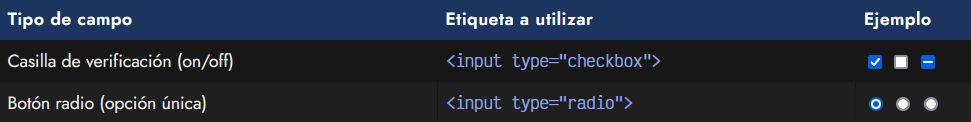

Veamos sus diferencias y profundicemos en este tipo de controles para ver sus posibilidades.

## Casillas de verificación.
Las casillas de verificación se pueden indicar utilizando el atributo type="checkbox" en un campo de entrada de datos < input >. Este tipo de control permite mostrar una casilla al usuario, dándole la posibilidad de marcarlo como activado o desactivado.

html:
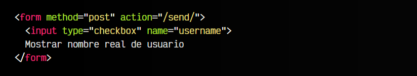

vista:
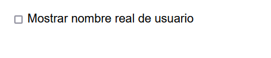
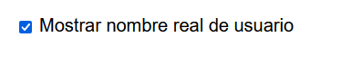

Este tipo de controles son útiles para definir estados que tienen valores BOOLEAN, es decir, verdadero/falso, on/off, activado/desactivado, positivo/negativo, etc.

## El atributo checked.
Si indicamos el atributo checked, haremos que por defecto la casilla de verificación esté marcado por defecto, es decir, inicialmente al cargar la página:

html:
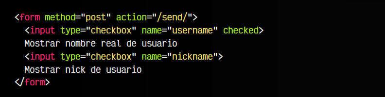

vista:

Para obtener el valor actual de un campo < input type="checkbox" > desde Javascript, deberíamos acceder al valor de la propiedad checked del < input >.

OJO: Por un lado, el atributo checked muestra el estado inicial de la casilla. Por otro lado, la propiedad checked (que no es lo mismo que el atributo checked) te muestra el estado actual de la casilla. Recuerda que un atributo no es lo mismo que una propiedad.

## Apariencia indeterminada.
Aunque desde el HTML no se puede hacer, es posible dar una apariencia de estado indeterminado, que suele aparecer visualmente en gris y con una línea, que representa que la casilla está en un estado de incertidumbre.

Este cambio se puede hacer desde Javascript, con el siguiente código:

html:
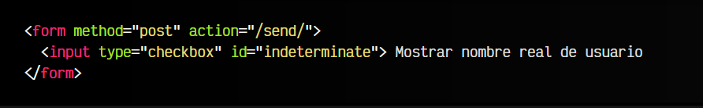

js:
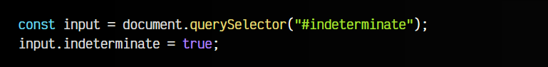

vista:

Ten en cuenta que el estado indeterminado sólo es una apariencia visual y no representa a un estado en sí mismo. El valor actual del campo se enviará en la propiedad checked igual que en el caso anterior.

## Tema visual.
La apariencia de los campos < input type="checkbox" > marcados pueden cambiarse facilmente con la propiedad CSS accent-color, la cuál nos permite cambiar un color acentuado de la mayoría de los campos de formulario.

Para ello, puedes hacer lo siguiente:

html:
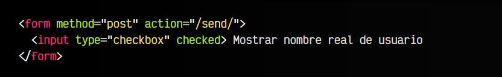

css:
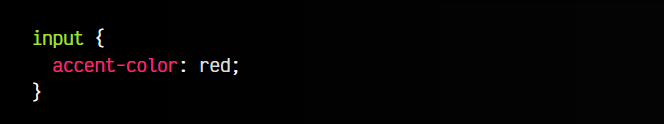

vista:

Con esta propiedad CSS podemos conseguir variaciones en las casillas de verificación similar a estas:

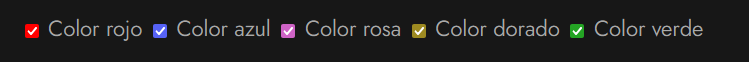

Si el usuario no marca una de las casillas de verificación, esos datos del formulario no se envían.

## Botones de radio.
Mediante la etiqueta < input type="radio" > podemos crear los denominados botones radio. Este tipo de control se suele utilizar cuando el usuario debe elegir sólo una opción específica de varias disponibles.

En el caso de los checkbox, el usuario puede seleccionar varias casillas, sin embargo, con los botones radio podemos hacer grupos de botones y al marcar uno, deseleccionamos el resto. Por otro lado, si las opciones son demasiadas, se suele recomendar utilizar una lista de [selección desplegable](https://lenguajehtml.com/html/formularios/etiqueta-html-select/).

html:
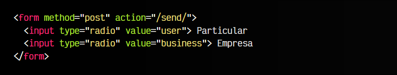

vista:

En el ejemplo anterior, hemos colocado dos botones radio. Observa que el primero permite al usuario marcar particular (internamente la categoría sería user), por otro lado, el segundo permite al usuario marcar empresa (*internamente, la categoría sería business). Sin embargo, no funciona como debe, ya que se pueden marcar ambos.

Para tener varios botones radio en un mismo grupo y que sólo se active uno de ellos, hay que colocar el mismo valor en el atributo name a cada opción. El ejemplo anterior quedaría de esta forma:

html:
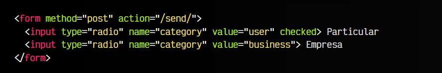

vista:

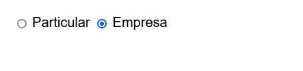

De la misma forma que en las casillas de verificación, si queremos que un botón de radio se encuentre marcado por defecto, le añadimos el atributo checked.

Si el usuario no marca una de las opciones de un botón radio, esos datos del formulario no se envían.

## Personalizar apariencia.
Por defecto, los elementos < input > de tipo checkbox o radio permiten personalización, pero no todas las propiedades CSS tienen efecto. Esto ocurre porque el sistema operativo tiene que proteger al usuario y evitar cambios con motivos maliciosos por parte de los desarrolladores.

Por ejemplo, si intentamos darle color de fondo con background o redondear las esquinas con border-radius, veremos que no produce el efecto deseado. Sin embargo, otras propiedades como accent-color, box-shadow o las dimensiones con width o height, si que producen efecto:

html:
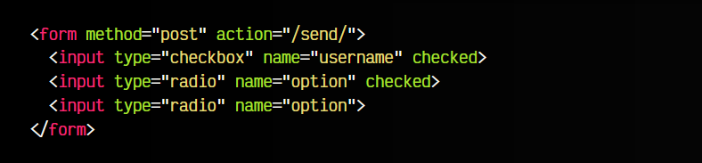

css:
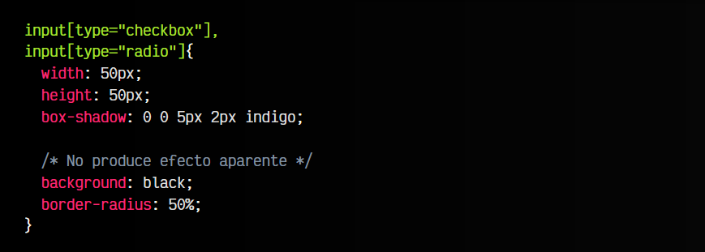
vista:

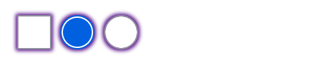

Sin embargo, si buscamos una personalización más intensiva, podemos desactivar la apariencia por defecto y hacerla a medida, utilizando la propiedad appeareance y estableciéndola a none. De esta forma, todos los estilos del elemento desaparecen y debemos personalizarlos nosotros.

A continuación tenemos un ejemplo donde personalizamos levemente una casilla de verificación y un botón radio:

html:
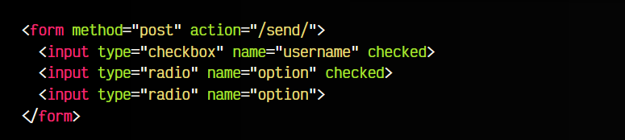

css:
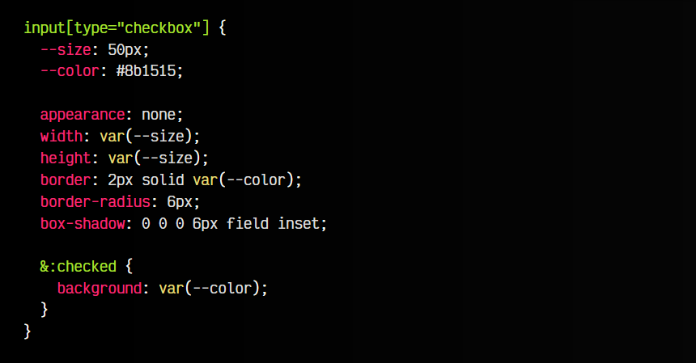
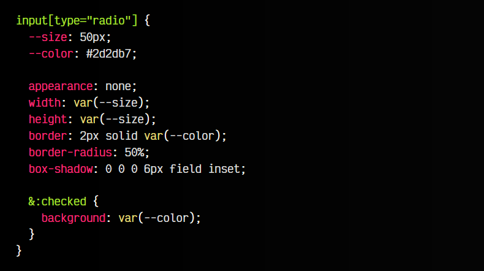

vista:
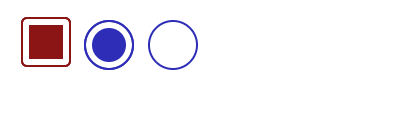
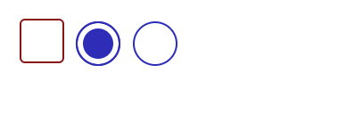
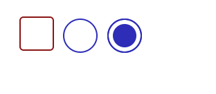

Observa que el color field indicado en el box-shadow es un color del sistema. Puedes encontrar más información en [Colores del sistema en CSS.](https://lenguajecss.com/css/colores/codigos-color/#colores-del-sistema)

