# 
Atributos de metadatos e idioma

Además de los [atributos HTML comunes](https://lenguajehtml.com/html/introduccion/atributos-comunes-html/) id, class y style que vimos en un artículo anterior, existen otros atributos HTML menos frecuentes, pero que pueden ser muy útiles y están disponibles para utilizar en cualquier etiqueta HTML.

## Atributos de metadatos.
Tenemos un primer grupo de atributos relacionados con metadatos:

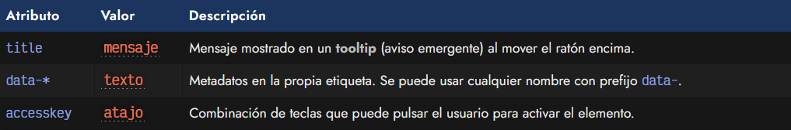

Expliquemos cada uno de ellos a continuación.

## Tooltips: El atributo title.
Aunque se suele hacer sobre todo en las etiquetas de imágenes < img >, en la mayoría de las etiquetas HTML podemos indicar el atributo title para especificar un mensaje de texto que aparezca cuando el usuario detenga el ratón sobre el elemento un instante. Al usuario le aparece un pequeño aviso emergente, generalmente con fondo amarillo y letras negras, que muestra el texto en cuestión:

html:
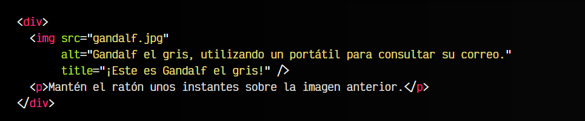

vista:

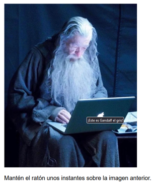

Es importante no confundir el atributo title con el atributo alt de las imágenes. Generalmente se confunden porque pueden tener objetivos parecidos, pero no tienen porque ser idénticos.

   - El atributo alt debe ser un texto alternativo que describa la imagen (en el caso de que no se pueda ver visualmente)
   - El atributo title puede describir la imagen, pero no tiene porque ser una descripción alternativa.

De la misma forma, podemos utilizar el atributo title para otros elementos, como por ejemplo, etiquetas < a > (enlaces) u otras. Sin embargo, el usuario normalmente no se esperará que existe un tooltip en cualquier elemento, así que quizás convendría hacérselo saber de forma explícita.

## Metadatos: El atributo data-.
En un documento HTML, la mayoría de los metadatos (información adicional) se incluyen en el interior de la etiqueta < head > del documento HTML. Sin embargo, también se pueden incluir metadatos en una etiqueta HTML a través de un atributo que comienza con el prefijo data-.

De esta forma, podemos inventarnos cualquier atributo que contenga información, habitualmente orientada a utilizarse desde Javascript o CSS:

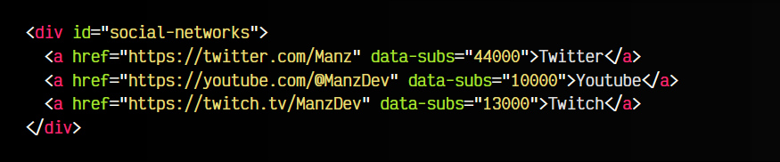

En este ejemplo, guardamos en el atributo data-subs el número de suscriptores que tiene el usuario en la red mencionada. Posteriormente, podremos acceder a esa información desde CSS o desde Javascript y utilizarla.

Desde Javascript, si queremos hacer referencia a estos elementos, podemos hacerlo de varias formas:

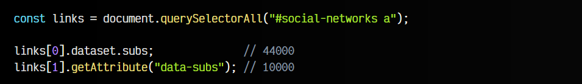

En la primera, accedemos a la propiedad .dataset donde tendremos una lista de propiedades dependiendo de los diferentes atributos con prefijo data- que tenga el elemento. Por otro lado, podemos también utilizar el método .getAttribute() del DOM.

## Atajos: El atributo accesskey.
En HTML es posible añadir el atributo accesskey para indicar un atajo de teclado que puede pulsar el usuario para activar ese elemento. Observa el siguiente ejemplo, donde tenemos 4 elementos:

   - 2 campos de texto < input >
   - 1 enlace < a >
   - 1 botón < button >

Cada uno de ellos tiene su correspondiente atributo accesskey. Si el usuario pulsa la combinación de teclas ALT+tecla

(donde tecla es la tecla indicada en el valor del atributo), se activará ese elemento:

html:
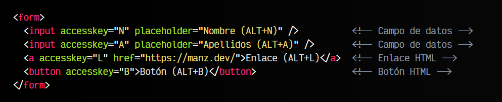

vista:
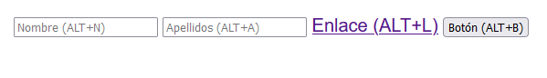

De esta forma, si pulsamos ALT+N, se colocará el foco en el primer campo de texto, si pulsamos ALT+L será como si hubieramos pulsado el enlace con el ratón y si pulsamos ALT+B se pulsará el botón.

Sin embargo, una de las desventajas de este sistema, es que no está estandarizada la forma de acceder entre navegadores y sistemas operativos, lo que lo hacen un sistema poco intuitivo. Por ejemplo, si establecemos un atajo con la tecla A, es decir, con el atributo accesskey="A", tendríamos que pulsar la siguiente combinación de teclas dependiendo de nuestro sistema operativo:

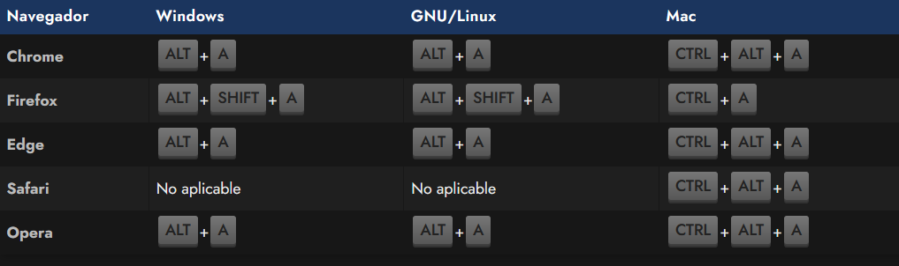

Esto hace que la combinación de teclas para un usuario poco familiarizado con este proceso, además de la incertidumbre de no saber que navegador va a utilizar, hagan que este proceso sea poco práctico.

## Atributos de idioma.
Ahora, comenzaremos a ver un nuevo grupos de atributos, que también son comunes, pero pertenecen a un segundo grupo de atributos relacionados con el idioma:

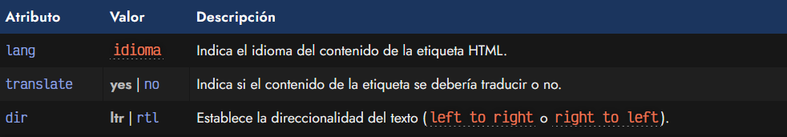

## Idioma: El atributo lang.
Mediante el atributo lang podemos indicar el idioma del contenido de la etiqueta. El valor de dicho atributo tendrá que ser el código ISO 639-1 del idioma al que queremos hacer referencia. Aunque en principio podemos hacer esto en cualquier etiqueta HTML, es obligatorio hacerlo en la etiqueta < html > que es la etiqueta que abarca todo el documento.

De esta forma, estaremos estableciendo el idioma en el que se encuentra el documento:

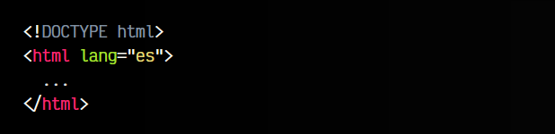

Más adelante, veremos para que sirve el resto de las etiquetas del documento.

## Traducción: El atributo translate.
En las etiquetas HTML se puede indicar el atributo translate, el cuál acepta los valores yes y no. Por defecto, aunque este atributo no sea añadido en una etiqueta, el valor por defecto que tiene es yes. Por lo tanto, todas las etiquetas están marcadas como «traducibles».

Si por ejemplo, tenemos un texto como el título de una obra, que no queremos que sea posible traducirlo, sino que queremos que conserve el texto original, podemos hacer lo siguiente:

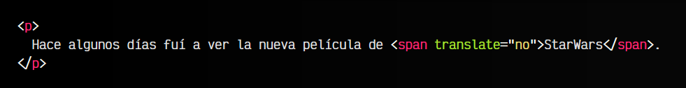

De esta forma, le indicamos al navegador o a herramientas como Google Translate, que esa frase específica no se debe traducir porque es el título que queremos que aparezca siempre. Recuerda que por defecto, si no se indica el atributo translate en una etiqueta, se asume que tiene el valor yes por defecto.

## Direccionalidad: El atributo dir.
Existe un atributo dir que permite al desarrollador indicar la direccionalidad del texto en el documento. Esto es ideal para idiomas en los que se escribe o lee de derecha a izquierda, en lugar de izquierda a derecha. El valor por defecto de este atributo es ltr (left to right, de izquierda a derecha), pero podemos modificarlo y establecer el valor rtl (right to left, de derecha a izquierda):

html:
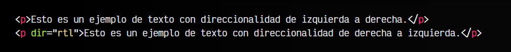

vista:
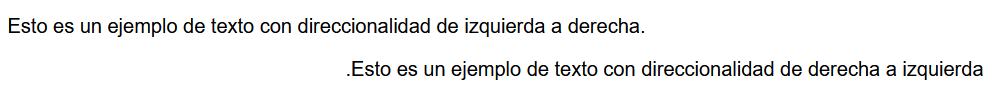

También es posible conseguir este efecto utilizando la propiedad CSS direction, que puede establecer su valor a ltr (por defecto) o a rtl.