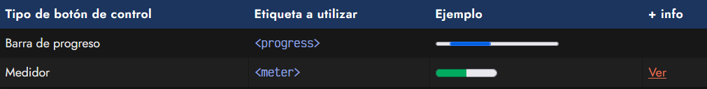
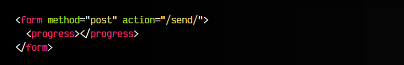
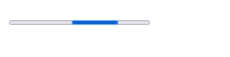
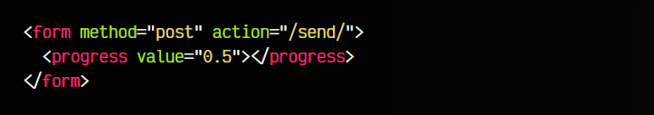
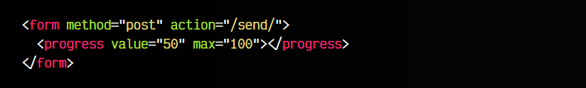
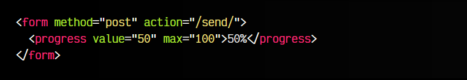
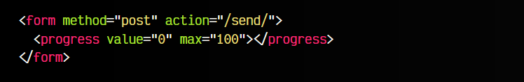
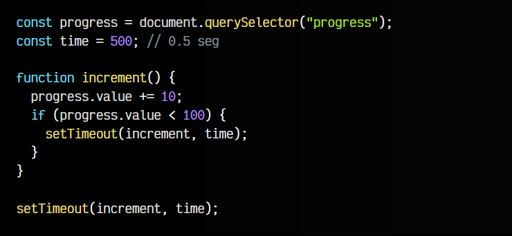

# 
La etiqueta HTML < progress >.

En HTML, existen algunos controles que, aunque no nos permiten introducir información, pueden ser muy útiles en formularios para presentar información de una forma más visual y ofrecer información específica al usuario. Eso sí, ten en cuenta que se trata de etiquetas que, sin el uso de Javascript, sólo podremos realizar funcionalidades muy básicas.

Las etiquetas son las siguientes:

En este artículo vamos a centrarnos en la primera de ellas, la etiqueta < progress >. En el siguiente artículo, profundizaremos en la etiqueta < meter >.

## La etiqueta < progress >.
En muchas ocasiones, nos interesa mostrar una barra visual que muestre el progreso o avance de alguna tarea o cuestión, de modo que el usuario sepa que debe esperar mientras se realizan dichas tareas. También se puede utilizar para indicar el progreso de algún proceso o incluso el avance del usuario a través de la página.

Para ello, utilizaremos una sencilla etiqueta HTML denominada < progress >:

html:

vista:

Por defecto, si solo indicamos la etiqueta, nos mostrará por defecto una barra de progreso infinita, es decir, nos muestra un avance y retroceso de la barra de progreso, indicando que está en proceso, pero sin determinar cuánto queda para finalizar o en que punto estamos. Esta es la funcionalidad básica que podemos conseguir si no utilizamos Javascript.

## Atributo value.
Veamos ahora el uso del atributo value. Por defecto, la barra de progreso entenderá que los valores que se esperan, son un valor numérico decimal entre 0 y 1, por lo que si definimos el atributo value a 0.5, la barra de progreso se verá definida justo en la mitad:

html:

vista:

## Atributo max.
No obstante, podemos personalizar estos valores, si no se adaptan a nuestro uso. Imaginemos que queremos utilizar valores entre 0 y 100. No tenemos más que definir el atributo max e indicarle el valor 100. Con esto, si indicamos un value a 50, sería equivalente al ejemplo anterior.

html:

vista:

## Contenido de la etiqueta.
Si queremos hacer un etiquetado HTML accesible y bien definido, lo ideal es que en el interior de la barra de progreso se añada el contenido de texto que debería verse de no ser soportada la etiqueta. Observa el siguiente ejemplo:

html:

vista:

En el caso de utilizar un navegador que no soporte, y por lo tanto, no conozca la etiqueta < progress >, la tratará como si fuera una etiqueta < div >, por lo que en el peor de los casos, mostrará al usuario el texto 50%.

## Barra de progreso dinámica.
Aún así, una de las funcionalidades más interesantes de la barra de progreso < progress > es que mediante Javascript podemos ir aumentando (o reduciendo) el valor del atributo value y que represente el estado actual.

Por ejemplo, observa el siguiente fragmento de código, donde usamos Javascript para ir modificando la barra de progreso:

html:

js:

vista:

En él, lo que hacemos es localizar el elemento < progress > del HTML y ejecutar la función increment() cada segundo. Si el valor de la barra de progreso es menor a 100, seguimos incrementando.

En definitiva, esto es un ejemplo de barra de progreso que va aumentando poco a poco en el tiempo, sin mayor lógica o complejidad. No obstante, a la hora de implementar una, lo ideal es que tenga una lógica con sentido para representar el progreso de carga, el tiempo que debemos esperar para comenzar una tarea, etc.

El progreso de la barra se podría suavizar con una transición CSS, pero necesitaríamos conocer algunos detalles sobre propiedades no estándar y sobre resetear la apariencia de un control del sistema. Veremos estos detalles más adelante.