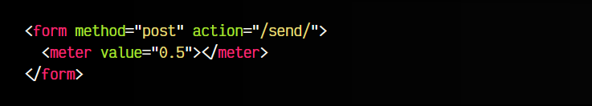

# 
La etiqueta HTML < meter >.

La etiqueta < meter > nos permite la creación de medidores que permitan mostrar el nivel o escala de un cierto valor. No deberían usarse estas etiquetas para medir cosas de las que no conocemos el valor máximo. Existen multitud de medidas que se podrían representar con una etiqueta < meter >:

   - El nivel de seguridad de una contraseña.
   - El espacio en uso en disco duro.
   - La cantidad de usuarios que votaron una opción en una encuesta.

Para ello, tenemos ciertos atributos disponibles en esta etiqueta < meter >:

Veamos cómo podemos utilizar estos atributos.

## Medidores básicos.
Veamos un ejemplo de este medidor con la etiqueta < meter >, la cuál debe tener siempre un atributo value donde puedes tener un valor entero o decimal (flotante):

html:

vista:

Por defecto, aunque no se indiquen, el atributo min tendrá el valor 0.0 y el valor max tendrá el valor 1.0. En el ejemplo anterior, que hemos indicado el value 0.5, debería mostrarse un medidor exactamente a la mitad. Si queremos cambiar estos valores, lo aconsejable sería definir los tres atributos:

html:

vista:

En este caso, el medidor se encuentra con un valor de 25 en la escala de 0 a 100.

Recuerda que el valor min siempre tiene que ser inferior al valor max. Además, el atributo value debe estar entre los valores min y max.

La etiqueta < meter > no debería usarse para medir un progreso, ya que hay otra etiqueta < progress > mucho más apropiada para esa finalidad.

## Umbrales low y high.
Además de los atributos mencionados anteriormente, hay otros atributos que podemos utilizar como low o high, con los que trazaremos tres segmentos:

 -   Umbrales bajos: por debajo de low
 -   Umbrales medios: por encima de low y debajo de high
 -   Umbrales altos: por encima de high

Observa el siguiente ejemplo, donde hemos añadido un umbral bajo low a 25 y un umbral alto high a 75. Si observas el medidor resultante, observarás que si el atributo value está por debajo de 25 o por encima de 75 aparecerá en amarillo, en caso contrario, si está entre 25 y 75, aparecerá en verde:

html:

vista:

En este otro ejemplo, subimos el valor de low a 50 y el valor de high a 90. Ahora los valores en amarillo son aquellos por debajo de 50 y por encima de 90, mientras que los valores del tramo intermedio aparecen en verde:

html:

vista:

Recuerda que el valor low siempre será menor que el valor high. Además, ambos valores deben estar siempre entre min y max.

## El atributo optimum.
Además de todo lo anterior, podemos utilizar el atributo optimum para definir cuál es nuestro umbral óptimo. Piensa que nuestro medidor puede representar un medidor de seguridad de contraseña, donde los valores más altos son los deseados, pero también podemos tener un medidor de estrés de un personaje de videojuego, donde los valores más bajos son los deseables.

Para configurar estos detalles, usaremos el atributo optimum. Veamos un ejemplo:

html:

vista:

En este caso, ocurrirá lo siguiente:

 -   Valores entre 75 y 100 se considera tramo deseable, aparecerá en verde.
 -   Valores entre 25 y 75 se considera tramo medio, aparecerá en amarillo.
 -   Valores entre 0 y 25 se considera tramo bajo, aparecerá en rojo.

Dependiendo de los valores establecidos, los colores del medidor cambiarán. A continuación tenemos un esquema de colores que nos muestra las combinaciones posibles:

