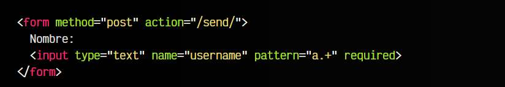

# 
El atributo pattern (RegExp).

Aunque los atributos de validación básicos de HTML5 son bastante potentes para muchos casos de validación, en muchos casos son insuficientes. El atributo pattern o los patrones de validación HTML5 son una excelente alternativa si necesitamos recurrir a validaciones mucho más potentes y flexibles, y nos permitirán ser mucho más específicos utilizando expresiones regulares para validar datos.

## El atributo pattern.
Estas validaciones avanzadas se pueden realizar a través de un attributo pattern que se puede colocar en elementos < input > de texto como text, search, url, tel, email o password. En su interior, se colocará un patrón de expresión regular, para validar el texto introducido por el usuario como válido o inválido.

El siguiente ejemplo pide mediante un campo de texto un nombre al usuario. Las restricciones son:

   - Debe escribir algo, ya que required indica que el campo es obligatorio.
   - El atributo pattern tiene la expresión regular a.+

html:

css:

vista:

Esa regexp (expresión regular) indica que debe escribirse un nombre de usuario que empiece por a y tenga uno (o más carácteres) a continuación. Por lo tanto, nos marcará en rojo cuando un campo no cumpla la validación:

Algunos nombres de usuario que cumplen o no cumplen la validación serían:

   - ✅ El usuario ana24 cumple la validación
   - ❌ El usuario pablo43 no cumple la validación -> (No empieza por a)
   - ✅ El usuario adrianglez cumple la validación
   - ❌ El usuario a no cumple la validación -> (Debe tener 1 o más carácteres después de la a)
   - ❌ El usuario omitido no cumple la validación -> (required, se debe escribir algo en el campo)
   - ❌ El usuario bart8 no cumple la validación -> (No empieza por a)
   - ✅ El usuario a2 cumple la validación

## Expresiones regulares básicas.
Crear patrones de expresiones regulares es todo un arte, y requiere cierta soltura y destreza. Aquí tienes algunos patrones básicos de las expresiones regulares que te pueden ayudar a empezar:

Una expresión regular es una cadena de texto que representa un posible patrón de coincidencias. En HTML5 se pueden aplicar mediante el atributo pattern. Aquí tienes más sobre [expresiones regulares](https://lenguajejs.com/javascript/regexp/expresiones-regulares/).

## Ejemplos de patrones HTML5.
Para clarificar estos conceptos y entenderlos mejor, vamos a mostrar algunos ejemplos de campos con validaciones HTML5 en casos reales, y así afianzar conceptos sobre expresiones regulares y su aplicación en los atributos pattern:

#### Ejemplo 1.

   - Tipo de campo: Nombre de usuario
   - Campo obligatorio: required
   - Entre 5-40 carácteres: minlength="5" y maxlength="40"
   - Sólo se permiten letras (mayúsculas y minúsculas) y números: pattern="[A-Za-z0-9]+"

html:

css:

vista:

Nótese que de no incluir los atributos minlength y maxlength el usuario no tendría limitación en cuanto al tamaño. Esto también puede incorporarse en la propia expresión regular, y prescindir de dichos atributos:

html:

css:

vista:

Ten en cuenta que al utilizar atributos básicos como maxlength o max, el texto del campo simplemente no pasa la validación de forma silenciosa. Sin embargo, con el atributo pattern, el navegador muestra un mensaje de advertencia en caso de no pasar la validación indicada en el mismo.

#### Ejemplo 2.
En el siguiente caso, se pide al usuario que indique el modelo de coche que posee, en un posible formulario de servicio técnico. Los modelos posibles son A1, A3, A4 y A15. En lugar de mostrar una lista de selección, podemos mostrar un campo de texto y colocar una validación como la siguiente:

   - Tipo de campo: Modelo de coche
   - Campo obligatorio: required.
   - Sólo se permiten las opciones: A1, A3, A4 y A15

html:

css:

vista:

Nótese que la expresión regular permite tanto el formato a1 como el formato A1. Por otro lado, ¿Para qué sirve aquí el atributo title? Te lo explico en el siguiente apartado.

## Personalización de validación.
Utilizar un atributo pattern en un campo de datos y escribir un texto que no pase la validación de la expresión regular está permitido en el navegador. La diferencia es que al intentar enviar el formulario, nos aparecerá el mensaje de advertencia predefinido del navegador.

Sin embargo, podemos ampliar el mensaje de advertencia con el atributo title, de forma que se añadirá al mismo:

html:

css:

vista:

Observa que el campo < input > a parte del atributo pattern, ahora también tiene un atributo title. En el caso de que el formulario tenga un botón de envío y el texto no cumpla las restricciones, el valor de este atributo formará parte del mensaje de aviso del navegador para indicarte que no se ha pasado la validación:

## Herramientas para RegExp.
A continuación, algunas herramientas útiles para crear o probar expresiones regulares:

