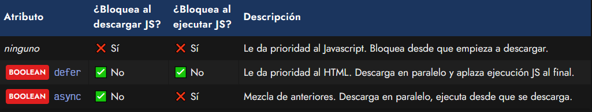

# 
Atributos defer y async < script >.

Al añadir una etiqueta < script > a nuestra página, el navegador va a descargar, procesar y ejecutar el Javascript de una forma muy concreta, que explicamos en el artículo anterior, en la modalidad clásica. Sin embargo, podemos modificar esta forma de comportarse indicando unos atributos en la etiqueta < script >.

El navegador, al encontrar una etiqueta < script >, debe interrumpir el renderizado de la página para descargar, procesar y ejecutar el Javascript, ya que no puede realizar ambas cosas a la vez. Con dichos atributos podemos definir como se va a comportar el navegador y cuando debe procesar el javascript.

Para ello, hay que entender bien estos tres procesos:

   - Descarga: El navegador pide un recurso (HTML, Javascript, etc...) y lo transfiere a nuestro sistema.
   - Parseo HTML: El navegador lee el código HTML y lo renderiza (dibuja) en la página.
   - Ejecución JS: El navegador ejecuta el código Javascript y lleva a cabo sus tareas.

Una vez tenemos claro estos tres procesos, ahora veamos cada modalidad. Observa especialmente si se bloquea la renderización del HTML en cada una de ellas:

## Modalidad diferida (defer).
En la modalidad de carga diferida, el navegador le da prioridad a la carga del documento HTML. Este tipo de carga se realiza incluyendo el atributo defer en la etiqueta < script > de la siguiente forma:

En esta modalidad, lo que ocurre es lo siguiente:

   - 👁‍🗨 El navegador está renderizando el documento HTML y encuentra una etiqueta < script defer >.
   - 🔽 Descarga el script de forma paralela sin detener ni bloquear el renderizado del documento HTML.
   - 👁‍🗨 Continua la renderización del HTML. Si encuentra otro < script defer > repite los pasos.
   - 🏃‍♀️ Una vez termina de renderizar el documento HTML, ejecuta el script.

En muchas ocasiones habrás observado que las etiquetas < script > se colocan (o se aconseja hacerlo) justo antes del cierre de la etiqueta < /body >. Esto ocurre así porque históricamente, el atributo defer no existía (o existía pero Internet Explorer no lo soportaba) y se necesitaba procesar el Javascript una vez se hubiese terminado de cargar todo el HTML, para evitar acceder a una parte del documento HTML desde Javascript y que aún no hubiera cargado.

Hoy en día, incluir una etiqueta < script defer > en el < head >, es equivalente a una etiqueta < script > justo antes del cierre del < /body >. 

Ten en cuenta que el atributo defer en una etiqueta < script > que también tiene atributo type="module" no es necesario, ya que el comportamiento de aplazar la ejecución Javascript al final viene implícita en el comportamiento de los módulos.

## Modalidad asíncrona (async).
En la modalidad de carga asíncrona, el navegador le da prioridad a la ejecución del Javascript. Este tipo de carga se realiza incluyendo el atributo async en la etiqueta < script > de la siguiente forma:

En esta modalidad de carga asíncrona, lo que ocurre es lo siguiente:

   - 👁‍🗨 El navegador está renderizando el documento HTML y encuentra una etiqueta < script async >.
   - 🔽 El navegador descarga el script sin detener ni bloquear la carga del documento HTML.
   - 🛑 Una vez descargado, interrumpe el renderizado HTML temporalmente y ejecuta el script.
   - 👁‍🗨 Una vez terminada la ejecución del código Javascript, continua con el renderizado HTML.

Este comportamiento puede interesar para cargar ciertas librerías que quieres que estén disponibles lo antes posible, pero que no van acceder directamente al HTML, por lo que no importa que el documento no esté renderizado por completo.