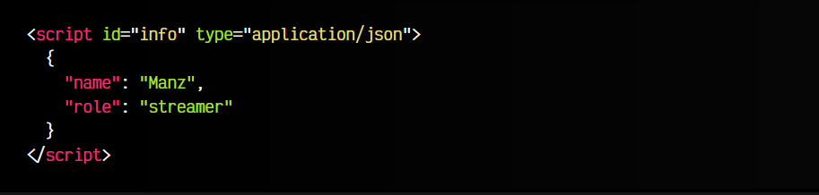
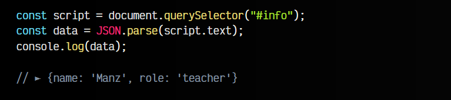
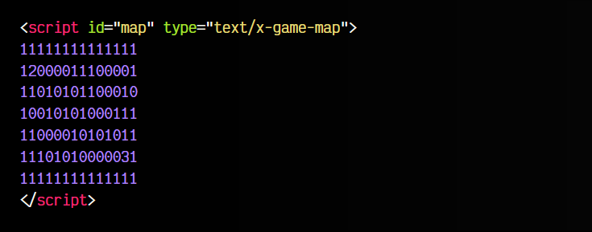
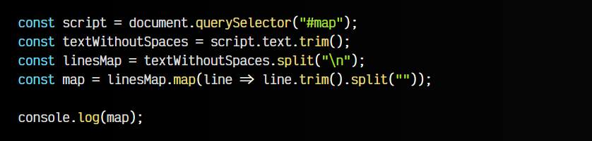
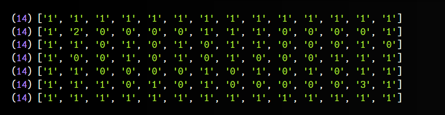

# 
Bloque de datos desconocido.

Si has visto el artículo de la etiqueta < script >, habrás observado que al atributo type le podemos indicar varios valores, entre los que se encuentran module, importmap o incluso omitir el atributo. En cada uno de ellos, las etiquetas < script > se comportan de una forma diferente.

Sin embargo, existe la posibilidad de indicar un valor type diferente a los anteriores, en cuyo caso, el navegador simplemente entenderá que la etiqueta < script > es un contenedor de datos de texto con un formato específico, pero que el navegador desconoce.

Para entenderlo mejor, veamos algunos ejemplos.

## Ejemplo 1: Bloque JSON.
En este fragmento de código podemos ver un fichero JSON que se indica en una etiqueta < script > que tiene el atributo type a application/json, que es el MIME de los ficheros JSON:

Los navegadores no están preparados para que las etiquetas < script > soporten ese valor type, por lo que entienden que el contenido está en un formato de texto que no pueden procesar, y ofrece una forma genérica al desarrollador de acceder a esos datos, mediante la propiedad .text de ese elemento Javascript.

Nosotros podemos aprovechar esta característica para trabajar con esta información con Javascript. Por ejemplo:

En este ejemplo, hemos localizado el elemento < script > desde Javascript y lo hemos parseado como un fichero .json, ya que es exactamente eso. Los bloques de datos nos permiten acceder a su contenido de texto mediante la propiedad script.text.

## Ejemplo 2: Bloque con mapa.
Otro ejemplo con un formato desconocido. Tenemos una etiqueta < script > con type con valor text/x-game-map. Este formato es un formato inventado donde tenemos los datos de un supuesto mapa de un juego:

</script>

Los números 0 indican una celda vacía del mapa, mientras que el 1 es un muro, el 2 el jugador y el 3 la salida del nivel. Estos datos podríamos procesarlos con Javascript para luego construir nuestro mapa del juego.

Observa el siguiente fragmento de código Javascript. En él, hacemos lo siguiente:

   - Localizamos el elemento < script > y lo guardamos en script
   - Accedemos al contenido de texto del bloque de datos con script.text
   - Eliminamos los espacios al inicio y final del texto con trim()
   - Dividimos el texto por los \n (saltos de línea), es decir, por líneas
   - Por cada línea, eliminamos espacios y dividimos cada caracter

Al final, obtenemos un array de arrays, con toda la información del mapa:

Ahora podríamos usar esa información para trabajar con ese nivel del juego.